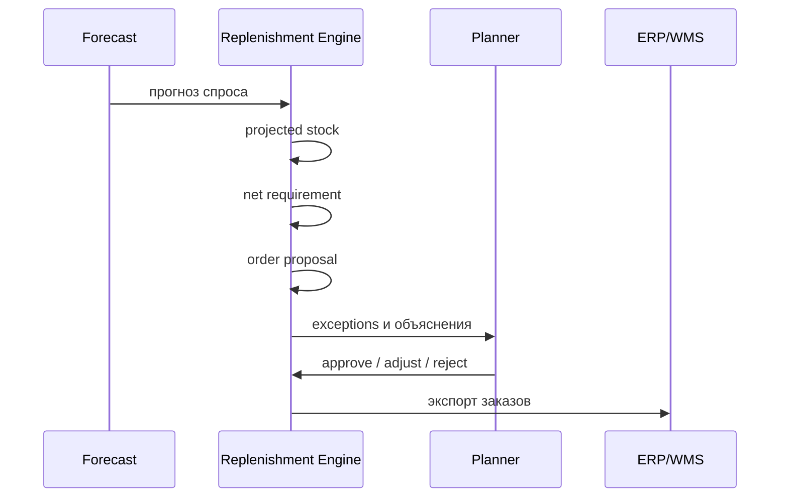

# Техническое Задание

## Бизнес-Процессы И UI Для Системы OPEN FNR

Документ описывает бизнес-процессы, пользовательские роли, сценарии работы и требования к интерфейсам системы прогнозирования спроса и пополнения запасов OPEN FNR.

Связанные документы:

- [TECHNICAL_SPEC.md](TECHNICAL_SPEC.md) - общее техническое задание.
- [TECHNOLOGY_ARCHITECTURE.md](TECHNOLOGY_ARCHITECTURE.md) - технологическая архитектура и стек.

## 1. Назначение Документа

Цель документа - определить, как бизнес-пользователи, аналитики, планировщики, Data Science и IT-команды взаимодействуют с системой OPEN FNR в ежедневных и периодических процессах.

Документ фиксирует:

- бизнес-процессы прогнозирования;
- бизнес-процессы пополнения;
- процессы промо;
- процессы fresh и скоропортящихся категорий;
- процессы управления исключениями;
- процессы ручных корректировок;
- требования к UI;
- требования к ролям и правам;
- требования к audit trail;
- требования к дашбордам и рабочим местам пользователей.

## 2. Общая Карта Бизнес-Процессов

```mermaid
flowchart LR
    A[Закрытие операционного дня] --> B[Загрузка данных]
    B --> C[Контроль качества данных]
    C --> D[Расчет прогноза]
    D --> E[Расчет пополнения]
    E --> F[Исключения и алерты]
    F --> G[Проверка планировщиком]
    G --> H[Корректировки и согласование]
    H --> I[Публикация заказов]
    I --> J[ERP / WMS / Автозаказ]
    J --> K[Мониторинг исполнения]
    K --> L[Оценка качества прогноза и заказов]
    L --> D
```

## 3. Роли Пользователей

| Роль | Основная ответственность | Основные UI-разделы |
| --- | --- | --- |
| Forecast Planner | контроль прогноза, корректировки, анализ ошибок | Forecast Workbench, Accuracy Dashboard |
| Replenishment Planner | контроль заказов, исключений и запасов | Replenishment Workbench, Exceptions |
| Promo Planner | проверка прогноза промо и потребности | Promo Workbench |
| Category Manager | контроль категории, промо, ассортимента | Category Dashboard |
| Supply Chain Manager | доступность, запасы, поставки, РЦ | Supply Chain Dashboard |
| Store Operations | проблемы магазинов, выкладка, stock-out | Store View |
| Fresh Manager | fresh-заказы, списания, срок годности | Fresh Workbench |
| Data Scientist | модели, метрики, drift, backtesting | Model Monitoring |
| Data Engineer | загрузки, качество данных, SLA | Data Quality Console |
| Administrator | права, справочники, настройки | Admin Console |
| Business Executive | KPI, эффект, сводные показатели | Executive Dashboard |

## 4. Основные Бизнес-Процессы

## 4.1. Ежедневный Процесс Прогнозирования

### Цель

Ежедневно сформировать прогноз продаж по активной матрице `магазин x SKU x дата` на горизонты `14 / 30 / 60 / 90` дней.

### Участники

- Forecast Planner;
- Data Scientist;
- Data Engineer;
- Category Manager.

### Входы

- продажи;
- остатки;
- цены;
- промо;
- календарь;
- справочники товаров и магазинов;
- внешние факторы;
- ручные корректировки предыдущих периодов.

### Процесс

1. Система загружает данные после закрытия дня.
2. Data Quality проверяет полноту, дубли, аномалии и SLA данных.
3. Система рассчитывает регулярный прогноз.
4. Система рассчитывает промо-uplift.
5. Система формирует итоговый прогноз.
6. Система рассчитывает метрики и алерты.
7. Forecast Planner проверяет исключения.
8. При необходимости пользователь вносит корректировки.
9. Прогноз публикуется для пополнения, DWH, BI и ERP.

### Выходы

- `regular_forecast_qty`;
- `promo_uplift_forecast_qty`;
- `total_forecast_qty`;
- интервалы или квантили;
- флаги качества;
- список исключений;
- audit trail.

## 4.2. Ежедневный Процесс Пополнения

### Цель

На базе прогноза, остатков, заказов в пути и ограничений рассчитать предложения заказов.

### Участники

- Replenishment Planner;
- Supply Chain Manager;
- Store Operations;
- Category Manager.

### Входы

- прогноз спроса;
- текущий остаток;
- открытые заказы;
- in-transit;
- lead time;
- календарь заказов и поставок;
- MOQ/MOV;
- кратность упаковки;
- safety stock;
- presentation stock;
- shelf capacity;
- ограничения поставщика и РЦ.

### Процесс

### Выходы

- projected stock;
- demand projection;
- order proposal;
- constraint flags;
- exceptions;
- комментарии пользователя;
- экспорт в ERP/WMS.

## 4.3. Процесс Промо-Планирования

### Цель

Сформировать прогноз продаж и потребность в товаре для промо-акций.

### Участники

- Promo Planner;
- Category Manager;
- Forecast Planner;
- Replenishment Planner;
- Supply Chain Manager.

### Процесс

1. Promo Planner загружает или проверяет промо-план.
2. Система проверяет полноту промо-данных: SKU, магазины, даты, механика, цена, скидка.
3. Система рассчитывает регулярный baseline на период промо.
4. Система рассчитывает uplift.
5. Replenishment Engine пересчитывает потребность.
6. UI показывает риск дефицита, overstock и ограничений РЦ.
7. Пользователь согласует или корректирует forecast/order proposal.
8. Заказы передаются в ERP/WMS.

### Важные UI-функции

- сравнение промо с аналогами;
- график regular vs uplift vs total;
- прогноз по дням промо;
- риск дефицита до начала промо;
- потребность РЦ;
- контроль post-promo stock.

## 4.4. Процесс Fresh И Скоропортящихся Категорий

### Цель

Сбалансировать доступность товара и минимизацию списаний.

### Участники

- Fresh Manager;
- Replenishment Planner;
- Store Operations;
- Supply Chain Manager.

### Процесс

1. Система рассчитывает спрос fresh-категорий.
2. Система учитывает срок годности, партии, остаточный срок и FEFO.
3. Replenishment Engine рассчитывает order proposal.
4. UI показывает риск stock-out и риск списаний.
5. Fresh Manager проверяет исключения.
6. При необходимости заказ корректируется.
7. Система фиксирует влияние корректировки на expected waste и service level.

### Метрики

- availability;
- projected spoilage;
- waste cost;
- lost sales;
- days of supply;
- shelf-life risk.

## 4.5. Процесс Управления Исключениями

### Цель

Система должна направлять внимание пользователя только на ситуации, где требуется действие.

### Типы Исключений

| Исключение | Пользователь | Действие |
| --- | --- | --- |
| Forecast anomaly | Forecast Planner | проверить прогноз, подтвердить или скорректировать |
| High stock-out risk | Replenishment Planner | увеличить заказ или проверить ограничение |
| High overstock risk | Replenishment Planner | снизить заказ или подтвердить исключение |
| Promo shortage risk | Promo Planner | проверить промо-поставку |
| High spoilage risk | Fresh Manager | снизить заказ или изменить параметр fresh |
| DC shortage | Supply Chain Manager | распределить дефицит по приоритетам |
| Supplier constraint | Supply Chain Manager | проверить MOQ/MOV/cutoff |
| Data quality failure | Data Engineer | исправить источник или запустить fallback |
| Model drift | Data Scientist | проверить модель, backtesting, retraining |

### Статусы Исключения

| Статус | Описание |
| --- | --- |
| `new` | новое исключение |
| `in_review` | взято в работу |
| `resolved` | решено |
| `ignored` | осознанно проигнорировано |
| `escalated` | передано на следующий уровень |
| `auto_resolved` | снято системой после пересчета |

## 4.6. Процесс Ручных Корректировок

### Цель

Разрешить бизнес-пользователям корректировать прогнозы и заказы без потери исходного ML-результата и с полным аудитом.

### Что Можно Корректировать

- регулярный прогноз;
- промо-uplift;
- итоговый прогноз;
- safety stock;
- presentation stock;
- order proposal;
- service level target;
- параметры fresh;
- параметры для SKU/магазина/категории.

### Требования

- исходный ML-прогноз не изменяется;
- корректировка хранится отдельным слоем;
- обязательно указывается причина;
- массовые корректировки должны иметь preview before apply;
- корректировки должны иметь срок действия;
- корректировки должны попадать в audit trail;
- BI должен показывать эффект ручных корректировок.

## 4.7. Процесс Согласования И Публикации

### Цель

Передать в ERP/WMS/автозаказ только согласованные прогнозы и предложения заказов.

### Статусы Прогноза

| Статус | Описание |
| --- | --- |
| `draft` | рассчитан, но не опубликован |
| `review_required` | есть критичные исключения |
| `approved` | подтвержден |
| `published` | опубликован |
| `superseded` | заменен новой версией |
| `failed` | публикация завершилась ошибкой |

### Статусы Заказа

| Статус | Описание |
| --- | --- |
| `draft` | рассчитан системой |
| `auto_approved` | автоматически принят |
| `manual_review` | требует проверки |
| `adjusted` | изменен пользователем |
| `approved` | подтвержден |
| `exported` | выгружен в ERP/WMS |
| `rejected` | отклонен |
| `blocked` | заблокирован ограничением |

## 5. UI: Общие Принципы

UI должен быть рабочим инструментом планировщика, а не маркетинговой витриной.

Требования:

- плотная, сканируемая компоновка;
- быстрые фильтры;
- таблицы с закрепленными колонками;
- графики рядом с таблицами;
- массовые действия;
- объяснение расчета;
- drill-down от сети до магазина и SKU;
- сравнение факта, прогноза и заказа;
- обязательный audit trail;
- темная тема VSCode с акцентом "благородный красный";
- доступность всех критичных действий с клавиатуры;
- отсутствие скрытых black-box решений.

## 6. Информационная Архитектура UI

```mermaid
flowchart TB
    HOME[Home / Control Tower]
    HOME --> F[Forecast]
    HOME --> R[Replenishment]
    HOME --> P[Promo]
    HOME --> FR[Fresh]
    HOME --> EX[Exceptions]
    HOME --> BI[Analytics]
    HOME --> DQ[Data Quality]
    HOME --> ML[Model Monitoring]
    HOME --> SUP[Supplier Collaboration]
    HOME --> CAP[Capacity]
    HOME --> DIAG[Supply Chain Diagnostics]
    HOME --> STORE[Store Tasks]
    HOME --> TRUE[True Inventory]
    HOME --> ADM[Admin]

    F --> FW[Forecast Workbench]
    F --> FA[Accuracy]
    R --> RW[Replenishment Workbench]
    R --> INV[Inventory Projection]
    P --> PW[Promo Workbench]
    FR --> FRESH[Fresh Workbench]
    EX --> EXL[Exception List]
    BI --> DASH[Dashboards]
    SUP --> SUPP[Supplier Portal/View]
    CAP --> CAPW[Capacity Workbench]
    DIAG --> RCA[Root Cause Analysis]
```

## 7. Основные Экраны UI

## 7.1. Control Tower

### Назначение

Главный экран состояния системы.

### Виджеты

- статус последнего расчета;
- SLA pipeline;
- количество критичных исключений;
- WAPE по сети;
- Bias по сети;
- stock-out risk;
- overstock risk;
- spoilage risk;
- статус экспорта в ERP/WMS;
- топ категорий с ухудшением качества;
- топ регионов с риском дефицита.

### Действия

- перейти к исключениям;
- открыть детализацию расчета;
- запустить пересчет;
- открыть отчет качества;
- проверить статус интеграций.

## 7.2. Forecast Workbench

### Назначение

Рабочее место прогнозирования.

### Фильтры

- период;
- горизонт;
- регион;
- магазин;
- категория;
- SKU;
- тип прогноза: regular / promo / total;
- наличие промо;
- fast/medium/slow mover;
- флаг stock-out;
- флаг ручной корректировки.

### Таблица

| Колонка | Описание |
| --- | --- |
| `store_id` | магазин |
| `sku_id` | SKU |
| `forecast_date` | дата |
| `fact_qty` | факт, если доступен |
| `regular_forecast_qty` | регулярный прогноз |
| `promo_uplift_qty` | промо-uplift |
| `total_forecast_qty` | итоговый прогноз |
| `manual_adjustment_qty` | ручная корректировка |
| `final_forecast_qty` | финальный прогноз |
| `WAPE` | ошибка |
| `Bias` | смещение |
| `quality_flag` | флаг качества |

### Графики

- факт vs прогноз;
- regular vs promo uplift;
- интервалы прогноза;
- остатки и stock-out;
- цена и промо-периоды.

### Действия

- скорректировать прогноз;
- массово применить корректировку;
- сравнить с предыдущей версией;
- открыть объяснение прогноза;
- отправить на согласование;
- выгрузить срез.

## 7.3. Promo Workbench

### Назначение

Проверка прогноза промо и связанного пополнения.

### Основные блоки

- список промо;
- прогноз uplift;
- сравнение с аналогами;
- потребность по магазинам;
- потребность РЦ;
- риск дефицита;
- post-promo stock;
- статус заказов под промо.

### Действия

- пересчитать промо;
- изменить uplift;
- применить аналог;
- утвердить промо-прогноз;
- открыть предложения заказов;
- сформировать список магазинов с риском дефицита.

## 7.4. Replenishment Workbench

### Назначение

Рабочее место планировщика пополнения.

### Фильтры

- дата заказа;
- дата поставки;
- поставщик;
- РЦ;
- магазин;
- категория;
- SKU;
- статус заказа;
- exception type;
- constraint flag.

### Таблица

| Колонка | Описание |
| --- | --- |
| `order_date` | дата заказа |
| `expected_delivery_date` | дата поставки |
| `source_location` | поставщик или РЦ |
| `target_location` | магазин или РЦ |
| `sku_id` | SKU |
| `forecast_demand_qty` | спрос на период покрытия |
| `stock_on_hand` | текущий остаток |
| `open_order_qty` | открытые заказы |
| `projected_stock_qty` | прогнозный остаток |
| `safety_stock_qty` | страховой запас |
| `presentation_stock_qty` | выкладка |
| `net_requirement_qty` | чистая потребность |
| `order_proposal_qty` | предложение заказа |
| `final_order_qty` | финальный заказ |
| `status` | статус |
| `exception_flag` | исключение |

### Действия

- подтвердить заказ;
- изменить заказ;
- отклонить заказ;
- массово подтвердить;
- применить правило округления;
- открыть объяснение заказа;
- экспортировать в ERP/WMS.

## 7.5. Inventory Projection

### Назначение

Показать будущий запас по дням.

### Отображение

- график projected stock;
- forecast demand;
- incoming orders;
- safety stock;
- presentation stock;
- stock-out threshold;
- overstock threshold;
- shelf-life risk.

### Действия

- перейти к заказу;
- открыть причину stock-out;
- изменить safety stock;
- проверить поставки в пути;
- открыть историю продаж.

## 7.6. Fresh Workbench

### Назначение

Управление fresh и скоропортящимися категориями.

### Блоки

- прогноз спроса;
- projected spoilage;
- остатки по срокам годности;
- FEFO;
- expected waste;
- availability;
- final order proposal;
- списания.

### Действия

- изменить заказ;
- изменить целевой service level;
- снизить риск списания;
- проверить партии;
- открыть магазины с высоким spoilage risk.

## 7.7. Exception Center

### Назначение

Единая очередь исключений.

### Фильтры

- тип исключения;
- критичность;
- роль владельца;
- регион;
- категория;
- поставщик;
- статус;
- срок реакции.

### Карточка Исключения

Карточка должна содержать:

- тип;
- критичность;
- объект: SKU, магазин, категория, поставщик;
- расчетный эффект;
- причину;
- рекомендованное действие;
- историю;
- ответственного;
- deadline.

### Действия

- взять в работу;
- применить рекомендацию;
- отклонить рекомендацию;
- эскалировать;
- закрыть;
- добавить комментарий.

## 7.8. Accuracy Dashboard

### Назначение

Контроль качества прогноза.

### Метрики

- WAPE;
- MAPE;
- Bias;
- RMSE;
- forecast value added;
- manual adjustment effect;
- промо-точность;
- regular-точность;
- точность по fast/medium/slow movers.

### Срезы

- сеть;
- регион;
- формат магазина;
- категория;
- SKU;
- промо;
- fresh;
- период;
- модель.

## 7.9. Replenishment Analytics

### Назначение

Контроль эффективности пополнения.

### Метрики

- service level;
- stock-out rate;
- lost sales;
- overstock;
- days of supply;
- inventory turnover;
- waste;
- proposal acceptance rate;
- manual adjustment rate;
- blocked orders.

## 7.10. Data Quality Console

### Назначение

Контроль входных данных.

### Блоки

- freshness;
- row counts;
- null checks;
- duplicates;
- referential integrity;
- price anomalies;
- stock anomalies;
- promo data completeness;
- failed partitions.

## 7.11. Model Monitoring

### Назначение

Контроль ML-моделей.

### Блоки

- версия модели;
- версия данных;
- training date;
- backtesting metrics;
- drift;
- fallback rate;
- feature importance;
- model comparison;
- retraining status.

## 7.12. Admin Console

### Назначение

Администрирование системы.

### Функции

- пользователи;
- роли;
- права;
- параметры пополнения;
- календари;
- поставщики;
- правила округления;
- business rules;
- SLA-настройки;
- справочники исключений;
- параметры ручных корректировок.

## 7.13. Supplier Collaboration

### Назначение

Рабочее место взаимодействия с поставщиками.

### Блоки

- forecast/order forecast для поставщика;
- purchase proposals;
- fill rate;
- on-time delivery;
- partial deliveries;
- rejected deliveries;
- supplier shortage risks;
- supplier exceptions.

### Действия

- отправить прогноз поставщику;
- получить подтверждение поставщика;
- открыть supply risk;
- выбрать альтернативного поставщика;
- эскалировать supplier exception;
- выгрузить forecast в CSV/SFTP/API.

## 7.14. Capacity Workbench

### Назначение

Контроль и сглаживание потоков поставок.

### Блоки

- capacity РЦ;
- capacity транспорта;
- capacity приемки магазина;
- workload выкладки;
- перегрузки по дням;
- рекомендации переноса;
- affected orders.

### Действия

- применить сглаживание;
- перенести поставку;
- подтвердить перегрузку;
- открыть affected order proposals;
- открыть workload forecast.

## 7.15. Supply Chain Diagnostics

### Назначение

Показать вероятные причины дефицита, списаний и overstock.

### Блоки

- root cause;
- affected scope;
- evidence;
- forecast vs fact;
- order vs delivery;
- stock movement;
- promo context;
- MDM/DQ context;
- recommended action.

### Действия

- создать exception;
- применить рекомендацию;
- назначить владельца;
- открыть связанные заказы/промо/SKU;
- закрыть diagnostic insight.

## 7.16. True Inventory

### Назначение

Показать виртуальный остаток и надежность баланса.

### Блоки

- last reliable stock;
- POS sales;
- deliveries;
- write-offs;
- corrections;
- virtual stock;
- confidence score;
- quality flag.

### Действия

- создать задачу проверки магазина;
- подтвердить корректировку остатка;
- исключить virtual stock из расчета;
- открыть историю движений.

## 7.17. Store Tasks

### Назначение

Мобильный или легкий интерфейс магазина для задач, влияющих на прогноз и пополнение.

### Задачи

- подтвердить промо-выкладку;
- проверить stock-out;
- подтвердить пополнение полки;
- проверить остаток;
- подтвердить приемку;
- сообщить о невозможности выкладки.

### Действия

- взять задачу;
- отметить выполнение;
- добавить комментарий;
- приложить фото, если функциональность разрешена;
- отправить feedback.

## 8. Требования К UX

### 8.1. Общие Требования

- пользователь должен видеть, что требует действия сегодня;
- каждое число прогноза и заказа должно быть объяснимым;
- массовые действия должны иметь preview;
- таблицы должны поддерживать сортировку, фильтрацию и закрепление колонок;
- критичные изменения должны требовать подтверждения;
- UI должен показывать эффект изменения до применения;
- все изменения должны иметь undo до публикации;
- после публикации изменения возможны только новой версией.

### 8.2. Визуальный Стиль

Стиль: **VSCode / благородный красный**.

| Элемент | Цвет |
| --- | --- |
| Основной фон | `#1E1E1E` |
| Панель | `#252526` |
| Акцент | `#8B1E2D` |
| Акцент hover | `#B83A4B` |
| Текст | `#D4D4D4` |
| Вторичный текст | `#9DA3AE` |
| Разделитель | `#3A3A3A` |
| Ошибка | `#D9534F` |
| Предупреждение | `#D6A542` |
| Успех | `#4F9D69` |

## 9. Права Доступа

| Действие | Forecast Planner | Replenishment Planner | Category Manager | DS | Admin |
| --- | --- | --- | --- | --- | --- |
| Смотреть прогноз | да | да | да | да | да |
| Корректировать прогноз | да | нет | ограниченно | нет | да |
| Смотреть order proposals | да | да | да | нет | да |
| Корректировать заказ | нет | да | ограниченно | нет | да |
| Подтверждать заказ | нет | да | нет | нет | да |
| Менять параметры модели | нет | нет | нет | да | да |
| Менять роли | нет | нет | нет | нет | да |
| Запускать пересчет | да | да | ограниченно | да | да |

## 10. Audit Trail

Система должна фиксировать:

- кто изменил;
- что изменил;
- старое значение;
- новое значение;
- причину;
- комментарий;
- время;
- источник изменения;
- версию прогноза или заказа;
- влияние на итоговый результат.

Audit trail должен быть доступен в UI для каждого прогноза, заказа, параметра и исключения.

## 11. Уведомления

Каналы:

- UI notification center;
- email;
- webhook;
- интеграция с корпоративным мессенджером, если разрешено.

Типы уведомлений:

- нарушение SLA;
- критичный stock-out risk;
- high spoilage risk;
- ошибка экспорта;
- критичная ошибка данных;
- завершение расчета;
- необходимость согласования;
- изменение статуса заказа.

## 12. Нефункциональные Требования К UI

| Требование | Значение |
| --- | --- |
| Время открытия главного экрана | до `3 секунд` |
| Время фильтрации агрегированного отчета | до `5 секунд` |
| Время открытия карточки SKU-магазин | до `3 секунд` |
| Экспорт таблицы | асинхронный |
| Массовые действия | через background job |
| Авторизация | RBAC |
| История изменений | обязательна |
| Язык | русский, с возможностью i18n |
| Браузеры | Chrome, Edge, Firefox |

## 13. Интеграции UI

UI должен получать данные через backend API, а не обращаться напрямую к ClickHouse или PostgreSQL.

Основные API:

- `/forecast`;
- `/forecast/metrics`;
- `/forecast/adjustments`;
- `/replenishment/proposals`;
- `/replenishment/projection`;
- `/replenishment/exceptions`;
- `/promo`;
- `/fresh`;
- `/data-quality`;
- `/model-monitoring`;
- `/admin`.

## 14. Критерии Приемки

| Критерий | Требование |
| --- | --- |
| Роли | все ключевые роли заведены |
| Forecast Workbench | доступен просмотр, фильтрация, график и корректировка |
| Replenishment Workbench | доступны order proposals, объяснения и корректировки |
| Promo Workbench | доступен прогноз uplift и риск дефицита |
| Fresh Workbench | доступны spoilage и shelf-life показатели |
| Exception Center | исключения имеют статусы, владельцев и действия |
| Audit Trail | все изменения фиксируются |
| BI | доступны метрики прогноза и пополнения |
| Экспорт | заказы могут быть опубликованы в ERP/WMS |
| UI SLA | основные экраны открываются в заданное время |
| Лицензии | UI-компоненты совместимы с Apache-2.0 проектом |

## 15. Рекомендуемый UI-Стек

Стек должен соответствовать лицензионному ограничению проекта: бесплатные self-hosted инструменты и permissive-лицензии.

| Зона | Технология | Лицензия |
| --- | --- | --- |
| Frontend | React | MIT |
| UI framework | Apache ECharts + собственные компоненты | Apache-2.0 / internal |
| Tables | TanStack Table | MIT |
| State | Zustand / TanStack Query | MIT |
| API client | OpenAPI-generated client | permissive |
| Backend API | FastAPI | MIT |
| BI | Apache Superset | Apache-2.0 |
| Auth integration | OpenID Connect через backend | зависит от IdP |

Не использовать в обязательном контуре UI:

- proprietary BI;
- AGPL-компоненты;
- GPL-компоненты;
- платные SaaS-зависимости;
- компоненты с неясной лицензией.
