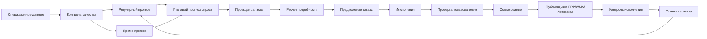

# Детальное Описание Бизнес-Процессов OPEN FNR

## 1. Назначение Документа

Документ описывает бизнес-процессы, покрываемые системой OPEN FNR: прогнозирование спроса, промо-планирование, пополнение запасов, fresh-категории, управление жизненным циклом товара, исключения, ручные корректировки, согласование и публикацию результатов.

Документ предназначен для:

- бизнес-владельцев;
- категорийных менеджеров;
- промо-планировщиков;
- планировщиков пополнения;
- supply chain команды;
- Data Science;
- Data Engineering;
- Backend;
- UI/UX;
- QA.

Связанные документы:

- [TECHNICAL_SPEC.md](TECHNICAL_SPEC.md)
- [TECHNOLOGY_ARCHITECTURE.md](TECHNOLOGY_ARCHITECTURE.md)
- [BUSINESS_PROCESSES_UI_SPEC.md](BUSINESS_PROCESSES_UI_SPEC.md)

## 2. Общая Процессная Модель

OPEN FNR покрывает цепочку:

```text
данные -> прогноз спроса -> расчет потребности -> предложение заказа -> проверка исключений -> согласование -> публикация -> контроль результата
```



## 3. Общие Объекты Бизнес-Процессов

| Объект | Описание |
| --- | --- |
| `SKU` | товарная единица, по которой строится прогноз и расчет заказа |
| `store` | магазин или торговая локация |
| `DC` | распределительный центр |
| `supplier` | поставщик |
| `assortment_matrix` | активная матрица товаров в магазинах |
| `regular_forecast` | прогноз спроса без промо |
| `promo_uplift` | дополнительный спрос от промо |
| `total_forecast` | итоговый прогноз спроса |
| `demand_projection` | потребность для пополнения с учетом запасов и ограничений |
| `projected_stock` | прогнозный остаток по дням |
| `order_proposal` | предложение заказа |
| `exception` | событие, требующее внимания пользователя |
| `manual_adjustment` | ручная корректировка прогноза, параметра или заказа |

## 4. Роли И Ответственность

| Роль | Ответственность |
| --- | --- |
| Category Manager | ассортимент, категории, промо-решения, бизнес-ограничения |
| Promo Planner | промо-план, механики, скидки, выкладка, объем промо |
| Forecast Planner | контроль прогноза, корректировки, анализ точности |
| Replenishment Planner | предложения заказов, исключения, параметры пополнения |
| Fresh Manager | fresh-заказы, срок годности, списания, доступность |
| Supply Chain Manager | поставщики, РЦ, транспорт, дефицит, capacity |
| Store Operations | операционные проблемы магазина, выкладка, остатки |
| Data Steward | справочники, MDM, товарные и магазинные атрибуты |
| Data Engineer | загрузки, качество данных, SLA |
| Data Scientist | модели, метрики, backtesting, drift |
| Administrator | роли, права, системные настройки |

## 5. BP-01. Ежедневное Закрытие Данных И Контроль Качества

### 5.1. Цель

Обеспечить готовность данных для ежедневного расчета прогноза и пополнения.

### 5.2. Входные Данные

| Домен | Данные |
| --- | --- |
| Продажи | дата, магазин, SKU, количество, сумма, возвраты |
| Остатки | on-hand, доступный остаток, резерв, in-transit |
| Цены | регулярная цена, фактическая цена, скидка |
| Промо | SKU, магазины, даты, механика, цена, скидка, выкладка |
| Справочники | товары, магазины, категории, поставщики, РЦ |
| Заказы | открытые заказы, даты поставок, статусы |
| Календарь | праздники, выходные, региональные события |

### 5.3. Процесс

1. Система получает данные из POS, ERP, WMS, MDM, промо-системы и внешних источников.
2. Проверяется полнота загрузки по каждому источнику.
3. Проверяются дубли по бизнес-ключам.
4. Проверяется ссылочная целостность `store_id`, `sku_id`, `supplier_id`, `dc_id`.
5. Проверяются отрицательные продажи, отрицательные цены, невозможные остатки.
6. Проверяется наличие цен для активной матрицы.
7. Проверяется наличие остатков для активной матрицы.
8. Проверяется корректность промо-плана: даты, скидки, SKU, магазины, пересечения.
9. Для критичных ошибок создаются блокирующие исключения.
10. Для некритичных ошибок создаются предупреждения и флаги качества.
11. Система принимает решение: запускать расчет, запускать degraded mode или блокировать публикацию.

### 5.4. Бизнес-Правила

| Правило | Описание |
| --- | --- |
| DQ-01 | Нельзя публиковать прогноз, если отсутствуют продажи по критичной доле магазинов |
| DQ-02 | Нельзя использовать промо без SKU, периода и механики |
| DQ-03 | Цена не может быть отрицательной или равной нулю для активного товара |
| DQ-04 | Остаток может быть отрицательным только как технический флаг, не как нормальное значение |
| DQ-05 | Все SKU и магазины должны быть связаны с MDM |

### 5.5. Выходы

- статус качества данных;
- список ошибок;
- список предупреждений;
- флаги качества по объектам;
- разрешение или запрет расчета;
- audit trail загрузки.

## 6. BP-02. Регулярное Прогнозирование Спроса

### 6.1. Цель

Сформировать прогноз продаж без промо-эффекта на уровне `магазин x SKU x дата`.

### 6.2. Входы

- история продаж;
- очищенные продажи;
- остатки и stock-out флаги;
- цены без промо;
- календарь;
- атрибуты магазина;
- атрибуты SKU;
- товарная матрица;
- жизненный цикл товара.

### 6.3. Процесс

1. Система формирует активную матрицу `store x SKU`.
2. Исключаются закрытые магазины, неактивные SKU и запрещенные к прогнозированию позиции.
3. История продаж очищается от stock-out, выбросов и разовых событий.
4. Рассчитываются лаговые признаки.
5. Рассчитываются rolling-признаки.
6. Рассчитываются календарные признаки.
7. Рассчитываются признаки цены и изменения цены.
8. Рассчитываются признаки жизненного цикла SKU.
9. Модель формирует регулярный прогноз.
10. Прогноз проходит контроль аномалий.
11. Система присваивает quality flag.
12. Результат сохраняется как версия прогноза.

### 6.4. Бизнес-Правила

| Правило | Описание |
| --- | --- |
| RF-01 | Нулевая продажа при отсутствии товара не считается нулевым спросом |
| RF-02 | Для новых SKU используется аналог или категорийный fallback |
| RF-03 | Для slow movers допускается агрегированный прогноз с последующим распределением |
| RF-04 | Регулярный прогноз не должен включать uplift от промо |
| RF-05 | Прогноз должен храниться отдельно от ручных корректировок |

### 6.5. Выходы

- регулярный прогноз;
- интервалы или квантили;
- качество прогноза;
- флаги fallback;
- объяснение основных факторов;
- версия модели и данных.

## 7. BP-03. Промо-Планирование И Промо-Прогноз

### 7.1. Цель

Спланировать промо-акцию, рассчитать дополнительный спрос, проверить обеспеченность товаром и сформировать потребность для заказа.

### 7.2. Обязательные Данные Промо

Для каждой промо-акции должны быть зафиксированы:

| Блок | Данные |
| --- | --- |
| Идентификация | `promo_id`, название промо, владелец, статус |
| Период | дата начала, дата окончания, дата поставки под промо, cutoff date |
| География | сеть, регион, кластер, список магазинов |
| Товары | список SKU, категория, бренд, замены, аналоги |
| Цена | регулярная цена, промо-цена, скидка в %, скидка в рублях |
| Механика | скидка, 1+1, 2 по цене 1, купон, комплект, loyalty, cashback |
| Выкладка | место выкладки, тип выкладки, мощность выкладки, display stock |
| Место выкладки | полка, торец, остров, паллета, кассовая зона, холодильник, промо-зона |
| Мощность выкладки | количество фейсингов, коробов, паллет, shelf capacity |
| Поддержка | листовка, приложение, сайт, push, наружная реклама, ТВ, digital |
| Ограничения | лимит товара, квоты, лимит на магазин, лимит поставщика |
| Supply | поставщик, РЦ, дата доступности товара, доступный объем |
| Цели | ожидаемый объем, целевой uplift, целевая маржа, целевой остаток после промо |
| Связи | конкурирующие промо, каннибализация, заменители |

### 7.3. Статусы Промо

| Статус | Описание |
| --- | --- |
| `draft` | черновик |
| `data_incomplete` | не хватает обязательных данных |
| `ready_for_forecast` | готово к расчету |
| `forecasted` | прогноз рассчитан |
| `supply_risk` | есть риск нехватки товара |
| `approved` | промо согласовано |
| `published` | передано в пополнение/ERP |
| `active` | промо идет сейчас |
| `closed` | промо завершено |
| `cancelled` | промо отменено |

### 7.4. Процесс

1. Promo Planner создает промо или загружает промо-план.
2. Система проверяет обязательные поля:
   - SKU;
   - магазины;
   - даты;
   - механика;
   - регулярная цена;
   - промо-цена;
   - скидка;
   - место выкладки;
   - мощность выкладки;
   - поставщик или РЦ;
   - дата готовности товара.
3. Система проверяет пересечения промо по SKU, магазину и датам.
4. Система проверяет цену: промо-цена должна быть ниже или равна регулярной, если механика предполагает скидку.
5. Система проверяет мощность выкладки: display stock не должен превышать физическую емкость.
6. Система подбирает исторические аналоги промо.
7. Система рассчитывает regular baseline на период промо.
8. Система рассчитывает promo uplift.
9. Система формирует total forecast.
10. Replenishment Engine рассчитывает потребность под промо.
11. Система проверяет доступность товара на РЦ и у поставщика.
12. Система показывает риски:
    - нехватка товара;
    - перепоставка;
    - остаток после промо;
    - каннибализация;
    - конфликт выкладки;
    - нарушение cutoff.
13. Promo Planner проверяет результат.
14. Category Manager согласует бизнес-параметры.
15. Supply Chain Manager согласует обеспеченность.
16. Промо переходит в статус `approved`.
17. Система публикует потребность и заказы.
18. Во время промо система ежедневно мониторит факт против прогноза.
19. После промо система оценивает точность, uplift и остатки.

### 7.5. Бизнес-Правила

| Правило | Описание |
| --- | --- |
| PR-01 | Промо без SKU, периода, магазинов и механики не допускается к расчету |
| PR-02 | Промо без цены или скидки получает статус `data_incomplete` |
| PR-03 | Для промо-выкладки обязательно указывается место и мощность выкладки |
| PR-04 | Display stock учитывается отдельно от presentation stock |
| PR-05 | Промо-uplift хранится отдельно от regular forecast |
| PR-06 | Post-promo stock должен рассчитываться до утверждения |
| PR-07 | Если товар недоступен на РЦ, создается `promo shortage risk` |
| PR-08 | Пересекающиеся промо требуют правила приоритета или ручного решения |
| PR-09 | Ручная корректировка uplift требует причины и комментария |
| PR-10 | После окончания промо должен быть рассчитан post-promo review |

### 7.6. Выходы

- промо-прогноз;
- uplift;
- потребность под промо;
- заказ под промо;
- риски промо;
- post-promo stock;
- отчет по эффективности промо.

## 8. BP-04. Пополнение Запасов

### 8.1. Цель

Рассчитать предложения заказов на базе прогноза, запасов, открытых заказов, сроков поставки и ограничений.

### 8.2. Входы

- total forecast;
- текущие остатки;
- открытые заказы;
- in-transit;
- lead time;
- календарь заказов;
- календарь поставок;
- MOQ;
- MOV;
- кратность упаковки;
- safety stock;
- presentation stock;
- shelf capacity;
- supplier constraints;
- DC constraints;
- промо-потребность.

### 8.3. Процесс

1. Система получает опубликованный прогноз.
2. Система рассчитывает спрос на период покрытия.
3. Система рассчитывает projected stock по дням.
4. Система рассчитывает demand projection.
5. Система рассчитывает gross requirement.
6. Система вычитает текущий остаток, открытые заказы и in-transit.
7. Система добавляет safety stock, presentation stock и display stock.
8. Система получает net requirement.
9. Система применяет MOQ/MOV.
10. Система округляет заказ до короба, слоя или паллеты.
11. Система проверяет ограничения поставщика.
12. Система проверяет ограничения РЦ.
13. Система проверяет ограничения магазина и полки.
14. Система формирует order proposal.
15. Система присваивает статус:
    - auto-approved;
    - manual review;
    - blocked.
16. Планировщик проверяет исключения.
17. Подтвержденные заказы публикуются в ERP/WMS.

### 8.4. Бизнес-Правила

| Правило | Описание |
| --- | --- |
| RP-01 | Заказ не должен создаваться на неактивный SKU |
| RP-02 | Заказ не должен создаваться после termination date |
| RP-03 | Заказ округляется по правилам поставщика |
| RP-04 | Заказ не должен превышать max stock без исключения |
| RP-05 | Если projected stock падает ниже safety stock, создается риск дефицита |
| RP-06 | Если заказ заблокирован MOQ/MOV, создается supplier constraint exception |
| RP-07 | Для промо display stock учитывается отдельно |
| RP-08 | Ручная корректировка заказа требует причины |

### 8.5. Выходы

- projected stock;
- net requirement;
- order proposal;
- final order;
- constraint flags;
- exceptions;
- export status.

## 9. BP-05. Multi-Echelon Пополнение

### 9.1. Цель

Согласовать потребность магазинов, РЦ, e-commerce и поставщиков в единой цепочке.

### 9.2. Процесс

1. Система рассчитывает прогноз спроса магазинов.
2. Система агрегирует потребность магазинов в потребность РЦ.
3. Система учитывает остатки РЦ и входящие поставки.
4. Система рассчитывает потребность поставщику.
5. При дефиците на РЦ система распределяет товар по приоритетам.
6. Приоритеты учитывают:
   - промо;
   - fresh;
   - ABC-класс;
   - уровень сервиса;
   - критичность магазина;
   - риск lost sales;
   - стратегические категории.
7. Система формирует предложения поставок в магазины и заказов поставщикам.

### 9.3. Бизнес-Правила

| Правило | Описание |
| --- | --- |
| ME-01 | Потребность РЦ должна быть связана с прогнозом нижнего уровня |
| ME-02 | При дефиците РЦ нельзя распределять больше доступного остатка |
| ME-03 | Промо-потребность имеет отдельный приоритет |
| ME-04 | Allocation должен сохранять объяснение решения |

## 10. BP-06. Fresh И Скоропортящиеся Товары

### 10.1. Цель

Сбалансировать доступность fresh-товаров и минимизацию списаний.

### 10.2. Обязательные Данные

- SKU;
- магазин;
- категория fresh;
- срок годности;
- batch или партия;
- дата производства;
- дата истечения срока;
- остаточный срок на дату поставки;
- условия хранения;
- FEFO/FIFO правило;
- ожидаемые списания;
- фактические списания;
- минимальная выкладка;
- вместимость полки.

### 10.3. Процесс

1. Система рассчитывает прогноз fresh-спроса.
2. Система получает остатки по партиям и срокам годности.
3. Система рассчитывает expected waste.
4. Система рассчитывает projected stock с учетом списаний.
5. Система рассчитывает заказ с учетом доступности и риска порчи.
6. Если риск списаний высокий, создается исключение.
7. Fresh Manager проверяет исключение.
8. Пользователь может снизить заказ, изменить service level или подтвердить риск.
9. Система сохраняет решение и ожидаемый эффект.

### 10.4. Бизнес-Правила

| Правило | Описание |
| --- | --- |
| FR-01 | Нельзя заказывать товар, который не успеет реализоваться до порчи |
| FR-02 | Для fresh должен считаться expected waste |
| FR-03 | Для fresh важен баланс service level и waste |
| FR-04 | Партии должны отбираться по FEFO, если это применимо |
| FR-05 | Ручная корректировка fresh-заказа должна показывать эффект на waste |

## 11. BP-07. Управление Жизненным Циклом Товара

### 11.1. Цель

Корректно управлять вводом, заменой и выводом товаров.

### 11.2. Процессы

| Сценарий | Описание |
| --- | --- |
| Phase-in | ввод нового SKU |
| Replacement | замена старого SKU новым |
| Phase-out | постепенное снижение заказов |
| Termination | запрет заказов после даты вывода |
| Clearance | распродажа остатка |
| End-of-season | завершение сезонного периода |

### 11.3. Процесс Phase-In

1. Category Manager задает дату ввода SKU.
2. Указывается список магазинов.
3. Указывается reference product или группа аналогов.
4. Указывается стартовая выкладка.
5. Система строит стартовый прогноз.
6. Система рассчитывает первый заказ.
7. После появления факта система постепенно заменяет аналог реальной историей.

### 11.4. Процесс Phase-Out

1. Category Manager задает termination date.
2. Система рассчитывает ожидаемый остаток на дату вывода.
3. Система снижает заказы.
4. Если остаток не будет распродан, создается clearance risk.
5. Пользователь принимает решение: скидка, перемещение, запрет заказа.

### 11.5. Бизнес-Правила

| Правило | Описание |
| --- | --- |
| LC-01 | Новый SKU должен иметь reference product или fallback |
| LC-02 | После termination date заказ запрещен |
| LC-03 | Replacement должен связывать старый и новый SKU |
| LC-04 | Clearance должен учитывать целевой остаток к концу периода |

## 12. BP-08. Управление Исключениями

### 12.1. Цель

Сфокусировать пользователей на событиях, где нужно решение.

### 12.2. Процесс

1. Система создает исключение.
2. Исключению назначается тип, критичность и владелец.
3. Пользователь получает уведомление.
4. Пользователь открывает карточку исключения.
5. Система показывает причину, эффект и рекомендацию.
6. Пользователь выбирает действие:
   - принять рекомендацию;
   - скорректировать;
   - отклонить;
   - эскалировать;
   - закрыть без действия.
7. Система фиксирует решение.
8. При следующем пересчете система проверяет, снято ли исключение.

### 12.3. Типы Исключений

| Тип | Владелец |
| --- | --- |
| Forecast anomaly | Forecast Planner |
| Promo shortage risk | Promo Planner |
| High stock-out risk | Replenishment Planner |
| High overstock risk | Replenishment Planner |
| High spoilage risk | Fresh Manager |
| DC shortage | Supply Chain Manager |
| Supplier constraint | Supply Chain Manager |
| Data quality failure | Data Engineer |
| Model drift | Data Scientist |

## 13. BP-09. Ручные Корректировки

### 13.1. Цель

Позволить пользователям корректировать прогноз, параметры и заказы с контролем влияния и аудитом.

### 13.2. Процесс

1. Пользователь выбирает объект корректировки.
2. Система показывает исходное значение.
3. Пользователь вводит новое значение или процент изменения.
4. Пользователь указывает причину.
5. Система показывает preview влияния:
   - на forecast;
   - на projected stock;
   - на order proposal;
   - на stock-out risk;
   - на overstock risk;
   - на waste, если fresh.
6. Пользователь подтверждает изменение.
7. Система сохраняет корректировку отдельным слоем.
8. Система пересчитывает зависимые показатели.

### 13.3. Причины Корректировок

- локальное событие;
- ошибка данных;
- договоренность с поставщиком;
- изменение промо;
- форс-мажор;
- экспертная оценка;
- ограничение магазина;
- ограничение полки;
- изменение цены;
- known demand spike.

## 14. BP-10. Согласование И Публикация

### 14.1. Цель

Передать в внешние системы только валидные и согласованные результаты.

### 14.2. Процесс

1. Система формирует версию прогноза и заказов.
2. Проверяется наличие блокирующих исключений.
3. Автоматически согласуются объекты без риска.
4. Объекты с риском переходят в manual review.
5. Ответственный пользователь принимает решение.
6. Система фиксирует согласование.
7. Система выгружает результаты в ERP/WMS/автозаказ/DWH/BI.
8. Система получает статус приема.
9. При ошибке экспорта создается исключение.

### 14.3. Бизнес-Правила

| Правило | Описание |
| --- | --- |
| AP-01 | Нельзя публиковать blocked order |
| AP-02 | Нельзя публиковать прогноз с критичным DQ failure |
| AP-03 | Повторная публикация создает новую версию |
| AP-04 | Экспорт должен быть идемпотентным |
| AP-05 | Все публикации должны иметь статус приема |

## 15. BP-11. Мониторинг Исполнения

### 15.1. Цель

Контролировать, что заказы были приняты, поставки выполнены, а прогноз и пополнение дали ожидаемый эффект.

### 15.2. Процесс

1. Система получает статусы заказов из ERP/WMS.
2. Система получает фактические поставки.
3. Система сравнивает заказ, подтверждение, поставку и факт продаж.
4. Система выявляет:
   - недопоставку;
   - задержку;
   - отказ поставщика;
   - overstock;
   - stock-out;
   - списания.
5. Система обновляет метрики поставщика, РЦ и магазина.
6. Результаты используются для оптимизации параметров пополнения.

## 16. BP-12. Оценка Качества И Непрерывное Улучшение

### 16.1. Цель

Постоянно улучшать прогнозы, параметры пополнения и бизнес-эффект.

### 16.2. Процесс

1. Система получает факт продаж и запасов.
2. Система считает WAPE, Bias, lost sales, overstock, waste.
3. Система сравнивает ML-прогноз и финальный прогноз после корректировок.
4. Система оценивает forecast value added.
5. Система выявляет категории, где модель деградирует.
6. Data Scientist анализирует drift.
7. Replenishment Planner анализирует параметры safety stock.
8. Category Manager анализирует промо-эффективность.
9. При необходимости создаются задачи на retraining, изменение параметров или исправление данных.

## 17. BP-13. Оптимизация Закупок

### 17.1. Цель

Автоматизировать выбор поставщика и формирование закупочной потребности для РЦ с учетом прогноза, ограничений поставщиков и целевых долей.

### 17.2. Входы

- demand projection РЦ;
- forecast/order forecast магазинов;
- список поставщиков SKU;
- lead time;
- график заказов;
- график поставок;
- MOQ/MOV;
- цена закупки;
- целевые доли поставщиков;
- supplier fill rate;
- supplier capacity.

### 17.3. Процесс

1. Система агрегирует потребность магазинов в потребность РЦ.
2. Система определяет доступных поставщиков по SKU.
3. Система проверяет календарь заказа и поставки.
4. Система рассчитывает закупочную потребность.
5. Система оценивает поставщиков по lead time, fill rate, ограничениям и целевым долям.
6. Система выбирает рекомендуемого поставщика или набор поставщиков.
7. Система формирует purchase proposal.
8. При конфликте ограничений создается supplier constraint exception.
9. Supply Chain Manager согласует решение.

### 17.4. Бизнес-Правила

| Правило | Описание |
| --- | --- |
| PO-01 | Нельзя выбрать поставщика вне активного договора |
| PO-02 | MOQ/MOV поставщика должны учитываться до публикации |
| PO-03 | Целевые доли поставщиков могут быть нарушены только с exception |
| PO-04 | Выбор поставщика должен быть объяснимым |

## 18. BP-14. Оптимизация Полочного Пространства И Выкладки

### 18.1. Цель

Учитывать физическую выкладку, мощность полки и зоны магазина при прогнозировании, промо и пополнении.

### 18.2. Входы

- место выкладки;
- тип выкладки;
- мощность выкладки;
- shelf capacity;
- presentation stock;
- display stock;
- зона магазина;
- планограмма, если доступна.

### 18.3. Процесс

1. Category/Promo Planner задает место и мощность выкладки.
2. Система проверяет физическую вместимость.
3. Промо-прогноз учитывает дополнительную выкладку.
4. Replenishment Engine учитывает presentation stock и display stock.
5. Система группирует товары одной зоны магазина для direct-to-shelf поставки.
6. Если заказ превышает shelf capacity, создается exception.

### 18.4. Бизнес-Правила

| Правило | Описание |
| --- | --- |
| SO-01 | Место и мощность выкладки обязательны для промо |
| SO-02 | Display stock не должен превышать физическую емкость |
| SO-03 | Direct-to-shelf может менять дату поставки только в допустимом окне |

## 19. BP-15. Оптимизация Мощностей

### 19.1. Цель

Сгладить поток поставок и заказов с учетом capacity РЦ, транспорта, поставщиков и магазинов.

### 19.2. Процесс

1. Система рассчитывает заказы.
2. Система агрегирует поставки по датам, РЦ, поставщикам и магазинам.
3. Система сравнивает объем с capacity.
4. Если лимит превышен, система предлагает перенос части поставок.
5. Система сохраняет приоритеты: промо, fresh, critical SKU, high lost-sales risk.
6. Пользователь согласует перенос или подтверждает перегрузку.

### 19.3. Выходы

- capacity risk;
- сглаженный график поставок;
- список переносов;
- affected order proposals;
- workload forecast.

## 20. BP-16. Диагностика Цепочки Поставок

### 20.1. Цель

Автоматически находить вероятные причины дефицита, списаний и избыточных запасов.

### 20.2. Процесс

1. Система выявляет проблему: stock-out, waste, overstock, DC shortage.
2. Система собирает evidence: прогноз, остатки, заказы, поставки, промо, MDM, DQ.
3. Система классифицирует root cause.
4. Система создает exception или diagnostic insight.
5. Пользователь открывает карточку причины.
6. Пользователь применяет рекомендацию или эскалирует.

### 20.3. Типы Причин

- ошибка прогноза;
- stock balance error;
- late delivery;
- supplier fill rate issue;
- promo uplift underestimated;
- shelf capacity issue;
- MDM/assortment issue;
- order blocked by constraint;
- DC shortage;
- store execution issue.

## 21. BP-17. Supplier Collaboration

### 21.1. Цель

Повысить надежность поставок через совместную работу с поставщиками.

### 21.2. Процесс

1. Система формирует forecast/order forecast для поставщика.
2. Система публикует прогноз через API/SFTP/CSV или supplier view.
3. Поставщик подтверждает доступность или сообщает риск.
4. Система контролирует fill rate и on-time delivery.
5. При риске создается supplier exception.
6. Supply Chain Manager решает: альтернативный поставщик, перенос, allocation.

### 21.3. Метрики

- fill rate;
- on-time delivery;
- rejected deliveries;
- partial deliveries;
- supplier shortage risk;
- forecast adherence.

## 22. BP-18. True Inventory

### 22.1. Цель

Поддержать расчет виртуального остатка, если фактические stock balances отсутствуют, запаздывают или ненадежны.

### 22.2. Процесс

1. Система берет последний надежный остаток.
2. Система применяет POS-продажи.
3. Система применяет поставки, возвраты, списания и корректировки.
4. Система рассчитывает virtual stock.
5. Система присваивает confidence score.
6. При низкой уверенности создается задача проверки магазина.
7. Virtual stock используется в прогнозе и пополнении только с quality flag.

## 23. BP-19. Store Management

### 23.1. Цель

Дать магазину мобильный или легкий интерфейс выполнения задач, влияющих на прогноз и пополнение.

### 23.2. Задачи Магазина

- подтвердить выкладку промо;
- проверить stock-out;
- подтвердить пополнение полки;
- проверить остаток;
- подтвердить приемку;
- сообщить о проблеме места выкладки;
- сообщить о невозможности display stock.

### 23.3. Процесс

1. Система создает store task из exception или процесса.
2. Сотрудник магазина открывает список задач.
3. Сотрудник фиксирует результат.
4. Результат попадает в audit trail.
5. Система обновляет quality flags, forecast или replenishment inputs.

## 24. BP-20. Workload Forecasting

### 24.1. Цель

Прогнозировать рабочую нагрузку магазинов и РЦ для планирования приемки, выкладки и пополнения.

### 24.2. Источники

- продажи;
- поставки;
- order proposals;
- промо;
- fresh;
- shelf replenishment;
- store tasks;
- historical workload.

### 24.3. Выходы

- workload forecast по дню;
- workload by process;
- overload risk;
- рекомендации по сглаживанию поставок.

## 25. Сквозные Требования

### 25.1. Версионирование

Версионируются:

- данные;
- прогноз;
- модель;
- параметры пополнения;
- заказ;
- ручные корректировки;
- публикации.

### 25.2. Audit Trail

Для каждого действия фиксируются:

- пользователь;
- время;
- объект;
- старое значение;
- новое значение;
- причина;
- комментарий;
- источник;
- версия.

### 25.3. Объяснимость

Система должна объяснять:

- из чего состоит прогноз;
- почему возник uplift;
- почему рассчитан заказ;
- какие ограничения сработали;
- почему возникло исключение;
- как ручная корректировка повлияет на результат.

## 26. Критерии Приемки Бизнес-Процессов

| Процесс | Критерий |
| --- | --- |
| DQ | ошибки данных видны, классифицированы и блокируют расчет при необходимости |
| Регулярный прогноз | прогноз рассчитан на уровне `store x SKU x day` |
| Промо | SKU, цена, скидка, механика, выкладка и мощность выкладки обязательны |
| Пополнение | order proposal объясним и учитывает ограничения |
| Multi-echelon | потребность РЦ связана с потребностью магазинов |
| Fresh | расчет учитывает срок годности и списания |
| Lifecycle | ввод/вывод SKU влияет на прогноз и заказ |
| Exceptions | исключения имеют владельца, статус и действие |
| Корректировки | все изменения проходят audit trail |
| Публикация | экспорт имеет статус и версию |
| Мониторинг | качество прогноза и пополнения измеряется регулярно |
| Закупки | выбор поставщика и purchase proposal объяснимы |
| Полка | место и мощность выкладки учитываются в промо и заказе |
| Capacity | перегрузки РЦ/транспорта/магазинов выявляются до публикации |
| Диагностика | root cause дефицита, overstock и списаний отображается |
| Supplier Collaboration | поставщик получает прогноз и supply exceptions |
| True Inventory | виртуальный остаток имеет confidence score и quality flag |
| Store Management | магазин получает задачи и возвращает feedback |
| Workload | рабочая нагрузка прогнозируется и влияет на capacity smoothing |
