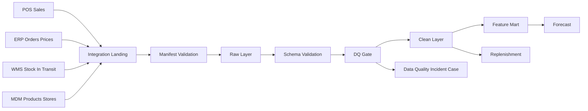

# DATA Integration Specification OPEN FNR

## 1. Назначение Документа

Документ фиксирует детальные требования к загрузке фактических операционных данных в OPEN FNR.

Этот документ дополняет:

- `INTEGRATION_STRATEGY.md` - общая стратегия интеграций;
- `DATA_GOVERNANCE.md` - владельцы данных, качество, SLA;
- `TECHNICAL_SPEC.md` - общие требования к системе;
- `PROJECT_EXECUTION_PLAN.md` - реализация по спринтам.

Фокус документа:

- фактические продажи;
- остатки в магазинах;
- остатки на складах и РЦ;
- товары в пути;
- открытые заказы;
- справочники товаров, магазинов, складов и поставщиков;
- контроль качества, SLA, повторная загрузка и audit trail.

## 2. Принципиальное Решение

Загрузка операционных данных должна быть оформлена как отдельный промышленный контур:

```text
Source Systems -> Integration Landing -> Raw Layer -> Clean Layer -> DQ Gate -> Feature/Forecast/Replenishment Marts
```

OPEN FNR не должен считать данные напрямую из продукционных таблиц ERP/WMS/POS. Все входящие данные проходят через управляемый ingestion-контур с версиями, статусами, проверками качества и возможностью повторного воспроизведения.

## 3. Источники Данных

| Домен | Источник | Тип загрузки | Частота | Критичность |
| --- | --- | --- | --- | --- |
| Продажи | POS / DWH sales mart | batch / micro-batch | ежедневно, опционально intraday | critical |
| Возвраты | POS / DWH | batch | ежедневно | high |
| Остатки магазинов | ERP / Store Inventory / WMS | snapshot | ежедневно, опционально intraday | critical |
| Остатки РЦ/складов | WMS | snapshot | ежедневно | critical |
| Товары в пути | WMS / TMS / ERP | snapshot + events | ежедневно, опционально несколько раз в день | critical |
| Открытые заказы | ERP / WMS | snapshot | ежедневно | critical |
| Приходы и поставки | WMS / ERP | facts | ежедневно | high |
| Цены | ERP / Pricing | snapshot + future intervals | ежедневно | high |
| Промо | Promo system | snapshot + status events | ежедневно / при изменении | high |
| Товары | MDM / PIM | snapshot + changes | ежедневно | critical |
| Магазины | MDM | snapshot + changes | ежедневно | critical |
| Склады/РЦ | WMS / MDM | snapshot | ежедневно | critical |
| Поставщики | ERP / MDM | snapshot | ежедневно | medium |

## 4. Обязательные Входящие Потоки

### 4.1. Фактические Продажи

Гранулярность:

```text
store_id x sku_id x business_date
```

Минимальные поля:

| Поле | Тип | Обязательность | Описание |
| --- | --- | --- | --- |
| `business_date` | date | да | дата продажи |
| `store_id` | string | да | магазин |
| `sku_id` | string | да | товар |
| `sales_qty` | decimal | да | проданное количество |
| `sales_amount` | decimal | да | сумма продаж |
| `receipt_count` | integer | желательно | количество чеков |
| `return_qty` | decimal | желательно | возвраты |
| `promo_flag` | boolean | желательно | продажа в промо |
| `source_system` | string | да | источник |
| `batch_id` | string | да | версия загрузки |

Ключевые проверки:

- нет отрицательных продаж без отдельного признака возврата;
- `store_id` и `sku_id` маппятся на MDM;
- нет дублей по ключу `business_date/store_id/sku_id/batch_id`;
- продажи приходят до forecast cutoff;
- аномальные пики не удаляются, а маркируются для DQ/forecast correction.

### 4.2. Остатки В Магазинах

Гранулярность:

```text
store_id x sku_id x snapshot_datetime
```

Минимальные поля:

| Поле | Тип | Обязательность | Описание |
| --- | --- | --- | --- |
| `snapshot_datetime` | timestamp | да | время снимка |
| `business_date` | date | да | дата бизнеса |
| `store_id` | string | да | магазин |
| `sku_id` | string | да | товар |
| `on_hand_qty` | decimal | да | физический остаток |
| `reserved_qty` | decimal | желательно | резерв |
| `available_qty` | decimal | желательно | доступный остаток |
| `stock_status` | string | желательно | normal / blocked / damaged |
| `source_system` | string | да | источник |
| `batch_id` | string | да | версия загрузки |

Ключевые проверки:

- остатки не отрицательные, кроме явно разрешённых корректировочных сценариев;
- snapshot не старше допустимого SLA;
- товар и магазин активны или имеют корректный lifecycle status;
- остаток согласуется с продажами и поставками в рамках tolerance.

### 4.3. Остатки На Складах И РЦ

Гранулярность:

```text
dc_id x sku_id x snapshot_datetime
```

Минимальные поля:

| Поле | Тип | Обязательность | Описание |
| --- | --- | --- | --- |
| `dc_id` | string | да | склад или РЦ |
| `sku_id` | string | да | товар |
| `on_hand_qty` | decimal | да | физический остаток |
| `available_qty` | decimal | да | доступно к распределению |
| `reserved_qty` | decimal | желательно | резерв |
| `quality_hold_qty` | decimal | желательно | заблокировано по качеству |
| `snapshot_datetime` | timestamp | да | время снимка |
| `batch_id` | string | да | версия загрузки |

Используется для:

- projected stock;
- replenishment;
- multi-echelon planning;
- order proposal feasibility.

### 4.4. Товары В Пути

Гранулярность:

```text
source_location_id x target_location_id x sku_id x expected_delivery_date x shipment_id
```

Минимальные поля:

| Поле | Тип | Обязательность | Описание |
| --- | --- | --- | --- |
| `shipment_id` | string | да | поставка или перемещение |
| `source_location_id` | string | да | источник |
| `target_location_id` | string | да | получатель |
| `sku_id` | string | да | товар |
| `in_transit_qty` | decimal | да | количество в пути |
| `ship_date` | date | желательно | дата отгрузки |
| `expected_delivery_date` | date | да | ожидаемая дата поставки |
| `status` | string | да | shipped / delayed / received / cancelled |
| `batch_id` | string | да | версия загрузки |

Ключевые проверки:

- ожидаемая дата поставки не раньше даты отгрузки;
- отменённые поставки не учитываются в projected stock;
- частично принятые поставки корректно уменьшают qty in transit;
- delayed status влияет на replenishment horizon.

### 4.5. Открытые Заказы

Гранулярность:

```text
order_id x order_line_id x sku_id
```

Минимальные поля:

| Поле | Тип | Обязательность | Описание |
| --- | --- | --- | --- |
| `order_id` | string | да | заказ |
| `order_line_id` | string | да | строка заказа |
| `supplier_id` | string | желательно | поставщик |
| `source_location_id` | string | желательно | склад/поставщик |
| `target_location_id` | string | да | магазин/РЦ |
| `sku_id` | string | да | товар |
| `ordered_qty` | decimal | да | заказано |
| `confirmed_qty` | decimal | желательно | подтверждено |
| `received_qty` | decimal | желательно | принято |
| `expected_delivery_date` | date | да | ожидаемая поставка |
| `status` | string | да | open / confirmed / shipped / received / cancelled |

## 5. Технические Форматы

Основной формат для больших загрузок:

```text
Parquet + manifest JSON
```

Допустимые fallback-форматы:

- CSV UTF-8 с явным schema contract;
- JSONL для малых потоков;
- API для статусов, небольших справочников и ручных корректировок.

Manifest обязателен для каждого batch:

```json
{
  "batch_id": "sales-2026-05-28-pos",
  "domain": "sales",
  "business_date": "2026-05-28",
  "source_system": "POS",
  "schema_version": "1.0",
  "file_count": 12,
  "row_count": 1250000,
  "checksum": "sha256:...",
  "created_at": "2026-05-28T02:10:00Z"
}
```

## 6. Статусы Загрузки

| Статус | Описание | Дальнейшее действие |
| --- | --- | --- |
| `waiting` | batch ожидается | мониторинг SLA |
| `loading` | batch загружается | технический мониторинг |
| `loaded` | raw загрузка завершена | запуск schema/DQ |
| `partial` | пришла часть данных | DQ warning/error |
| `failed` | загрузка не прошла | incident case |
| `accepted` | clean layer принят | доступно для feature/forecast |
| `rejected` | данные заблокированы | исправление в source или replay |

## 7. Архитектура Потока



## 8. SLA И Cutoff

| Поток | Целевой cutoff | Блокирует forecast | Блокирует replenishment |
| --- | --- | --- | --- |
| Продажи | до 02:30 | да | косвенно |
| Остатки магазинов | до 02:45 | да | да |
| Остатки РЦ | до 03:00 | нет | да |
| Товары в пути | до 03:00 | нет | да |
| Открытые заказы | до 03:00 | нет | да |
| Цены | до 03:00 | да | да |
| MDM | до 01:30 | да | да |
| Промо | до promo forecast cutoff | да для promo | да для promo order impact |

## 9. Data Quality Gate

Каждая загрузка проходит уровни:

1. manifest validation;
2. schema validation;
3. row count validation;
4. duplicate validation;
5. referential integrity against MDM;
6. freshness SLA;
7. business rule validation;
8. acceptance or incident creation.

Critical ошибки:

- нет продаж за ключевой регион;
- нет остатков магазинов;
- нет MDM mapping для значимого числа строк;
- нет цен для активной матрицы;
- товары в пути не пришли перед replenishment cutoff.

## 10. Повторная Загрузка И Идемпотентность

Повторная загрузка должна быть безопасной:

- один `batch_id` не создаёт дубли;
- новый batch той же даты создаёт новую версию;
- clean layer выбирает последнюю accepted-версию;
- все replay фиксируются в audit;
- downstream feature/forecast/replenishment получают ссылки на batch ids.

## 11. Интеграционные API

Минимальные endpoint-контракты:

| Endpoint | Назначение |
| --- | --- |
| `POST /integration/batches` | зарегистрировать batch manifest |
| `GET /integration/batches/{batch_id}` | получить статус batch |
| `POST /integration/batches/{batch_id}/accept` | принять clean batch |
| `POST /integration/batches/{batch_id}/reject` | отклонить batch |
| `GET /integration/domains/{domain}/status` | статус домена за дату |
| `GET /integration/reject-reports/{batch_id}` | отчёт по ошибочным строкам |

## 12. Наблюдаемость

Метрики:

- batch latency;
- rows loaded;
- rows rejected;
- DQ error rate;
- missing domains;
- replay count;
- source delay;
- time to accepted.

Алерты:

- продажи не пришли до cutoff;
- остатки магазинов не пришли до cutoff;
- товары в пути не пришли до replenishment cutoff;
- DQ critical выше threshold;
- source прислал batch с неверной schema version.

## 13. Ответственность

| Зона | Ответственный |
| --- | --- |
| Source extract | владелец внешней системы |
| Landing delivery | Integration Team |
| Manifest/schema validation | Data Engineering |
| DQ business rules | Data Owner + Data Engineering |
| Incident resolution | Data Owner |
| Replay approval | Data Owner + Platform Owner |
| Downstream acceptance | Forecast Owner / Replenishment Owner |

## 14. Связанные Бизнес-Процессы

Должны быть реализованы через OPEN FNR Process Engine:

- `data_load_monitoring_process`;
- `dq_check_process`;
- `data_load_incident_case`;
- `data_quality_incident_case`;
- будущий `integration_replay_approval_process`;
- будущий `source_delay_escalation_process`.

## 15. Критерии Приёмки Интеграционного Контура

- для продаж, остатков, товаров в пути и открытых заказов есть утверждённые schema contracts;
- каждый batch имеет manifest, checksum, row count и status;
- повторная загрузка не создаёт дублей;
- DQ critical создаёт incident case;
- accepted batch доступен downstream;
- прогноз и пополнение хранят lineage до исходных batch ids;
- SLA и source delays видны в UI/monitoring.
