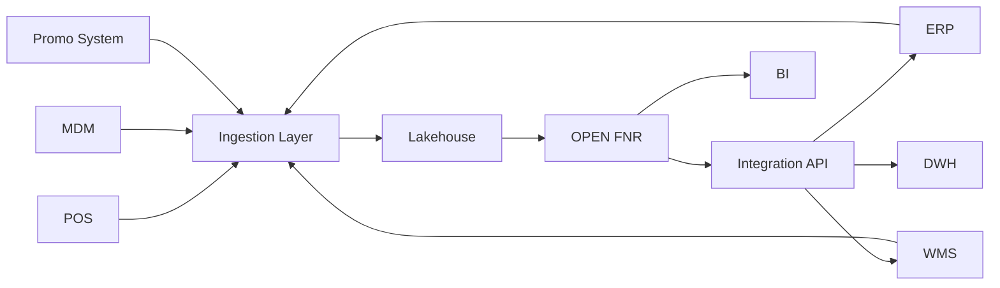

# Integration Strategy OPEN FNR

## 1. Назначение

Документ описывает стратегию интеграций OPEN FNR с корпоративными системами: ERP, WMS, DWH, POS, MDM, промо-системой, BI и внешними источниками.

Детальные требования к загрузке фактических продаж, остатков, товаров в пути, открытых заказов и MDM вынесены в отдельный документ [DATA_INTEGRATION_SPEC.md](DATA_INTEGRATION_SPEC.md).

## 2. Интеграционные Принципы

- source of truth остается в master-системах;
- OPEN FNR не заменяет ERP/WMS/MDM;
- все интеграции версионируются;
- exports идемпотентны;
- каждое сообщение имеет correlation id;
- ошибки интеграции создают исключения;
- повторная отправка не должна создавать дубли;
- batch-интеграции допускаются для ежедневного контура;
- API применяются для интерактивных запросов и статусов.

## 3. Карта Интеграций

| Система | Направление | Данные |
| --- | --- | --- |
| POS | inbound | продажи, возвраты, чеки |
| ERP | inbound/outbound | цены, заказы, поставщики, статусы |
| WMS | inbound/outbound | остатки РЦ, in-transit, поставки, transfers |
| DWH | inbound/outbound | исторические факты, витрины, прогнозы |
| MDM/PIM | inbound | товары, магазины, иерархии |
| Promo System | inbound/outbound | промо-план, статусы промо |
| Planogram / Shelf System | inbound | место выкладки, мощность выкладки, shelf capacity |
| TMS / Capacity Source | inbound | транспортные ограничения, capacity, delivery windows |
| Supplier Portal / SFTP | inbound/outbound | forecast sharing, supplier confirmations, supply exceptions |
| Store App | inbound/outbound | store tasks, display confirmation, stock-out feedback |
| BI | outbound | агрегаты, KPI, витрины |
| External | inbound | календарь, погода, события |

## 4. Интеграционная Архитектура



## 5. Форматы

Допустимые форматы:

- Parquet для больших batch-данных;
- JSON для API;
- CSV только как временный или fallback-формат;
- OpenAPI для контрактов API;
- Avro/Protobuf опционально для event streaming.

## 6. API Strategy

Все API должны иметь:

- OpenAPI specification;
- version prefix;
- authentication;
- request id;
- idempotency key для write operations;
- pagination;
- error schema;
- audit log.

Пример:

```text
/api/v1/forecast
/api/v1/replenishment/proposals
/api/v1/process/tasks
/api/v1/integration/exports
```

## 7. Batch Strategy

Для больших данных применяются batch-интеграции:

- sales facts;
- stock facts;
- prices;
- promo plans;
- MDM snapshots;
- forecast exports;
- order proposal exports.

Каждый batch должен иметь:

- business date;
- file/table version;
- row count;
- checksum;
- load status;
- reject report.

## 8. Интеграция Заказов

Order proposals передаются в ERP/WMS только после:

- проверки DQ;
- расчета projected stock;
- проверки constraints;
- согласования или auto-approval;
- присвоения версии;
- фиксации audit trail.

Статусы:

- `prepared`;
- `sent`;
- `accepted`;
- `rejected`;
- `failed`;
- `cancelled`;
- `superseded`.

## 9. Error Handling

| Ошибка | Действие |
| --- | --- |
| source unavailable | retry + alert |
| schema mismatch | block load |
| duplicate batch | idempotent skip |
| partial load | reject + incident |
| ERP reject | export failure exception |
| timeout | retry with backoff |

## 10. SLA Интеграций

| Поток | SLA |
| --- | --- |
| Продажи | до D+1 расчета |
| Остатки | до replenishment |
| Промо | до promo forecast |
| MDM | ежедневно до расчета |
| Заказы outbound | до cutoff ERP/WMS |
| Статусы заказов | в течение операционного дня |

## 11. Критерии Приемки

- все интеграции имеют контракт;
- критичные потоки мониторятся;
- write operations идемпотентны;
- ошибки создают исключения;
- экспорт заказов подтверждается статусом;
- DWH получает прогнозы и заказы;
- lineage сохраняет источник данных.
