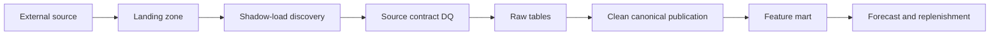
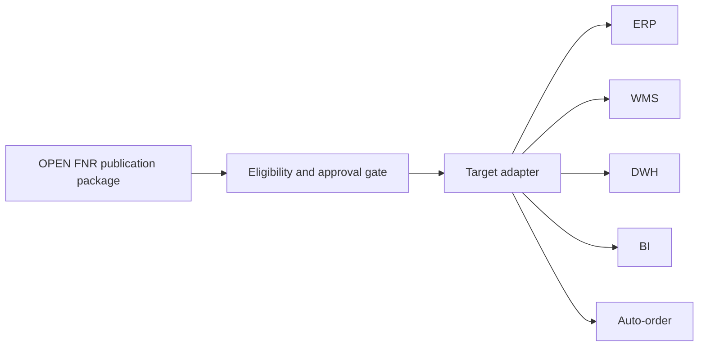

# Integration Strategy OPEN FNR

## 0. Назначение

Документ фиксирует стратегию интеграций OPEN FNR с корпоративными системами торговой сети: POS, ERP, WMS, DWH, MDM/PIM, промо-системой, BI, TMS, supplier portal и store app.

OPEN FNR не заменяет мастер-системы. Система принимает факты, справочники и планы, рассчитывает прогнозы и предложения пополнения, а затем публикует управляемые результаты во внешние контуры.

## 1. Текущий Статус Реализации

| Контур | Статус | Реализация |
| --- | --- | --- |
| Inbound source contracts | implemented | `apps/backend/open_fnr_api/ingestion.py`, `data_contracts.py` |
| Local file-drop adapter | implemented | `apps/backend/open_fnr_api/source_adapters.py` |
| Manifest sidecar | implemented | `manifest.json` рядом с source-файлами, не считается data-файлом |
| Shadow-load gate | implemented | `/data/ingestion/shadow-load/run` |
| Source contract DQ | implemented | `/data-quality/source-contract-runs` |
| Clean publication | implemented | `dry_run`, `mock_run`, ClickHouse HTTP execution |
| Feature mart gate | implemented | `/feature-mart/build-plans`, `/feature-mart/build-runs` |
| Daily pipeline gate | implemented | `/pipeline/daily-gate/run` |
| Outbound publication | implemented | mock fallback + configurable HTTP target adapter |

## 2. Интеграционные Принципы

- Все IP-адреса, host names, порты и external URLs задаются только через конфигурацию.
- Все write operations идемпотентны и используют `idempotency_key`.
- Каждый inbound batch имеет `business_date`, contract version, row count, checksum, source batch id и audit trail.
- Каждый outbound package имеет package id, target, object ids, payload version, idempotency key, retry count и response status.
- Ошибки интеграции создают исключения и не должны молча пропускаться.
- Mock-режим допустим только для DEV/TEST и пилотных репетиций без реальных систем.
- STAGE/PROD должны использовать реальные target URLs или явно утвержденный degraded mode.

## 3. Карта Интеграций

| Система | Направление | Данные | Канал |
| --- | --- | --- | --- |
| POS | inbound | продажи, возвраты, чеки | file-drop/API |
| WMS | inbound | остатки, открытые заказы, товары в пути | file-drop/API |
| ERP | inbound | цены, поставщики, статусы заказов | file-drop/API |
| ERP | outbound | заказы поставщикам, финальные заказы | HTTP API/file export |
| DWH | inbound/outbound | исторические факты, витрины, forecast exports | file/API/ClickHouse |
| MDM/PIM | inbound | товары, магазины, иерархии, lifecycle | file-drop/API |
| Promo System | inbound/outbound | промо-планы, статусы, результаты прогноза | file/API |
| WMS | outbound | финальные заказы и распределение | HTTP API/file export |
| BI/Superset | outbound/read | KPI, forecast accuracy, service level | ClickHouse marts |
| TMS | inbound/outbound | capacity, delivery windows, moved orders | API/file |
| Supplier Portal | inbound/outbound | forecast sharing, confirmations | API/CSV |
| Store App | inbound/outbound | store tasks, display confirmation, stock count | API |

## 4. Inbound Поток



### 4.1 Landing

Стандартный путь:

```text
{landing_root}/{source_system}/{contract_name}/business_date=YYYY-MM-DD/{data_file}
{landing_root}/{source_system}/{contract_name}/business_date=YYYY-MM-DD/manifest.json
```

`manifest.json` является sidecar metadata и не должен попадать в список data files.

### 4.2 Source DQ

Минимальные проверки:

- наличие файлов по всем обязательным контрактам;
- размер файла больше нуля;
- schema validation;
- checksum;
- row count;
- required keys;
- referential integrity;
- freshness;
- duplicate batch detection.

## 5. Clean Publication

Clean publication преобразует raw-слой в канонические таблицы:

- `open_fnr.clean_sales_daily`;
- `open_fnr.clean_stock_snapshot_daily`;
- `open_fnr.clean_open_orders`;
- `open_fnr.clean_in_transit`;
- `open_fnr.clean_prices`;
- `open_fnr.clean_promo_plans`.

Поддерживаемые режимы:

| Mode | Назначение |
| --- | --- |
| `dry_run` | Проверить план без выполнения SQL |
| `mock_run` | Вернуть SQL statements без подключения к ClickHouse |
| `clickhouse` | Выполнить SQL через ClickHouse HTTP interface |

## 6. Outbound Publication

Outbound publication публикует прогнозы и финальные заказы во внешние контуры.



### 6.1 Реализованный HTTP Adapter

Если для target задан URL, OPEN FNR отправляет `POST` с JSON payload:

- `package_id`;
- `target`;
- `idempotency_key`;
- `actor`;
- `service_account`;
- `items`.

Заголовки:

- `Content-Type: application/json; charset=utf-8`;
- `Idempotency-Key`;
- `X-Service-Account`.

Если URL не задан, используется local mock fallback для DEV/TEST.

### 6.2 Конфигурация Target URLs

| Env | Назначение |
| --- | --- |
| `OPEN_FNR_ERP_EXPORT_URL` | ERP outbound endpoint |
| `OPEN_FNR_WMS_EXPORT_URL` | WMS outbound endpoint |
| `OPEN_FNR_DWH_EXPORT_URL` | DWH outbound endpoint |
| `OPEN_FNR_BI_EXPORT_URL` | BI outbound endpoint |
| `OPEN_FNR_AUTO_ORDER_EXPORT_URL` | Auto-order outbound endpoint |
| `OPEN_FNR_PUBLICATION_HTTP_TIMEOUT_SECONDS` | HTTP timeout |

## 7. Idempotency

Правила:

- повтор с тем же `idempotency_key` не должен создавать дубль;
- retry failed package увеличивает `retry_count`;
- duplicate package возвращается как duplicate response;
- внешняя система тоже должна хранить idempotency key.

## 8. Security

Минимальные требования:

- service account `svc-open-fnr-export` для outbound;
- RBAC для ручного запуска send/retry;
- audit event на send/retry;
- secrets только через env/secret store;
- object-level access для регионов и категорий.

## 9. Error Handling

| Ошибка | Реакция |
| --- | --- |
| missing source files | recovery task, resend request |
| DQ blocker | block clean publication |
| ClickHouse unavailable | HTTP 503, incident |
| target unavailable | HTTP 503, retry process |
| unapproved final order | HTTP 409 |
| wrong service account | HTTP 403 |
| duplicate idempotency key | duplicate response |

## 10. Acceptance Criteria

- Inbound source contracts покрывают POS/WMS/ERP/MDM/PROMO.
- Shadow-load и DQ gates создают понятный status для daily pipeline.
- Clean publication поддерживает dry-run, mock-run и ClickHouse execution.
- Outbound publication поддерживает HTTP target URLs через env.
- Все адреса и порты вынесены в конфигурацию.
- Audit включен по умолчанию и может быть отключен настройкой.
- DEV/TEST/STAGE compose config валиден.
- Regression tests проходят.
