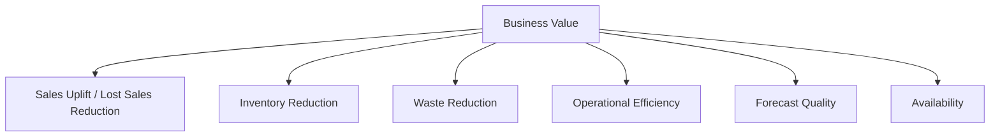

# KPI И Business Value Framework OPEN FNR

## 1. Назначение

Документ фиксирует, как измеряется качество OPEN FNR и бизнес-эффект от внедрения.

## 2. KPI-Дерево



## 3. Метрики Прогноза

| Метрика | Формула | Назначение |
| --- | --- | --- |
| WAPE | `sum(abs(fact - forecast)) / sum(fact)` | основная метрика приемки |
| Bias | `sum(forecast - fact) / sum(fact)` | систематическое завышение/занижение |
| MAPE | `avg(abs(fact - forecast) / fact)` | относительная ошибка на стабильных рядах |
| RMSE | `sqrt(avg((fact - forecast)^2))` | крупные ошибки |
| Forecast Value Added | сравнение ML/final/baseline | польза модели и корректировок |

## 4. Метрики Пополнения

| Метрика | Назначение |
| --- | --- |
| Service Level | доступность товара для покупателя |
| Out-of-stock Rate | доля дней/SKU без товара |
| Lost Sales Estimate | оценка потерянных продаж |
| Overstock Value | стоимость избыточного запаса |
| Days of Supply | дни запаса |
| Inventory Turnover | оборачиваемость |
| Order Fill Rate | исполнение заказа поставщиком/РЦ |
| Proposal Acceptance Rate | доля принятых предложений заказа |
| Manual Adjustment Rate | доля ручных корректировок |

## 5. Метрики Fresh

| Метрика | Назначение |
| --- | --- |
| Waste Qty | количество списаний |
| Waste Value | стоимость списаний |
| Projected Spoilage Accuracy | точность прогноза списаний |
| Fresh Availability | доступность fresh |
| Fresh Lost Sales | потерянные продажи fresh |

## 6. Метрики Промо

| Метрика | Назначение |
| --- | --- |
| Promo WAPE | точность промо-прогноза |
| Uplift Accuracy | точность uplift |
| Promo Stock-out Rate | дефицит во время промо |
| Post-Promo Overstock | остаток после промо |
| Promo Supply Readiness | готовность товара до старта |
| Promo Cannibalization Indicator | признак каннибализации |

## 7. Метрики Процессов

| Метрика | Назначение |
| --- | --- |
| SLA Compliance | соблюдение времени расчета |
| Exception Resolution Time | скорость закрытия исключений |
| Auto-Approval Rate | доля автоматических согласований |
| Rework Rate | доля повторных корректировок |
| Export Success Rate | успешность публикаций |
| Data Quality Failure Rate | частота проблем данных |

## 8. Business Value Calculation

### 8.1. Lost Sales Reduction

```text
lost_sales_reduction_value
    = baseline_lost_sales_value - actual_lost_sales_value
```

### 8.2. Overstock Reduction

```text
overstock_reduction_value
    = baseline_overstock_value - actual_overstock_value
```

### 8.3. Waste Reduction

```text
waste_reduction_value
    = baseline_waste_value - actual_waste_value
```

### 8.4. Operational Efficiency

```text
planner_time_saved_value
    = saved_hours * average_hour_cost
```

### 8.5. Total Value

```text
total_business_value
    = lost_sales_reduction
    + overstock_reduction
    + waste_reduction
    + planner_time_saved
    - operating_cost
```

## 9. KPI By Level

| Уровень | Метрики |
| --- | --- |
| Executive | total value, service level, inventory value, waste |
| Category | WAPE, Bias, promo uplift, overstock |
| Store | stock-out, availability, days of supply |
| SKU | forecast error, order accuracy, lifecycle issues |
| Process | SLA, exceptions, manual adjustments |
| Model | drift, fallback rate, model WAPE |

## 10. Приемочные KPI

Для пилота:

- WAPE лучше baseline;
- Bias в согласованном диапазоне;
- предложения заказов объяснимы;
- ручная корректировка ниже целевого порога;
- критичные исключения закрываются в SLA;
- пользователи подтверждают пригодность процесса.

Для промышленной версии:

- ежедневный расчет в SLA;
- снижение out-of-stock;
- снижение overstock;
- снижение fresh waste;
- стабильный proposal acceptance rate;
- измеримый business value.

## 11. Принципы Измерения

- всегда сравнивать с baseline;
- отделять ML-прогноз от final forecast;
- измерять эффект ручных корректировок;
- считать регулярный и промо-прогноз отдельно;
- считать fresh отдельно;
- фиксировать методику расчета до пилота;
- не менять формулы KPI без версии и согласования.

