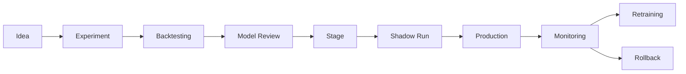

# ML Governance OPEN FNR

## 1. Назначение

Документ описывает управление ML-моделями: разработку, валидацию, approval, публикацию, monitoring, drift, retraining и rollback.

## 2. Область

ML Governance распространяется на:

- regular forecast models;
- promo uplift models;
- fresh demand models;
- cold-start models;
- reconciliation methods;
- spoilage estimation;
- risk scoring;
- fallback/baseline models.

## 3. Принципы

- модель не попадает в production без backtesting;
- baseline всегда сохраняется;
- production forecast версионируется;
- модель имеет владельца;
- модель имеет метрики допуска;
- drift мониторится;
- rollback должен быть возможен;
- ручные корректировки не затирают ML-прогноз.

## 4. Model Lifecycle

## 5. Model Registry

Для каждой модели хранится:

- model id;
- version;
- owner;
- training data version;
- feature version;
- parameters;
- metrics;
- approval status;
- deployment date;
- rollback candidate;
- artifact location.

Инструмент: MLflow.

## 6. Approval Criteria

Модель допускается к production, если:

- WAPE лучше baseline;
- Bias в допустимом диапазоне;
- нет деградации на critical categories;
- backtesting покрывает сезонность;
- есть fallback;
- inference укладывается в SLA;
- результаты объяснимы;
- есть monitoring plan.

## 7. Monitoring

| Область | Метрики |
| --- | --- |
| Accuracy | WAPE, Bias, RMSE, MAPE |
| Drift | feature drift, target drift |
| Stability | forecast volatility, extreme values |
| Operations | runtime, failed partitions, fallback rate |
| Business | service level, lost sales, overstock |

## 8. Drift Policy

| Уровень | Действие |
| --- | --- |
| Low | log |
| Medium | alert DS |
| High | investigation |
| Critical | freeze model or rollback |

## 9. Retraining Policy

Retraining запускается:

- по расписанию;
- при drift;
- при деградации WAPE/Bias;
- при изменении ассортимента;
- при изменении промо-механик;
- после major data correction.

## 10. Rollback

Rollback возможен на:

- предыдущую production model;
- baseline;
- category fallback;
- last successful forecast.

Rollback должен фиксироваться в audit trail.

## 11. Explainability

Модель должна предоставлять:

- feature importance;
- decomposition regular/promo;
- quality flags;
- fallback reason;
- anomaly reason;
- confidence/quantiles, если доступны.

## 12. Критерии Приемки

- MLflow registry используется;
- production models имеют approval;
- backtesting документирован;
- monitoring доступен;
- drift alerts работают;
- rollback протестирован;
- модели совместимы с SLA.

