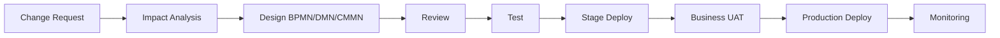

# Process Engine Governance OPEN FNR

## 1. Назначение

Документ описывает управление подпроектом **OPEN FNR Process Engine**: BPMN/DMN/CMMN-моделями, версиями процессов, правилами, релизами, тестированием и ответственностью.

## 2. Принятое Решение

| Параметр | Решение |
| --- | --- |
| Подпроект | OPEN FNR Process Engine |
| Engine | Flowable OSS |
| Процессы | BPMN 2.0 |
| Правила | DMN |
| Исключения/case management | CMMN |
| Лицензия | Apache-2.0 |
| Process DB | PostgreSQL |

## 3. Принципы

- бизнес-процессы не хардкодятся в UI/backend;
- UI получает статусы и доступные действия из Process Engine;
- каждая модель процесса версионируется;
- каждое правило имеет владельца;
- каждое изменение проходит тестирование;
- production deployment BPMN/DMN/CMMN идет через controlled release;
- process audit является обязательным.

## 4. Область Process Engine

В Process Engine входят:

- Promo Planning Process;
- Forecast Review Process;
- Replenishment Approval Process;
- Exception Resolution Process;
- Manual Adjustment Process;
- Fresh Order Review Process;
- SKU Phase-In/Phase-Out Process;
- Publication Process;
- Data Quality Incident Process.

Не входят:

- Spark jobs;
- ML inference;
- ClickHouse inserts;
- feature engineering;
- backtesting;
- тяжелая оптимизация заказов.

## 5. Владение

| Роль | Ответственность |
| --- | --- |
| Process Owner | бизнес-правильность процесса |
| BPM Analyst | BPMN/CMMN-модель |
| Rules Owner | DMN-правила |
| Backend Owner | интеграция с доменными сервисами |
| QA Owner | тестирование процессов |
| Release Manager | публикация process definitions |
| Administrator | роли, deployment, доступы |

## 6. Версионирование

Версионируются:

- BPMN diagrams;
- DMN decision tables;
- CMMN case models;
- process deployment package;
- process instance;
- user tasks;
- decision result;
- migration scripts;
- release notes.

Версия процесса должна иметь формат:

```text
process_name.major.minor.patch
```

Пример:

```text
promo_planning.1.3.0
```

## 7. Жизненный Цикл Изменения Процесса



## 8. Change Request

Каждое изменение процесса должно содержать:

- бизнес-причину;
- affected processes;
- affected roles;
- affected UI screens;
- affected APIs;
- affected rules;
- backward compatibility;
- migration approach;
- rollback approach.

## 9. DMN Governance

DMN-таблицы должны использоваться для:

- обязательности полей промо;
- классификации риска;
- auto-approval заказов;
- publication eligibility;
- routing исключений;
- severity;
- SLA/deadline rules.

Каждая DMN-таблица должна иметь:

- владельца;
- описание входов;
- описание выходов;
- тест-кейсы;
- версию;
- дату публикации.

## 10. CMMN Governance

CMMN используется для исключений, которые не являются линейными процессами:

- Promo Shortage Case;
- DC Shortage Case;
- Supplier Constraint Case;
- High Spoilage Risk Case;
- Forecast Anomaly Case;
- Data Quality Incident Case;
- Export Failure Case.

## 11. Тестирование Процессов

Обязательные тесты:

- unit-тесты DMN;
- BPMN path tests;
- CMMN lifecycle tests;
- integration tests с backend services;
- UI E2E tests;
- audit tests;
- migration tests;
- rollback tests.

## 12. Production Rules

В production запрещено:

- редактировать процесс без версии;
- менять DMN без тестов;
- удалять process definition, если есть активные instances;
- менять значения статусов без миграции;
- публиковать процесс без release notes.

## 13. Критерии Приемки

- ключевые процессы исполняются через Flowable;
- UI использует process state из engine;
- DMN покрывает обязательные бизнес-правила промо;
- CMMN покрывает ключевые исключения;
- все изменения версионируются;
- process audit доступен;
- rollback documented.

