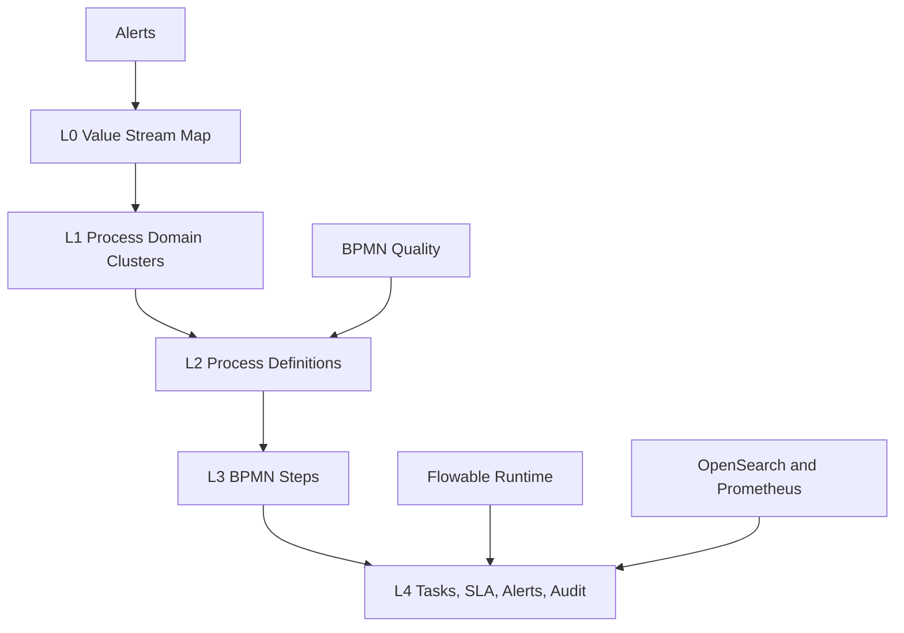

# OPEN FNR Process Navigator Map Specification

Status: design accepted, backend contract started.
Date: 2026-05-29.
Module name: `OPEN FNR Process Navigator`.

## 1. Purpose

OPEN FNR already has Process Engine artifacts, task inbox, process deployment, runtime strategy and BPMN cognitive quality gates. The missing layer is an executive and operational navigation module that shows the whole business-process landscape as a map: healthy areas, degraded areas, blocked gates, current tasks, SLA breaches and model/process-quality challenges.

The module must let a user move from a high-level value stream to a concrete BPMN step, task, owner, SLA and audit trail in the same way a map UI moves from country to city to street.

## 2. Existing Project Mechanisms

| Mechanism | Existing implementation | Gap |
| --- | --- | --- |
| Process Engine | Flowable OSS boundary, BPMN/DMN/CMMN artifacts, `/process/*` API | No map-level navigation |
| Task inbox | UI section `Process Engine Task Inbox` | Task-centric, not process-landscape-centric |
| Process deployment | `/process-deployment/packages/current` and Flowable upload/dry-run | Artifact-centric, no business heatmap |
| Runtime strategy | BPMN runtime, DMN/CMMN governed artifacts | Not visualized as execution layers |
| BPMN quality | `/process-deployment/packages/current/bpmn-quality` | Quality challenges are not shown on a process map |
| Observability | OpenSearch/Prometheus/Alertmanager scope | Alerts are not tied to process topology |

## 3. External Practice And Tooling Baseline

| Area | Finding | Decision for OPEN FNR |
| --- | --- | --- |
| Process execution | Flowable exposes REST APIs and history services for process instances, tasks and audit-like history | Use Flowable REST/history as the production runtime source when live runtime is connected |
| Standard notation | BPMN 2.0.2 is the official process-model standard maintained by OMG | Keep BPMN as the canonical executable process notation |
| Diagram rendering | bpmn-js is a browser BPMN rendering/modeling toolkit | Add bpmn-js viewer in a later UI sprint for exact BPMN diagram rendering |
| Zoomable graph/map | Apache ECharts supports graph/SVG map interactions with roam/pan/zoom and event handling | Use Apache ECharts as first implementation because it is already accepted in the stack |
| Drill-down UI | Semantic zoom and graph aggregation are established patterns for large topology views | Implement domain cluster -> process -> BPMN step -> task/audit semantic zoom |

Sources:

- Flowable REST API: https://www.flowable.com/open-source/docs/bpmn/ch14-REST
- Flowable History: https://www.flowable.com/open-source/docs/bpmn/ch10-History
- OMG BPMN 2.0.2: https://www.omg.org/spec/BPMN/2.0.2
- bpmn-js: https://bpmn.io/toolkit/bpmn-js
- Apache ECharts events and graph interactions: https://echarts.apache.org/handbook/en/concepts/event/
- Apache ECharts SVG map roam: https://echarts.apache.org/handbook/en/how-to/component-types/geo/svg-base-map/

## 4. Product Concept

The first screen is not a static diagram. It is an operational control map:

- domain clusters: Data, Forecast, Promo, Replenishment, Store, Supplier, Security, Release;
- color/status: healthy, attention, blocked;
- overlays: SLA breach, BPMN quality challenge, data-quality blocker, model drift, integration failure;
- drill-down: click cluster, process, BPMN step, task, audit event;
- navigation: pan, zoom, search, filters, minimap and breadcrumbs.

## 5. Semantic Zoom Model

| Zoom | Name | What user sees | Backend data |
| --- | --- | --- | --- |
| 0 | Domain clusters | Large process domains with health color and alert count | grouped process definitions and alerts |
| 1 | Process definitions | BPMN/DMN/CMMN artifacts grouped under domain | process registry, owners, artifact types |
| 2 | Runtime overlay | process instances, open tasks, SLA and integration alerts | Flowable runtime/tasks/history, OpenSearch, Alertmanager |
| 3 | BPMN steps | selected BPMN decomposes into start, tasks, gateways, end events | parsed BPMN graph |
| 4 | Task and audit timeline | selected step shows task, role, SLA, action history, linked CMMN case | Process Engine task API and audit/history |

## 6. Backend Contract

Initial backend API is implemented as a stable local contract:

| Endpoint | Purpose |
| --- | --- |
| `GET /process-navigator/map?zoom=0..4` | Return semantic map nodes and edges |
| `GET /process-navigator/alerts` | Return quality/SLA/process alerts linked to process keys |
| `GET /process-navigator/processes/{process_key}/drilldown` | Return BPMN graph for selected process |

Current data sources:

- `PROCESS_DEFINITIONS` from `process_engine.py`;
- `TASKS` and `AUDIT_EVENTS` from `process_engine.py`;
- process artifacts from `settings.process_artifacts_root_path`;
- BPMN quality issues from `build_bpmn_quality_report()`.

Production data-source evolution:

| Stage | Source |
| --- | --- |
| DEV | local artifacts and in-memory process fixtures |
| TEST/STAGE | Flowable REST, PostgreSQL process repository, OpenSearch, Prometheus |
| PROD | Flowable runtime/history, PostgreSQL audit/process DB, OpenSearch logs, Alertmanager alerts |

## 7. UI Requirements

### 7.1. Main Screen

The Process Navigator must become a separate UI module and route:

- route: `#/process-navigator`;
- top-level navigation item: `Process Navigator`;
- default view: zoomable process map;
- right panel: selected node details;
- bottom panel: alerts, tasks and audit timeline;
- global filters: domain, owner role, severity, artifact type, SLA status, business date, environment.

### 7.2. Interactions

| Interaction | Expected behavior |
| --- | --- |
| Pan | User can move across process landscape |
| Zoom in | Domain cluster expands to processes, then BPMN steps |
| Zoom out | Detailed nodes aggregate back to process/domain |
| Click process | Open detail panel with owner, artifact, runtime strategy, alerts |
| Click BPMN step | Show step type, role/SLA challenge, current tasks |
| Click alert | Navigate to affected process/step and recommended action |
| Search | Find process, task, business key, owner or alert |
| Filter | Hide/show domains, severity and status |

### 7.3. Visual Rules

| Status | Meaning |
| --- | --- |
| Healthy | No blocker or open escalation |
| Attention | Warning, cognitive challenge or escalated task exists |
| Blocked | Blocker prevents release, publication or production gate |

The visual concept must stay aligned with the project theme: VSCode-like professional UI and noble red accent for blockers/critical attention. The UI must not depend on hardcoded endpoints; it must use central frontend service configuration.

## 8. Alert And Nonconformity Model

| Alert type | Source | Example |
| --- | --- | --- |
| BPMN quality blocker | BPMN cognitive quality gate | dead-end path, invalid sequence flow |
| BPMN cognitive challenge | BPMN cognitive quality gate | human task needs role/SLA/audit confirmation |
| SLA breach | Process Engine / Flowable | escalated task or missed cutoff |
| Source data breach | Source SLA gate | POS late or WMS incomplete |
| Model drift | ML governance | WAPE drift or fallback spike |
| Integration failure | Integration/export pipeline | ERP export retry exceeded |
| Security violation | Security/audit | denied object-level access |

## 9. Process Quality Challenge View

The module must not only show technical failures. It must actively challenge business-process quality:

- Is there a clear owner for every human task?
- Is there a measurable SLA?
- Is there a visible audit event or engine listener?
- Does every gateway have meaningful alternatives?
- Is every business exception routable to a CMMN case?
- Can a blocked process recover without developer intervention?
- Is the process aligned with retail best practice for forecast, replenishment, promo, fresh and supplier collaboration?

This challenge view is mandatory before pilot and production release.

## 10. Technology Decision

| Layer | Technology | Reason |
| --- | --- | --- |
| Runtime engine | Flowable OSS | Already accepted, self-hosted, BPMN runtime |
| Backend API | FastAPI | Existing backend stack |
| Process repository | PostgreSQL | Existing production-ready process/audit storage target |
| Process map rendering | Apache ECharts graph/SVG map | Already accepted stack, supports interactive graph/map patterns |
| BPMN exact viewer | bpmn-js | Browser BPMN rendering toolkit for later drill-down sprint |
| Logs and search | OpenSearch | Existing self-hosted log/search stack |
| Metrics/alerts | Prometheus, Alertmanager, OpenTelemetry | Existing observability stack |

No proprietary BPM suite, SaaS process miner or incompatible-license dependency is required.

## 11. Implementation Sprints

| Sprint | Scope | Deliverables |
| --- | --- | --- |
| PN-1 Backend Map Contract | process map, alerts, BPMN drill-down | `process_navigator.py`, API tests |
| PN-2 UI Process Navigator Shell | route, map canvas, filters, detail panel | React route, ECharts graph, UI tests |
| PN-3 Runtime Overlay | Flowable task/instance/history integration | live process status, SLA overlay, integration tests |
| PN-4 Alert Correlation | Prometheus/OpenSearch/Process Engine correlation | alert-to-process linking, performance tests |
| PN-5 BPMN Exact Viewer | bpmn-js diagram panel | BPMN viewer, visual regression tests |
| PN-6 Production Hardening | RBAC, object-level access, load, audit, reports | security/load/E2E test reports |

## 12. Tests

| Test group | Checks |
| --- | --- |
| Backend API | zoom levels, domain grouping, alert generation, BPMN drill-down |
| BPMN process | every process has owner/SLA/audit challenge result |
| UI smoke | map route loads, controls visible, no blank canvas |
| UI E2E | zoom from domain to BPMN, click alert, open task, inspect audit |
| Visual regression | desktop and mobile map screenshots |
| Accessibility | keyboard navigation, focus states, contrast |
| Performance | map response latency, ECharts render time, alert burst |
| Security | RBAC by role/domain, denied process details, audit |

## 13. Acceptance Criteria

- Business can answer in one screen: what process is broken, who owns it, why it matters and what action is next.
- Every alert links to process key, domain, owner, source and recommended action.
- Drill-down reaches BPMN steps for executable processes.
- Process quality challenges are visible, not hidden in test logs.
- The module works without hardcoded IP addresses, ports or service URLs.
- The module is compatible with Apache 2 project distribution.

## 14. Current Implementation Snapshot

Implemented in this checkpoint:

- backend module `apps/backend/open_fnr_api/process_navigator.py`;
- `/process-navigator/map`;
- `/process-navigator/alerts`;
- `/process-navigator/processes/{process_key}/drilldown`;
- backend tests `tests/backend/test_process_navigator.py`.

Next implementation step:

- add UI route `#/process-navigator` with ECharts semantic zoom and alert detail panel.
