# OPEN FNR Process Navigator Map — Specification Supplement 1

Status: Mandatory addendum for implementation planning
Date: 2026-05-29
Parent document: PROCESS_NAVIGATOR_MAP_SPEC.md
Precedence: this supplement takes precedence over the parent document for topics it covers.

## 1. Purpose and Scope

Этот документ дополняет `PROCESS_NAVIGATOR_MAP_SPEC.md` по темам, которые стали обязательными после анализа `TECHNICAL_SPEC_SUPPLEMENT_1.md`, текущего состояния проекта и требований к промышленному управлению бизнес-процессами OPEN FNR.

Дополнение фиксирует требования к Process Navigator как к операционной карте процессов, которая показывает не только статус процесса, но и соответствие фактического исполнения модели, производительность, причинно-следственные связи алертов, версии процессов, окружение, исторические снимки, RACI, инфраструктурные зависимости, регулярную отчетность, доступность UI и недостающие спринты Supplement 1.

Границы дополнения:

| Область | Решение |
|---|---|
| Runtime BPMN | BPMN-артефакты размещаются в `processes/` и исполняются через Flowable OSS |
| DMN/CMMN | DMN и CMMN остаются управляемыми артефактами на API-уровне до отдельного утверждения runtime adapter |
| Сеть и окружения | IP-адреса, порты, hostnames и service URLs не хардкодятся; используются переменные окружения и централизованная конфигурация |
| Лицензии | Допустимы только self-hosted open-source инструменты, совместимые с Apache License 2.0 |
| UI | Process Navigator остается частью существующего React-приложения и использует Apache ECharts для карты процессов |

## 2. Conformance Checking

### 2.1. Purpose

Process Navigator должен сравнивать модель процесса "как спроектировано" с фактическим журналом исполнения "как выполнено". Это закрывает пробел родительской спецификации: статус процесса показывается, но не проверяется, что исполнение действительно прошло обязательные шаги BPMN в допустимой последовательности.

### 2.2. Requirements

- Для каждого executable BPMN process definition рассчитывается conformance score от `0` до `100`.
- Проверка должна выявлять пропуск обязательных шагов, включая обход согласования, пропуск контрольной задачи, пропуск эскалации или пропуск закрывающего события.
- Проверка должна выявлять нарушение последовательности, когда шаг B выполнен до обязательного шага A.
- Обязательность шага определяется BPMN-моделью и governance-метаданными процесса.
- Источник фактических событий - Flowable History API, раздел `ch10-History`.
- Формат внутреннего event log должен быть совместим с идеями IEEE 1849 XES: case id, activity id, timestamp, lifecycle transition, resource.
- Методологическая база - process mining по van der Aalst: trace replay, deviation detection, fitness score.
- Результат должен учитываться в карте процессов как отдельный слой качества исполнения, а не заменять SLA-статус.
- Conformance check выполняется **асинхронно** при отсутствии кэша. POST `/process-navigator/processes/{key}/conformance/check` запускает фоновый job и возвращает `job_id`. GET `/process-navigator/processes/{key}/conformance/status/{job_id}` — polling статуса и готового результата.
- GET `/process-navigator/processes/{key}/conformance` возвращает кэшированный результат, если он существует; иначе инициирует async job и возвращает ответ со статусом `pending`.
- TTL кэша берётся из централизованной конфигурации (по умолчанию 1 час); не хардкодится.
- Для zoom-level badge карты доступен облегченный режим: GET `.../conformance?summary_only=true` — возвращает только `conformance_score` и `last_checked_at` из кэша, никогда не запускает новый расчет.
- Если кэш отсутствует и job не запущен, badge показывает `conformance: pending` и автоматически инициирует async check.

### 2.3. Backend Contract Additions

`POST /process-navigator/processes/{key}/conformance/check` — инициировать async job.

Ответ:

| Поле | Тип | Описание |
|---|---|---|
| `job_id` | string | Идентификатор фонового задания |
| `status` | string | `queued`, `running` |
| `estimated_seconds` | integer | Оценка времени расчета из конфигурации |

`GET /process-navigator/processes/{key}/conformance/status/{job_id}` — статус и результат job.

Ответ добавляет к conformance response:

| Поле | Тип | Описание |
|---|---|---|
| `job_status` | string | `queued`, `running`, `done`, `failed` |
| `error` | string or null | Сообщение при `failed` |

`GET /process-navigator/processes/{key}/conformance`

Параметры:

| Параметр | Обязательность | Описание |
|---|---:|---|
| `env` | нет | Окружение из разрешенного списка конфигурации |
| `business_date_from` | нет | Начало периода анализа |
| `business_date_to` | нет | Конец периода анализа |
| `version` | нет | Версия process definition, если требуется отдельная проверка |

Ответ:

| Поле | Тип | Описание |
|---|---|---|
| `process_key` | string | Ключ процесса |
| `process_definition_id` | string | Runtime definition id из Flowable |
| `conformance_score` | number | Оценка соответствия |
| `checked_instances` | integer | Количество проверенных process instances |
| `deviations` | array | Список отклонений |
| `mandatory_steps_skipped` | integer | Число пропусков обязательных шагов |
| `unexpected_sequences` | integer | Число нарушений последовательности |
| `generated_at` | string | Время расчета в формате ISO |

Deviation item:

| Поле | Тип | Описание |
|---|---|---|
| `instance_id` | string | Идентификатор process instance |
| `step_id` | string | BPMN step id |
| `deviation_type` | string | `skipped_mandatory_step` или `unexpected_sequence` |
| `expected` | string | Ожидаемое поведение |
| `actual` | string | Фактическое поведение |
| `severity` | string | `warning`, `major`, `critical` |

### 2.4. UI Requirements

- На node процесса показывается conformance badge.
- В detail panel отображается список отклонений с фильтрами по severity, step id и instance id.
- При drill-down до BPMN step отклонения подсвечиваются на соответствующих шагах.
- Badge не должен скрывать основной health status процесса; это отдельный индикатор качества исполнения.

### 2.5. Test Requirements

| Тест | Проверка |
|---|---|
| Backend API | Возврат conformance score, deviation list, фильтрация по версии и периоду |
| BPMN process | Happy path без отклонений дает высокий score |
| BPMN alternative path | Допустимая ветка gateway не помечается как нарушение |
| BPMN error path | Пропуск mandatory approval фиксируется как `skipped_mandatory_step` |
| History mapping | Flowable History events корректно преобразуются в XES-like event log |
| UI E2E | Badge виден на карте, detail panel открывает deviation list |
| Audit | Просмотр deviation фиксируется в audit trail при включенном аудите событий бизнес-процессов |

### 2.6. Acceptance Criteria

- Для каждого executable BPMN процесса можно получить conformance score через API.
- Пропущенный обязательный шаг и нарушение последовательности воспроизводимо выявляются тестами.
- UI показывает conformance badge и список отклонений.
- Conformance checking не блокирует live map при недоступности Flowable History, но переводит слой качества в degraded state.

## 3. Process Performance Metrics

### 3.1. Purpose

Process Navigator должен показывать производительность процессов: не только факт SLA breach, но и реальные cycle time, waiting time, processing time, rework и throughput.

### 3.2. Requirements

- Для каждого process definition рассчитываются cycle time median, P95 и max за rolling window `30` дней.
- Для human tasks отдельно рассчитывается waiting time: время с момента создания задачи до начала работы.
- Для human tasks отдельно рассчитывается processing time: время от начала работы до завершения.
- Rework rate считается как доля instances, прошедших один и тот же gateway loop более одного раза.
- Throughput считается как количество started и completed instances по business day.
- Threshold bands `red`, `amber`, `green` выводятся из SLA human tasks и escalation rules, определенных в разделе K `TECHNICAL_SPEC_SUPPLEMENT_1.md`.
- В alert model родительской спецификации, раздел 8, добавляется alert type: `cycle time P95 exceeds SLA`.

### 3.3. Backend Contract Additions

`GET /process-navigator/processes/{key}/performance`

Параметры:

| Параметр | Обязательность | Описание |
|---|---:|---|
| `env` | нет | Окружение из разрешенного списка конфигурации |
| `window_days` | нет | Окно расчета; по умолчанию значение из конфигурации |
| `version` | нет | Версия process definition |

Ответ:

| Поле | Тип | Описание |
|---|---|---|
| `cycle_time_median_minutes` | number | Median cycle time |
| `cycle_time_p95_minutes` | number | P95 cycle time |
| `cycle_time_max_minutes` | number | Max cycle time |
| `human_task_metrics` | array | Waiting и processing time по задачам |
| `rework_rate` | number | Доля instances с повторным прохождением loop |
| `throughput_by_business_day` | array | Started/completed instances по дням |
| `sla_thresholds` | object | Threshold bands из конфигурации и раздела K |

### 3.4. UI Requirements

- В detail panel процесса отображается performance mini-chart.
- Cycle time P95 подсвечивается red/amber/green относительно SLA target.
- Для human task показывается stacked view: waiting time и processing time.
- Rework rate показывается рядом с gateway loop в BPMN drill-down.
- Throughput отображается как daily bar chart.

### 3.5. Test Requirements

| Тест | Проверка |
|---|---|
| Backend API | Корректный расчет median, P95, max |
| Boundary | Empty history возвращает controlled empty state |
| SLA thresholds | Threshold bands берутся из конфигурации, а не хардкодятся |
| Rework | Повторный gateway loop увеличивает rework rate |
| UI E2E | Mini-chart и threshold bands отображаются в detail panel |
| Alert | P95 выше SLA создает alert type `cycle time P95 exceeds SLA` |

### 3.6. Acceptance Criteria

- Пользователь видит cycle time, waiting time, processing time, rework и throughput по выбранному процессу.
- P95 cycle time выше SLA создает отдельный alert.
- Все пороги берутся из конфигурации и governance-решений Supplement 1.

## 4. Causal Chain Alert Correlation

### 4.1. Purpose

В retail F&R один upstream-сбой часто создает цепочку последствий. Process Navigator должен отличать root cause от каскадных эффектов, например: поздние POS-данные, заблокированная feature mart, деградированный forecast, заблокированное replenishment, задержанный ERP export.

### 4.2. Requirements

- Каждый alert может содержать `upstream_alert_key` и `downstream_alert_keys`.
- Backend должен строить `cause_chain`: упорядоченный список alert keys от root cause до leaf effect.
- Алгоритм построения цепочки - BFS от root alert по process dependency graph.
- Dependency graph использует существующую структуру domain clusters и process edges родительской карты.
- Root alert помечается отдельно от cascaded effects.
- Цепочка причин не должна скрывать локальный статус процесса: процесс может иметь собственные alerts и cascaded alerts одновременно.

### 4.3. Backend Contract Additions

Расширение ответа `GET /process-navigator/alerts`:

| Поле | Тип | Описание |
|---|---|---|
| `upstream_alert_key` | string or null | Непосредственная upstream-причина |
| `downstream_alert_keys` | array | Непосредственные downstream-эффекты |
| `cause_chain` | array | Полная цепочка от root до текущего alert |
| `root_cause` | boolean | Признак root alert |
| `cascade_level` | integer | Глубина от root alert |

Расширение ответа `GET /process-navigator/map?zoom=0..4`:

| Поле | Тип | Описание |
|---|---|---|
| `causal_edges` | array | Directed edges между degraded/blocked nodes, связанными alert chain |

### 4.4. UI Requirements

- Карта рисует directed edges между причинно связанными degraded/blocked nodes.
- Tooltip edge показывает полную cause chain.
- Alert panel показывает root cause badge.
- Cascaded alerts визуально отличаются от root cause alerts.
- Фильтр alert panel позволяет показать только root causes.

### 4.5. Test Requirements

| Тест | Проверка |
|---|---|
| Unit | BFS строит корректную цепочку от root до leaf |
| Backend API | Alert response содержит `cause_chain` |
| Backend API | Map response содержит `causal_edges` |
| UI E2E | Directed edges видны при наличии upstream alert |
| UI E2E | Root cause badge отображается в alert panel |
| Regression | Цикл в dependency graph не создает бесконечный traversal |

### 4.6. Acceptance Criteria

- Пользователь может отличить первопричину от каскадного эффекта.
- Cause chain отображается на карте и в alert panel.
- Циклические или неполные зависимости обрабатываются безопасно.

## 5. Process Version Co-existence

### 5.1. Purpose

Flowable поддерживает несколько deployed versions одного process definition. Process Navigator должен показывать совместное существование версий и не сворачивать их в один непрозрачный health status.

### 5.2. Requirements

- Для каждого process node отображается `active_version_count`.
- Для каждой версии показываются running, completed, failed и stuck instance counts.
- Deprecated version определяется по registry: версия не является current, но имеет running instances.
- Alert type родительской спецификации, раздел 8, дополняется типом `instances still running on deprecated process version N`.
- Health status процесса должен раскрывать version breakdown.

### 5.3. Backend Contract Additions

`GET /process-navigator/processes/{key}/versions`

Параметры:

| Параметр | Обязательность | Описание |
|---|---:|---|
| `env` | нет | Окружение из разрешенного списка конфигурации |
| `include_instances` | нет | Включить список instances по версиям |

Ответ:

| Поле | Тип | Описание |
|---|---|---|
| `process_key` | string | Ключ процесса |
| `current_version` | integer | Текущая версия |
| `active_version_count` | integer | Количество версий с active instances |
| `versions` | array | Breakdown по версиям |

Version item:

| Поле | Тип | Описание |
|---|---|---|
| `version` | integer | Номер версии |
| `status` | string | `current`, `deprecated`, `retired` |
| `running_instances` | integer | Running instances |
| `stuck_instances` | integer | Stuck instances |
| `completed_instances` | integer | Completed instances |
| `instance_list` | array | Опционально, если `include_instances=true` |

### 5.4. UI Requirements

- На process node показывается version pill.
- Drill-down показывает breakdown по версиям и список stuck instances.
- Deprecated version с running instances подсвечивается как warning или major в зависимости от SLA.
- При выборе версии BPMN/detail view показывает события именно этой версии.

### 5.5. Test Requirements

| Тест | Проверка |
|---|---|
| Backend API | Несколько версий возвращаются раздельно |
| Backend API | Deprecated running instances создают alert |
| UI E2E | Version pill отображается на process node |
| UI E2E | Drill-down показывает per-version instance list |
| Regression | Health status не теряет version breakdown |

### 5.6. Acceptance Criteria

- Карта не схлопывает версии процесса без раскрытия version breakdown.
- Пользователь видит stuck instances на deprecated versions.
- Deprecated version alert воспроизводится тестом.

## 6. Environment Selector

### 6.1. Purpose

Process Navigator должен явно показывать, с каким окружением работает пользователь. Это нужно для исключения неоднозначных screenshots, ошибок приемки и смешивания DEV, STAGE и PROD статусов.

### 6.2. Requirements

- В toolbar добавляется global environment selector: `DEV | STAGE | PROD`.
- Все endpoints `/process-navigator/*` принимают query parameter `env=dev|stage|prod`.
- Значение `env` валидируется против `allowed_environments` из централизованной конфигурации.
- Runtime default берется из `OPEN_FNR_RUNTIME_MODE`.
- Environment name не хардкодится в коде UI или backend.
- Blocked/degraded counts всегда сопровождаются environment label.

### 6.3. Backend Contract Additions

Все существующие и новые endpoints `/process-navigator/*` принимают:

| Параметр | Обязательность | Описание |
|---|---:|---|
| `env` | нет | `dev`, `stage` или `prod`; допустимые значения берутся из `allowed_environments` |

Ошибки:

| Условие | Ожидаемое поведение |
|---|---|
| `env` отсутствует | Используется `OPEN_FNR_RUNTIME_MODE` |
| `env` не входит в allowed list | Возвращается validation error стандартного формата API |
| Источник окружения недоступен | Возвращается degraded response с диагностикой |

### 6.4. UI Requirements

- Environment selector всегда виден в toolbar.
- Environment badge отображается рядом с заголовком карты.
- Counts в alert panel и screenshot labels включают environment label.
- При смене environment карта, alerts, drill-down, conformance, performance и versions перезагружаются согласованно.

### 6.5. Test Requirements

| Тест | Проверка |
|---|---|
| Backend API | Все `/process-navigator/*` endpoints принимают `env` |
| Backend API | Недопустимое окружение отклоняется |
| UI E2E | Переключение DEV/STAGE/PROD обновляет карту |
| Fixtures | Navigator tests запускаются на dev и test fixtures |
| Quality gate | Navigator module проверяется на отсутствие hardcoded network literals по паттерну `test_no_hardcoded_network_config.py` |

### 6.6. Acceptance Criteria

- Пользователь всегда видит выбранное окружение.
- Смена окружения не требует изменения кода.
- Quality gate блокирует сетевые хардкоды в navigator module.

## 7. Historical Snapshot / Time-Travel

### 7.1. Purpose

Business date filter родительской спецификации должен иметь точную семантику. Snapshot mode позволяет восстановить состояние карты процессов на прошедшую business date для post-mortem analysis, аудита инцидентов и контроля регуляторных требований.

### 7.2. Requirements

- Snapshot mode - режим, в котором карта реконструирует process landscape health на прошлую `business_date`.
- Источники snapshot: alert history, process audit tables, Flowable History events.
- Live mode используется по умолчанию, если `business_date` не передан.
- Alert snapshots хранятся в PostgreSQL `90` дней, согласованно с audit retention из раздела F `TECHNICAL_SPEC_SUPPLEMENT_1.md`.
- В snapshot mode live alerts panel скрывается или явно переводится в historical mode.

### 7.3. Backend Contract Additions

Расширение `GET /process-navigator/map?zoom=0..4&business_date=YYYY-MM-DD`

| Параметр | Обязательность | Описание |
|---|---:|---|
| `business_date` | нет | Дата snapshot mode |
| `env` | нет | Окружение из разрешенного списка |

Ответ дополняется:

| Поле | Тип | Описание |
|---|---|---|
| `mode` | string | `live` или `snapshot` |
| `business_date` | string or null | Дата snapshot |
| `snapshot_generated_from` | array | Использованные источники истории |
| `retention_warning` | string or null | Предупреждение, если дата вне retention window |

### 7.4. UI Requirements

- В toolbar добавляется date picker.
- При выборе прошлой даты показывается banner: `Viewing snapshot: 2026-05-01`.
- Live alerts panel скрывается или помечается как historical.
- Кнопка возврата в live mode доступна без сброса zoom level.

### 7.5. Test Requirements

| Тест | Проверка |
|---|---|
| Backend API | Без `business_date` возвращается live mode |
| Backend API | С `business_date` возвращается snapshot mode |
| Retention | Дата вне retention window возвращает controlled warning |
| UI E2E | Date picker включает snapshot banner |
| UI E2E | Live alerts panel скрывается в snapshot mode |
| Audit | Просмотр исторического snapshot фиксируется при включенном аудите |

### 7.6. Acceptance Criteria

- Карта может быть восстановлена на прошлую business date в пределах retention.
- Snapshot mode визуально не путается с live mode.
- Retention window документирован и покрыт тестами.

## 8. RACI Visualization

### 8.1. Purpose

Родительская спецификация в разделе 9 задает вопрос о владельце human task, но не определяет, как RACI виден пользователю. Process Navigator должен показывать ответственность прямо на карте и в BPMN drill-down.

### 8.2. Requirements

- Каждый process definition содержит `responsibility_matrix`.
- Элемент matrix имеет структуру `{step_id, role, raci_type}`.
- Допустимые `raci_type`: `R`, `A`, `C`, `I`.
- Process quality challenge check из раздела 9 родительской спецификации должен проверять, что каждая human task имеет ровно одну роль `R` и ровно одну роль `A`.
- Process quality report перед pilot должен включать RACI completeness percentage по domain.

### 8.3. Backend Contract Additions

Расширение `GET /process-navigator/processes/{process_key}/drilldown`:

| Поле | Тип | Описание |
|---|---|---|
| `responsibility_matrix` | array | RACI matrix по шагам процесса |
| `raci_completeness_percent` | number | Процент human tasks с корректной RACI |
| `raci_findings` | array | Missing или duplicate R/A findings |

RACI item:

| Поле | Тип | Описание |
|---|---|---|
| `step_id` | string | BPMN step id |
| `role` | string | Роль участника |
| `raci_type` | string | `R`, `A`, `C` или `I` |

### 8.4. UI Requirements

- Tooltip BPMN step показывает RACI row для выбранного шага.
- Challenge panel показывает missing R или missing A с severity `warning`.
- Duplicate R или duplicate A показываются как governance defect.
- В domain summary отображается RACI completeness percentage.

### 8.5. Test Requirements

| Тест | Проверка |
|---|---|
| Backend quality | Human task без R получает warning |
| Backend quality | Human task без A получает warning |
| Backend quality | Duplicate R/A получает governance defect |
| UI E2E | Tooltip step показывает RACI row |
| Report | Process quality report содержит RACI completeness по domain |

### 8.6. Acceptance Criteria

- Каждая human task имеет проверяемую RACI responsibility.
- Пользователь видит RACI на уровне BPMN step.
- Pilot gate блокируется или предупреждает при неполной RACI согласно severity policy.

## 9. Infrastructure Component Linkage

### 9.1. Purpose

Process alerts должны быть связаны с инфраструктурой, которая эти процессы исполняет. Это нужно, чтобы Process Navigator показывал upstream infrastructure risk, а не только бизнес-симптом.

### 9.2. Requirements

- Каждый process definition содержит `infrastructure_dependencies`.
- Элемент dependency имеет структуру `{component_type, component_id}`.
- Допустимые `component_type`: `airflow_dag`, `flowable_engine`, `clickhouse`, `postgres`, `opensearch`.
- `component_id` берется из централизованной конфигурации.
- Airflow DAG IDs ссылаются на module names из `orchestration/airflow/dags/`.
- При сбое infrastructure health check backend повышает риск dependent process definitions.
- Infrastructure risk не заменяет бизнес-алерт, а добавляется как upstream risk layer.

### 9.3. Backend Contract Additions

`GET /process-navigator/infrastructure/health`

Параметры:

| Параметр | Обязательность | Описание |
|---|---:|---|
| `env` | нет | Окружение из разрешенного списка |

Ответ:

| Поле | Тип | Описание |
|---|---|---|
| `components` | array | Статусы инфраструктурных компонентов |
| `dependent_processes` | array | Процессы, затронутые degraded components |
| `generated_at` | string | Время проверки |

Component item:

| Поле | Тип | Описание |
|---|---|---|
| `component_type` | string | Тип компонента |
| `component_id` | string | Идентификатор из конфигурации |
| `status` | string | `healthy`, `degraded`, `blocked`, `unknown` |
| `risk_reason` | string | Объяснение риска |

### 9.4. UI Requirements

- Tooltip process node показывает infrastructure risk.
- Пример текста tooltip: `Infrastructure risk: Airflow DAG erp_commercial_ingestion is unhealthy`.
- Карта может показывать infrastructure risk icon рядом с process health.
- Drill-down показывает список dependent infrastructure components.

### 9.5. Test Requirements

| Тест | Проверка |
|---|---|
| Backend API | Health endpoint возвращает components и dependent processes |
| Config | Component IDs читаются из конфигурации |
| Enrichment | Degraded component повышает risk dependent process |
| UI E2E | Tooltip показывает infrastructure risk |
| Quality gate | В navigator module нет hardcoded component endpoints |

### 9.6. Acceptance Criteria

- Инфраструктурный сбой виден на карте как риск для связанных процессов.
- Component IDs управляются конфигурацией.
- Пользователь может перейти от process alert к инфраструктурной причине.

## 10. Scheduled Reporting and Superset

### 10.1. Purpose

Не все stakeholders работают в UI. Process Navigator должен поддерживать регулярный digest и данные для BI-отчетности без хардкода внешних адресов.

### 10.2. Requirements

- Добавляется weekly process health digest через Airflow DAG `orchestration/airflow/dags/process_health_digest.py`.
- DAG запрашивает `GET /process-navigator/map?zoom=0` и формирует summary по domains, blocked/degraded counts, root causes и SLA breaches.
- Уведомления используют routing из раздела K `TECHNICAL_SPEC_SUPPLEMENT_1.md`.
- Superset dashboard строится на ClickHouse-backed dataset по process alert history.
- Superset host и port берутся из `OPEN_FNR_SUPERSET_HOST` и `OPEN_FNR_SUPERSET_PORT`.
- PDF export v1 реализуется как JSON payload, пригодный для последующего HTML/PDF rendering.

### 10.3. Backend Contract Additions

`GET /process-navigator/reports/weekly?business_week=YYYY-Www`

Параметры:

| Параметр | Обязательность | Описание |
|---|---:|---|
| `business_week` | да | Неделя отчета |
| `env` | нет | Окружение из разрешенного списка |

Ответ:

| Поле | Тип | Описание |
|---|---|---|
| `business_week` | string | Неделя отчета |
| `environment` | string | Окружение |
| `domain_summary` | array | Итоги по domains |
| `alert_summary` | array | Итоги по alert types |
| `root_causes` | array | Root cause alerts |
| `sla_breaches` | array | Нарушения SLA |
| `superset_dataset_ref` | string | Логический идентификатор dataset без service URL |

ClickHouse-backed chart fields:

| Поле | Описание |
|---|---|
| `alert_type` | Тип алерта |
| `domain` | Домен процесса |
| `count` | Количество alert events |
| `week` | Business week |

### 10.4. UI Requirements

- В Process Navigator detail panel добавляется ссылка на weekly report action, если роль пользователя имеет право на reporting.
- UI не содержит Superset service URL.
- Отчетный payload может быть использован HTML-презентацией для stakeholders.

### 10.5. Test Requirements

| Тест | Проверка |
|---|---|
| Airflow DAG | `process_health_digest.py` импортируется и строит payload |
| Backend API | Weekly report endpoint возвращает JSON payload |
| Notification | Routing берется из раздела K governance config |
| Superset config | Host и port читаются из env/config |
| Data | ClickHouse dataset содержит `alert_type`, `domain`, `count`, `week` |
| Quality gate | В reporting коде нет hardcoded service URLs |

### 10.6. Acceptance Criteria

- Weekly digest формируется без ручного входа в UI.
- Stakeholder report доступен как JSON payload.
- BI dataset готов для Superset dashboard без хардкода сетевых параметров.

## 11. Revised Implementation Sprint Plan

Этот раздел дополняет `SUPPLEMENT_1_IMPLEMENTATION_SPRINT_PLAN.md`. В release map должны быть добавлены два спринта: `SUP-0a` перед `SUP-1` и `SUP-3a` перед `SUP-3`.

Обновленная последовательность:

```mermaid
flowchart LR
    S0[SUP-0 Adoption completed] --> S0A[SUP-0a Open Questions Sign-off]
    S0A --> S1[SUP-1 Source SLA]
    S1 --> S2[SUP-2 ML lifecycle]
    S2 --> S3A[SUP-3a ABC/XYZ Segmentation]
    S3A --> S3[SUP-3 Replenishment finance]
    S3 --> S4[SUP-4 Simulation and acceptance]
    S4 --> S5[SUP-5 API and integration governance]
    S5 --> S6[SUP-6 Supplier isolation]
    S6 --> S7[SUP-7 Notifications and ITSM]
    S7 --> SREG[SUP-REG Cross-Sprint Regression]
    SREG --> S8[SUP-8 Lineage, retention and DR/BC]
    S8 --> S9[SUP-9 Process Navigator Map]
    S9 --> S10[SUP-10 Pilot Production Gate]
```

### SUP-0a. Open Questions Sign-off

| Поле | Описание |
|---|---|
| Цель | Получить бизнес-решения по всем открытым вопросам раздела M `TECHNICAL_SPEC_SUPPLEMENT_1.md` до старта реализации runtime controls |
| Functional scope | Review и sign-off по вопросам M-01 - M-12 |
| Output | `docs/decisions/supplement_1_open_questions.md` |
| Gate | `SUP-1` не стартует, пока все 12 вопросов не имеют recorded decision |

Process Engine artifacts:

| Тип | Артефакт | Правило |
|---|---|---|
| BPMN | `supplement_1_open_questions_review_process.bpmn20.xml` или расширение `pilot_operational_process.bpmn20.xml` | Runtime-deployed Flowable process в `processes/` |
| DMN | `supplement_1_question_deferral_decision` | Governed API artifact; runtime adapter не включается без отдельного approval |
| CMMN | `supplement_1_open_question_exception_case` | Governed API artifact для deferred или disputed decisions |

Business process:

| Шаг | Участник | Результат |
|---|---|---|
| Create review package | Product Owner | Список M-01 - M-12 опубликован |
| Review question | Accountable role из раздела M | Decision draft |
| Approve decision | Business sponsor | Approved, deferred to v2 или rejected |
| Record impact | Analyst | Impact on spec зафиксирован |
| Close governance task | Product Owner | Decision record completed |

Test matrix:

| Класс теста | Required checks |
|---|---|
| BPMN happy path | Все 12 вопросов проходят review и approval |
| BPMN alternative path | Вопрос deferred to v2 с обязательным v2 document reference |
| BPMN error path | Отсутствует accountable role или date - процесс не закрывается |
| DMN table | Deferral decision требует v2 document |
| CMMN lifecycle | Disputed question открывает exception case и закрывается решением |
| UI | Decision list, status, owner, due date, impact visible |
| Audit | Каждое изменение decision record попадает в audit trail |

Acceptance criteria:

- `docs/decisions/supplement_1_open_questions.md` содержит 12 records: question text, decision, accountable role, date, impact on spec.
- Deferred question явно ссылается на v2 document.
- `SUP-1` имеет автоматическую или ручную gate-проверку наличия всех decisions.

### SUP-3a. ABC/XYZ Segmentation

| Поле | Описание |
|---|---|
| Цель | Реализовать segmentation engine, который нужен для safety stock и service level targets в `SUP-3` |
| Functional scope | ABC by revenue, XYZ by coefficient of variation, combined 9-cell matrix |
| Output table | `open_fnr.sku_abc_xyz_segments` |
| Airflow DAG | `orchestration/airflow/dags/abc_xyz_segmentation.py` |
| API | `GET /replenishment/segments?sku_id=&store_id=` |
| Schedule | Weekly full refresh active SKU x store pairs |

Segmentation rules:

| Сегмент | Правило |
|---|---|
| ABC | Revenue cut: `80%`, `15%`, `5%` |
| XYZ | CV of daily sales: `<=0.3`, `0.3-0.6`, `>0.6` |
| Combined | 9-cell matrix: AX, AY, AZ, BX, BY, BZ, CX, CY, CZ |

ClickHouse table:

| Column | Type | Описание |
|---|---|---|
| `sku_id` | string | SKU |
| `store_id` | string | Store |
| `abc_class` | string | A, B или C |
| `xyz_class` | string | X, Y или Z |
| `segment_run_date` | date | Дата расчета |
| `data_version` | string | Версия данных |

Process Engine artifacts:

| Тип | Артефакт | Правило |
|---|---|---|
| BPMN | `abc_xyz_segmentation_publish_process.bpmn20.xml` | Runtime-deployed Flowable process в `processes/` для review и publish |
| DMN | `abc_xyz_threshold_policy_decision` | Governed API artifact; thresholds читаются из config |
| CMMN | `abc_xyz_segmentation_exception_case` | Governed API artifact для low-quality или disputed segments |

Business process:

| Шаг | Участник | Результат |
|---|---|---|
| Start weekly segmentation | Airflow | Расчет запущен |
| Validate source data | Data Engineer | Freshness, duplicates, completeness checked |
| Calculate segments | Batch engine | Таблица сегментов сформирована |
| Review anomalies | Planner или Analyst | Исключения подтверждены или отправлены в case |
| Publish segments | Supply Chain Owner | Сегменты доступны для `SUP-3` |

Test matrix:

| Класс теста | Required checks |
|---|---|
| Unit | Boundary CV values for X/Y/Z |
| Unit | Revenue cut stability for ABC |
| Config | Thresholds берутся из config, не из inline logic |
| Data | No duplicates by `sku_id`, `store_id`, `segment_run_date`, `data_version` |
| Airflow | DAG imports and weekly schedule is configured |
| API | Segment lookup by SKU/store returns latest published segment |
| Integration | `SUP-3` financial parameters API reads segment from table |
| Regression | `replenishment.py` не содержит inline ABC/XYZ classification logic |

Acceptance criteria:

- `open_fnr.sku_abc_xyz_segments` populated for active SKU x store pairs.
- `GET /replenishment/segments?sku_id=&store_id=` returns segment from ClickHouse-backed source.
- `SUP-3` service level target assignment uses stored segment.
- No inline ABC/XYZ classification logic exists in `replenishment.py`.

### SUP-REG. Cross-Sprint Integration Regression

| Поле | Описание |
|---|---|
| Цель | Проверить, что SUP-1..SUP-7 не регрессируют друг друга до тяжёлых изменений схемы в SUP-8 |
| Gate | SUP-8 не стартует, пока хотя бы один тест из SUP-1..SUP-7 падает в полном regression run |

Scope:

- Полный прогон `python -m pytest` со всеми активными фичами SUP-1..SUP-7.
- Проверка: source SLA controls (SUP-1) не сломаны notification pipeline changes (SUP-7).
- Проверка: ML lifecycle controls (SUP-2) не сломаны API versioning changes (SUP-5).
- Проверка: supplier isolation (SUP-6) проходит после notification changes (SUP-7).
- Docker Compose full-stack smoke test с включёнными SUP-фичами.
- HTML regression report: `docs/test-reports/sprint-sup-regression/index.html`.
- Новые feature flags и конфигурации SUP-1..SUP-7 задокументированы в `CONFIGURATION_MANIFEST.md`.

Test matrix:

| Класс теста | Required checks |
|---|---|
| Backend regression | `python -m pytest` — 0 failures, все SUP-1..SUP-7 tests |
| Integration smoke | Compose stack поднимается, health endpoints OK |
| SUP-1 × SUP-7 | SLA breach создаёт notification без дублирования |
| SUP-2 × SUP-5 | Versioned ML API не ломает champion/challenger protocol |
| SUP-6 × SUP-7 | Supplier isolation alerts маршрутизируются корректно |

Acceptance criteria:

- `python -m pytest` проходит без failures для всех SUP-1..SUP-7 tests.
- HTML report сформирован и содержит evidence по каждой cross-feature проверке.
- `CONFIGURATION_MANIFEST.md` актуален для всех SUP-1..SUP-7 env vars.

## 12. Data Classification Quality Gate

### 12.1. Purpose

`SUP-6` вводит классификацию C1-C4, но нужен автоматический quality gate. Без него API может случайно отдать C3/C4 данные без supplier isolation или claim validation.

### 12.2. Requirements

- Добавляется `tests/quality/test_data_classification.py`.
- Каждый Pydantic model class в `data_contracts.py`, который представляет data exchange object, должен иметь class-level field или docstring annotation `data_classification`.
- Допустимые значения: `C1`, `C2`, `C3`, `C4`.
- API response, содержащий C3 или C4 fields, должен иметь проверку `supplier_id` claim validation.
- Проверка cross-reference выполняется относительно `policy.py`.
- Тест добавляется в CI workflow `.github/workflows/ci.yml` в тот же quality check step, где выполняются encoding и network config gates.

### 12.3. Backend Contract Additions

Прямой API endpoint не добавляется. Требование изменяет backend development contract:

| Объект | Обязательное поле или annotation |
|---|---|
| Pydantic data exchange model | `data_classification: Literal["C1","C2","C3","C4"]` |
| API route returning C3/C4 | Supplier claim validation through `policy.py` |

### 12.4. UI Requirements

- UI не должен отображать C3/C4 supplier-sensitive fields без backend-authorized response.
- При отказе доступа UI показывает стандартное состояние access denied без раскрытия значения поля.

### 12.5. Test Requirements

| Тест | Проверка |
|---|---|
| Quality | Все exchange models имеют data classification |
| Quality | Допустимы только C1-C4 |
| Security | C3/C4 response требует supplier_id claim validation |
| CI | Test включен в quality check step |
| UI | Access denied state не раскрывает sensitive field value |

### 12.6. Acceptance Criteria

- CI падает, если data exchange model не классифицирован.
- CI падает, если C3/C4 response не защищен supplier claim validation.
- UI не раскрывает restricted/confidential values при отказе доступа.

## 13. Accessibility Requirements

### 13.1. Purpose

Process Navigator должен соответствовать WCAG 2.1 Level AA, потому что карта процессов используется операционными пользователями, включая store и warehouse managers на desktop и tablet devices.

### 13.2. Requirements

- Нормативная цель: WCAG 2.1 Level AA для route `#/process-navigator`.
- SVG/Canvas nodes, rendered by Apache ECharts, должны иметь доступные labels, описывающие node name, status и alert count.
- Keyboard navigation: `Tab` перемещает фокус между domain cluster nodes.
- Keyboard action: `Enter` выполняет drill-down.
- Keyboard action: `Escape` возвращает на parent zoom level.
- Все действия должны быть доступны без мыши.
- Touch targets для интерактивных элементов должны быть не меньше `44x44` CSS pixels.
- **Язык UI в v1: только английский.** Все labels, tooltip, aria-label, ECharts node text и error messages — на английском.
- Русская локализация откладывается до v2. Слой отображения текста (source из полей API response) должен быть спроектирован таким образом, чтобы поддержка второго языка добавлялась без переработки UI-компонентов.
- ECharts aria-labels должны использовать ASCII-совместимые строки для избежания rendering issues в разных окружениях.
- Если кто-либо из пилотных пользователей требует русскоязычной доступности — это решение пересматривается до старта пилота.
- Pan/zoom animations должны учитывать `prefers-reduced-motion`.
- Status colors healthy green, attention amber и blocked red должны иметь contrast ratio не ниже `4.5:1` к background в light и dark theme.
- В UI E2E suite добавляется axe-core check для route `#/process-navigator`.

### 13.3. Backend Contract Additions

Прямой backend endpoint не добавляется. Backend должен возвращать достаточно данных для accessibility labels:

| Поле | Назначение |
|---|---|
| `node.name` | Доступное имя node |
| `node.status` | Доступное описание состояния |
| `node.alert_count` | Количество alert events |
| `node.domain` | Контекст domain для screen reader |

### 13.4. UI Requirements

- Каждый interactive node получает `aria-label`.
- Focus state должен быть видимым и контрастным.
- Keyboard order должен соответствовать визуальной иерархии zoom levels.
- Reduced motion mode отключает или сокращает pan/zoom animations.
- Axe-core запускается как часть UI E2E.

### 13.5. Test Requirements

| Тест | Проверка |
|---|---|
| Accessibility | axe-core не возвращает critical/serious violations |
| Keyboard | Tab, Enter, Escape покрывают основной сценарий навигации |
| Visual | Focus state видим на light и dark theme |
| Contrast | Status colors проходят contrast ratio threshold |
| Touch | Interactive controls имеют target size не меньше требования |
| Reduced motion | UI уважает `prefers-reduced-motion` |

### 13.6. Acceptance Criteria

- Route `#/process-navigator` проходит WCAG 2.1 AA gate для согласованного набора проверок.
- Навигация по карте возможна только с клавиатуры.
- ECharts nodes имеют доступные labels.

## 14. Revised Acceptance Criteria

Ниже приведены acceptance criteria, которые расширяют критерии родительской спецификации, раздел 13.

| Area | Acceptance criteria |
|---|---|
| Semantic map | Карта по-прежнему показывает domain clusters, process definitions, BPMN steps, tasks и audit timeline |
| Conformance | Для executable BPMN доступен conformance score и deviation list |
| Performance | Для процесса доступны cycle time, waiting time, processing time, rework и throughput |
| Alert correlation | Root cause и cascaded alerts различимы в API и UI |
| Versions | Process versions не схлопываются без breakdown |
| Environment | Все navigator endpoints и UI работают с environment selector |
| Snapshot | Business date включает historical snapshot mode |
| RACI | Human tasks проверяются на ровно одну R и ровно одну A role |
| Infrastructure | Process risk связан с infrastructure health |
| Reporting | Weekly digest и report payload доступны без ручного входа в UI |
| ABC/XYZ | `SUP-3a` реализует segmentation engine до `SUP-3` |
| Open questions | `SUP-0a` закрывает M-01 - M-12 до `SUP-1` |
| Data classification | CI quality gate проверяет C1-C4 и supplier isolation |
| Accessibility | Process Navigator UI route проходит WCAG 2.1 AA checks |
| Configuration | Network values, environment names, component IDs и thresholds берутся из config/env |
| Licensing | Новые dependencies совместимы с Apache License 2.0 |
| BPMN boundary | BPMN runtime artifacts находятся в `processes/`; DMN/CMMN остаются governed API artifacts до approval |
| Performance SLA | Все navigator endpoints имеют числовые P95 targets; performance tests используют их как критерий pass/fail |
| Lazy load | zoom=0 загружается без conformance/performance данных; detail panel загружается on demand |
| Real-time refresh | Карта автообновляется по configurable интервалу; пользователь всегда видит время последнего refresh |
| RBAC navigator | Все navigator endpoints применяют role-based access через policy.py; supplier role заблокирован |
| Business key tracking | Оператор вводит SKU ID и видит полный process trail через все домены |
| Alert deduplication | High-frequency alerts одного типа группируются; occurrence_count виден на карте |
| Conformance async | Conformance check асинхронен; кэш TTL из конфигурации; summary_only для badge |
| Cross-sprint regression | SUP-REG checkpoint после SUP-7 обязателен перед SUP-8 |
| UI language | v1 English-only; text layer localizable для v2 без переработки компонентов |
| Process simulation (v2) | Архитектура conformance и performance metrics готова к будущей what-if simulation без смены data model |

## 15. Open Standards References

| Reference | Как применяется |
|---|---|
| BPMN 2.0.2 | Canonical executable notation для runtime процессов |
| IEEE 1849 XES | Концептуальный event log формат для conformance checking |
| Process mining по van der Aalst | Методологическая основа trace replay, deviation detection и fitness score |
| WCAG 2.1 Level AA | Нормативная цель accessibility для Process Navigator UI |
| OpenTelemetry semantic principles | Согласованное описание observability events и correlation metadata |
| Apache ECharts | Визуализация zoomable process map |
| Flowable OSS History API | Источник фактических process execution events |

---

## 16. Performance SLA for Process Navigator

### 16.1. Purpose

Без числовых целевых значений performance tests из раздела 12 родительской спецификации не имеют критерия pass/fail. Этот раздел фиксирует обязательные SLA для всех navigator endpoints и UI-рендеринга.

### 16.2. SLA Targets

Backend API:

| Endpoint | P50 | P95 | Max |
|---|---|---|---|
| `GET /process-navigator/map?zoom=0` | < 200 мс | < 500 мс | 1 с |
| `GET /process-navigator/map?zoom=1-2` | < 300 мс | < 800 мс | 2 с |
| `GET /process-navigator/map?zoom=3-4` | < 400 мс | < 1 000 мс | 2 с |
| `GET /process-navigator/alerts` | < 150 мс | < 400 мс | 1 с |
| `GET /process-navigator/processes/{key}/drilldown` | < 200 мс | < 600 мс | 1.5 с |
| `GET /process-navigator/processes/{key}/performance` | < 300 мс | < 800 мс | 2 с |
| `GET /process-navigator/processes/{key}/conformance` (cache hit) | < 100 мс | < 300 мс | 500 мс |
| `GET /process-navigator/processes/{key}/conformance` (async trigger) | < 100 мс | < 200 мс | 500 мс |
| `GET /process-navigator/processes/{key}/conformance/status/{job_id}` | < 100 мс | < 300 мс | 500 мс |
| `GET /process-navigator/infrastructure/health` | < 200 мс | < 500 мс | 1 с |
| `GET /process-navigator/tracking` | < 300 мс | < 800 мс | 2 с |
| `GET /process-navigator/reports/weekly` | < 500 мс | < 2 с | 5 с |

UI:

| Метрика | Target |
|---|---|
| Time to first interactive (zoom=0, 100 nodes) | < 2 с |
| Node click response (drill-down trigger) | < 100 мс |
| Alert burst re-render (50 новых alerts) | < 500 мс |
| Detail panel load (async on-demand) | < 1 с |

Нагрузочный профиль: 100 одновременных пользователей на zoom=0 — все endpoints должны оставаться в пределах P95 targets.

### 16.3. Requirements

- Все navigator endpoints возвращают `X-Response-Time-Ms` header для observability.
- Запросы, превышающие P95 threshold, логируются в OpenSearch как slow queries.
- Conformance async job не должен занимать более 60 секунд для процессов с <= 10 000 instances; это ограничение берётся из конфигурации.
- Числовые targets из этого раздела являются единственными допустимыми критериями pass/fail для performance тестов.

### 16.4. Test Requirements

| Тест | Проверка |
|---|---|
| Performance | Каждый endpoint — P50 и P95 под нагрузочным профилем |
| ECharts | 100-node map достигает first interactive в пределах target |
| Alert burst | 50 concurrent alerts не превышают re-render target |
| Conformance job | Async job завершается в пределах configurable max seconds |
| Header | `X-Response-Time-Ms` присутствует в ответе каждого endpoint |

### 16.5. Acceptance Criteria

- Все API endpoints проходят P95 targets под нагрузочным профилем.
- ECharts map достигает first interactive в пределах target.
- Performance test report сформирован в `docs/test-reports/` для спринта PN-6.
- Числовые targets задокументированы в `CONFIGURATION_MANIFEST.md` как конфигурируемые значения.

---

## 17. Data Loading Strategy

### 17.1. Purpose

Карта с 100+ процессами плюс conformance, performance, versions, infrastructure data для каждого из них — при one-shot загрузке даёт неприемлемый payload и время ответа. Этот раздел определяет стратегию lazy/incremental загрузки и пагинации, которая является **архитектурным ограничением для всех API contracts** разделов 2–10.

### 17.2. Loading Strategy by Zoom Level

| Zoom | Загружается upfront | Загружается on demand |
|---|---|---|
| 0 | Domain cluster aggregates: health, alert_count, blocked_count | Всё остальное |
| 1 | Process definition list: key, name, owner, artifact_type, health | BPMN graph, conformance, performance, versions, infrastructure |
| 2 | Runtime overlay: instance_count, open_tasks, sla_status для видимых процессов | Conformance score, performance chart, infra risk detail |
| 3 | BPMN graph только для выбранного процесса | Step-level RACI, step-level tasks |
| 4 | Task, SLA, action history для выбранного шага | Full audit timeline, linked CMMN case |

Данные conformance (раздел 2), performance (раздел 3), versions (раздел 5) и infrastructure (раздел 9) **никогда не включаются в main map response** ни на каком zoom level. Они загружаются исключительно через запросы detail panel.

### 17.3. Alert Pagination

| Параметр | Значение |
|---|---|
| Default page size | 50 |
| Max page size | 200 |
| Pagination type | Cursor-based (не offset) |
| Cursor drift | Cursor-based пагинация устойчива к live updates |

`GET /process-navigator/alerts` — дополнительные параметры:

| Параметр | Обязательность | Описание |
|---|---:|---|
| `limit` | нет | Размер страницы, default 50, max 200 |
| `cursor` | нет | Pagination cursor из предыдущего ответа |
| `root_only` | нет | Только root cause alerts |

Ответ дополняется:

| Поле | Тип | Описание |
|---|---|---|
| `next_cursor` | string or null | Cursor для следующей страницы |
| `total_count` | integer | Общее количество matching alerts |

### 17.4. Request Batching

- При drill-down на domain cluster backend **batch-запрашивает** performance summaries для всех процессов в кластере (max 20) одним внутренним запросом.
- Клиент не должен делать N отдельных requests per cluster при drill-down.
- zoom=0 response size не должен превышать 100 KB.

### 17.5. UI Requirements

- Карта остаётся интерактивной, пока detail panel загружает данные асинхронно.
- Loading skeleton виден в detail panel во время async fetch.
- Alert list показывает кнопку "Load more" при `next_cursor != null`.
- Карта не блокируется на conformance или performance data — они появляются в detail panel после первоначального рендера.

### 17.6. Test Requirements

| Тест | Проверка |
|---|---|
| API zoom=0 | Response не содержит per-process conformance/performance данных |
| API zoom=3 | BPMN graph возвращается только для выбранного процесса |
| API alerts | Cursor-based пагинация работает корректно при live updates |
| Response size | zoom=0 response < 100 KB |
| UI | Карта рендерится до завершения загрузки detail panel |
| UI | Loading skeleton виден при async fetch |

### 17.7. Acceptance Criteria

- zoom=0 загружается без conformance, performance и version данных.
- Alert list пагинирован; unbounded response невозможен.
- Detail panel загружается асинхронно без блокировки карты.
- Response size zoom=0 < 100 KB при 100 nodes.

---

## 18. Real-time Refresh Strategy

### 18.1. Purpose

Операционный control map должен обновляться автоматически. Пользователь должен всегда знать, насколько актуальны данные на карте. Этот раздел определяет стратегию обновления для v1 и путь перехода к WebSocket в v2.

### 18.2. Requirements

- Live map mode использует **client-side polling** в v1. WebSocket не используется в v1.
- Интервалы polling берутся из централизованной конфигурации, не хардкодятся.

| Zoom / компонент | Default polling interval |
|---|---|
| zoom=0 и zoom=1 (map) | 60 секунд |
| zoom=2 и zoom=3 (runtime overlay) | 30 секунд |
| Alert list | 30 секунд |
| Infrastructure health | 60 секунд |

- Карта всегда показывает `Last updated: HH:MM:SS`, sourced из поля `generated_at` API response.
- Manual refresh button доступен в любой момент и инициирует немедленный poll.
- При переключении из snapshot mode в live mode немедленно инициируется poll.
- При HTTP 5xx или timeout карта показывает staleness warning: `Data may be outdated — last successful refresh: HH:MM:SS`.
- Staleness warning появляется, если время с последнего успешного poll превысило 2× polling interval.
- **WebSocket для v2**: polling реализуется за абстракцией (hook `useNavigatorRefresh` или аналог), чтобы замена на WebSocket push не требовала изменения UI-компонентов.

### 18.3. Backend Contract Additions

Все map и alert endpoints возвращают:

| Поле | Тип | Описание |
|---|---|---|
| `generated_at` | string | ISO timestamp генерации данных |
| `data_freshness_seconds` | integer | Возраст исходных данных в секундах |

### 18.4. UI Requirements

- `Last updated: HH:MM:SS` виден в toolbar.
- Staleness warning появляется при просроченном poll.
- Manual refresh button в toolbar.
- Refresh-логика инкапсулирована в абстракцию для будущей замены на WebSocket.

### 18.5. Test Requirements

| Тест | Проверка |
|---|---|
| Config | Polling intervals читаются из config, не хардкодятся |
| Staleness | Staleness warning появляется после симулированного poll failure |
| Timestamp | `generated_at` виден в UI toolbar |
| Manual | Manual refresh инициирует немедленный poll |
| Abstraction | Refresh hook изолирует UI-компонент от transport layer |

### 18.6. Acceptance Criteria

- Карта автообновляется с configurable интервалом.
- Пользователь всегда знает время последнего успешного обновления.
- Poll failure вызывает staleness warning, а не молчаливые устаревшие данные.
- Polling interval нигде не хардкодится.

---

## 19. RBAC Matrix for Process Navigator

### 19.1. Purpose

Этот раздел определяет, какие роли имеют доступ к каким данным Process Navigator. Все роли берутся из реестра `policy.py`. Без этой матрицы security tests из раздела 12 родительской спецификации и SEC-2 задача проекта не могут быть покрыты.

### 19.2. Role Access Matrix

| Роль | Карта zoom=0-1 | Drill-down | Conformance | Performance | Instance IDs | Audit trail | Actions |
|---|---|---|---|---|---|---|---|
| `admin` | Да | Да | Да | Да | Немаскированные | Да | Да |
| `supply_chain_director` | Да | Да | Да | Да | Маскированные | Собственный домен | Нет |
| `category_manager` | Да | Свои категории | Нет | Свои категории | Нет | Нет | Нет |
| `planner` | Да | Свой домен | Нет | Свой домен | Нет | Нет | Нет |
| `store_manager` | zoom=0-1 only | Нет | Нет | Нет | Нет | Нет | Нет |
| `supplier` | **Нет** | Нет | Нет | Нет | Нет | Нет | Нет |
| `auditor` | Да | Да | Да | Да | Маскированные | Да | Нет |
| `service_account` | Да | Да | Да | Да | Немаскированные | Нет | Да (API only) |

**Instance ID masking**: роли без unmasked доступа получают `hashed_instance_id` вместо реального Flowable process instance ID.

**Domain scope**: `category_manager` и `planner` видят только процессы в доменах, соответствующих scope из JWT claim.

**Supplier rule**: любой запрос от роли `supplier` к любому `/process-navigator/*` endpoint возвращает HTTP 403. Проверка выполняется на уровне backend — не только UI.

### 19.3. Backend Contract Additions

Все `/process-navigator/*` endpoints:

- Валидируют JWT claim и извлекают роль и scope через `policy.py`.
- Применяют domain filter из JWT scope перед формированием process list.
- Маскируют `instance_id` для ролей без unmasked доступа.
- Возвращают HTTP 403 для роли `supplier`.

### 19.4. UI Requirements

- RBAC применяется на backend; UI не рендерит элементы управления, которые пользователь не может использовать.
- Для `store_manager`: доступны только zoom=0 и zoom=1; кнопка drill-down скрыта.
- Для `supplier`: маршрут `#/process-navigator` не отображается в навигационном меню.

### 19.5. Test Requirements

| Тест | Проверка |
|---|---|
| Security | `admin` получает немаскированные instance IDs |
| Security | `planner` получает только domain-scoped process list |
| Security | `store_manager` не может открыть zoom=3 drill-down |
| Security | `supplier` получает HTTP 403 на любом navigator endpoint |
| Security | `auditor` может читать, но не может выполнять actions |
| Security | `service_account` имеет доступ ко всем read и action endpoints |
| UI | Маршрут navigator отсутствует в меню для роли `supplier` |

### 19.6. Acceptance Criteria

- Все navigator endpoints применяют RBAC через `policy.py`.
- Instance IDs маскируются для ролей без admin доступа.
- Роль `supplier` заблокирована на уровне backend, не только UI.
- Role matrix покрыта positive и negative tests.

---

## 20. Business Key and SKU Process Tracking

### 20.1. Purpose

Поиск в родительской спецификации упоминает "business key" без определения. Для операционного пользователя сценарий №1 — "что происходит с заказом на артикул X в магазине Y?" — требует явного определения business key и dedicated tracking endpoint.

### 20.2. Business Key Definition

| Тип | Компоненты | Пример |
|---|---|---|
| `sku-store` | `sku_id`, `store_id`, `business_date` | `12345_0042_2026-05-29` |
| `forecast-run` | `forecast_run_id` | `FR-20260529-001` |
| `order-proposal` | `order_proposal_id` | `OP-20260529-0042-12345` |
| `replenishment-cycle` | `store_id`, `business_week` | `0042_2026-W22` |
| `promo` | `promo_id` | `PROMO-2026-SUMMER-001` |

Форматы business key зарегистрированы в централизованной конфигурации и не хардкодятся в navigator.

### 20.3. SKU Process Trail

По `sku_id` и `store_id` navigator показывает полный путь этого SKU через все домены в хронологическом порядке:

`MDM → Feature Mart → Forecast → (Promo, если применимо) → Replenishment → Order Proposal → ERP Export → Store App`

Для каждого шага отображается: `process_key`, статус, cycle time, open tasks, alerts.

### 20.4. Backend Contract Additions

`GET /process-navigator/tracking`

Параметры:

| Параметр | Обязательность | Описание |
|---|---:|---|
| `business_key_type` | да | `sku-store`, `forecast-run`, `order-proposal`, `replenishment-cycle`, `promo` |
| `sku_id` | условно | Обязателен для `sku-store` |
| `store_id` | условно | Обязателен для `sku-store`, `replenishment-cycle` |
| `business_date` | нет | По умолчанию — сегодня |
| `forecast_run_id` | условно | Обязателен для `forecast-run` |
| `order_proposal_id` | условно | Обязателен для `order-proposal` |
| `env` | нет | Окружение из разрешенного списка |

Ответ:

| Поле | Тип | Описание |
|---|---|---|
| `business_key` | string | Канонический business key string |
| `business_key_type` | string | Тип ключа |
| `trail` | array | Упорядоченный список шагов пути |

Trail item:

| Поле | Тип | Описание |
|---|---|---|
| `domain` | string | Домен процесса |
| `process_key` | string | Ключ process definition |
| `instance_id` | string | Process instance (маскируется по RBAC) |
| `status` | string | `healthy`, `attention`, `blocked` |
| `cycle_time_minutes` | number or null | Фактическое cycle time |
| `open_tasks` | integer | Открытые human tasks |
| `alerts` | array | Linked alerts для этого шага |
| `started_at` | string or null | ISO timestamp |
| `completed_at` | string or null | ISO timestamp |

Расширение поиска: `GET /process-navigator/map?search=SKU:12345` перенаправляет на `/tracking?business_key_type=sku-store&sku_id=12345`.

### 20.5. UI Requirements

- Search bar принимает SKU ID в формате `SKU:<sku_id>` или подбирает тип автоматически по формату.
- SKU trail view показывает полный domain journey как горизонтальный timeline.
- Каждый шаг trail кликабелен и открывает process detail panel.
- Alerts, связанные с SKU trail, подсвечиваются на основной карте.

### 20.6. Test Requirements

| Тест | Проверка |
|---|---|
| Backend API | tracking endpoint возвращает упорядоченный trail для `sku-store` key |
| Backend API | Неизвестный `sku_id` возвращает пустой trail, не ошибку |
| Backend API | RBAC применён к `instance_id` в trail |
| Config | Business key formats из конфигурации, не хардкодятся |
| UI | Поиск по SKU ID открывает trail view |
| UI | Trail timeline связывает шаги с process detail |
| Integration | Trail покрывает все active domains для тестового SKU пилота |

### 20.7. Acceptance Criteria

- Оператор вводит SKU и видит полный process journey в одном экране.
- Business key форматы определены в конфигурации, не хардкодятся.
- Tracking endpoint применяет RBAC через `policy.py`.

---

## 21. Alert Deduplication

### 21.1. Purpose

При высокой частоте событий (например, POS SLA breach за один и тот же период) карта и alert panel могут быть перегружены однотипными alerts. Этот раздел определяет deduplication policy для группировки alerts без потери информации о частоте.

### 21.2. Requirements

- Alerts одного типа (`alert_type`), для одного `process_key`, из одного источника, в пределах configurable deduplication window (по умолчанию 15 минут из конфигурации) группируются в один **alert group**.
- Alert group показывает `occurrence_count`, `first_seen`, `last_seen`.
- Deduplication window нигде не хардкодится.
- Когда deduplication window истекает без разрешения, group re-evaluated: если alert ещё активен — `occurrence_count` растёт; если resolved — group закрывается.
- Causal chain из раздела 4 работает на уровне **deduplicated alert groups**, а не сырых alert events.
- Каждый alert group ссылается на ITSM incident (если создан через SUP-7) через поле `itsm_incident_ref`.

### 21.3. Backend Contract Additions

Alert group item (заменяет individual alert в `GET /process-navigator/alerts`):

| Поле | Тип | Описание |
|---|---|---|
| `alert_key` | string | Deduplication key: `{alert_type}:{process_key}:{source}` |
| `alert_type` | string | Тип алерта из раздела 8 родительской спецификации |
| `process_key` | string | Affected process |
| `occurrence_count` | integer | Количество raw events в группе |
| `first_seen` | string | ISO timestamp первого события |
| `last_seen` | string | ISO timestamp последнего события |
| `dedup_window_seconds` | integer | Активное deduplication window из конфигурации |
| `itsm_incident_ref` | string or null | Ссылка на ITSM incident если создан |
| `root_cause` | boolean | Является ли group root cause |
| `cause_chain` | array | Causal chain как определено в разделе 4 |

### 21.4. UI Requirements

- Alert panel показывает grouped alerts с `occurrence_count` badge.
- Badge color: 1–5 occurrences = amber, 6+ = red.
- Tooltip показывает `first_seen`, `last_seen`, `occurrence_count`.
- Раскрытие группы показывает raw alert timeline.

### 21.5. Test Requirements

| Тест | Проверка |
|---|---|
| Dedup | Одинаковые `alert_type` + `process_key` в пределах window создают одну группу |
| Dedup | Новое событие увеличивает `occurrence_count` |
| Dedup | Истечение window инициирует re-evaluation |
| Config | Window duration берётся из конфигурации |
| Integration | Causal chain работает корректно с deduplicated groups |
| UI | `occurrence_count` badge виден в alert panel |

### 21.6. Acceptance Criteria

- High-frequency alerts не перегружают карту и alert panel.
- Alert группировка видна и объяснима пользователю.
- Deduplication window configurable.

---

## 22. v2 Roadmap (Out of Scope for v1)

Следующие возможности явно исключены из v1. Перечисление необходимо для сохранения совместимости архитектурных решений v1 с будущими требованиями.

| Возможность | Причина переноса | Архитектурное требование к v1 |
|---|---|---|
| WebSocket push | v1 polling достаточен; замена WebSocket требует более широкого инфраструктурного решения | Refresh-логика изолирована в абстракцию (`useNavigatorRefresh`) без coupling к transport |
| Русская локализация UI | English-only v1; pilot user feedback ещё не собран | Text layer sourced из API response fields; localizable без переработки компонентов |
| Process simulation / what-if | Требует simulation engine или Flowable Simulation adapter | Conformance и performance data models не противоречат будущей simulation; business key и process trail готовы |
| DMN/CMMN runtime adapter | Граница BPMN/DMN зафиксирована в CLAUDE.md; adapter требует отдельного approval | DMN/CMMN остаются governed API artifacts; architecture не предполагает их runtime deployment до approval |
| OTB / seasonal budget integration | Деферировано из Supplement 1, раздел L | OTB spec в v2 document (docs/decisions); budget constraints не вводятся в v1 replenishment |
| Mobile Process Navigator | Tablet/desktop first в v1 | WCAG 2.1 AA gate пройден; touch targets ≥ 44×44 px совместимы с tablet операторами |
