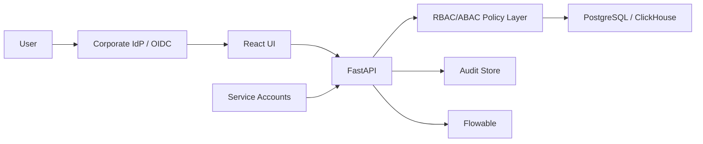

# OPEN FNR Production Security Hardening Plan

Date: 2026-05-28

## Goal

Move security from development role checks to production-ready authentication, authorization, secrets, audit and object-level access.

## Target Security Architecture

## Required Capabilities

| Capability | Target |
| --- | --- |
| Authentication | OIDC login for users, service tokens for integrations |
| Authorization | RBAC plus object-level scope by region, category, supplier, store and location |
| Secrets | external runtime secrets, no secrets in git or container images |
| Audit | persistent audit for login, read/write, process actions, exports and admin changes |
| Service accounts | separate accounts per integration and batch job |
| Admin controls | access request workflow, periodic access review |
| Security tests | RBAC, BOLA, secrets leakage, audit completeness, privilege escalation |

## Role And Scope Model

| Role | Scope dimensions |
| --- | --- |
| Forecast Planner | region, category |
| Promo Planner | category, promo campaign |
| Replenishment Planner | region, category, supplier |
| Supply Chain Manager | DC, region, supplier |
| Store Operations | store_id only |
| Supplier User | supplier_id only |
| Data Engineer | data domain |
| Data Scientist | model family |
| Admin | tenant/system scope |
| Auditor | read-only audit scope |

## Implementation Steps

1. Add OIDC/JWT middleware to FastAPI.
2. Add user identity model and claims mapping.
3. Add policy layer for role and object-level checks.
4. Replace endpoint-local role checks with shared policy calls.
5. Persist audit events to PostgreSQL.
6. Add secrets management for database credentials, IdP secrets and integration keys.
7. Add service account registry.
8. Add access review process in Flowable.
9. Add security regression tests.
10. Add stage security checklist before pilot.

## Acceptance Criteria

- Users authenticate through OIDC.
- API rejects unauthenticated requests.
- Object-level access prevents cross-store/cross-supplier reads and writes.
- All write operations have audit events.
- Service accounts are scoped and rotated.
- Secrets are not present in git, logs or screenshots.
- Security test suite runs in CI.
