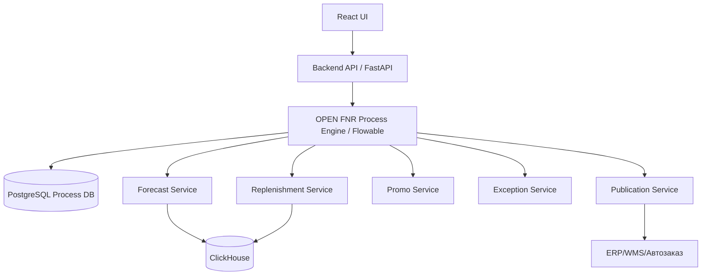

# Устав Проекта OPEN FNR

## 1. Назначение Проекта

OPEN FNR - промышленная система прогнозирования спроса и пополнения запасов для крупной торговой сети.

Система предназначена для:

- прогнозирования регулярного спроса;
- прогнозирования промо-продаж;
- расчета потребности;
- формирования предложений заказов;
- управления запасами;
- управления исключениями;
- поддержки бизнес-процессов планирования, согласования и публикации решений.

Целевая гранулярность:

```text
магазин x SKU x дата
```

Целевой масштаб:

- до `30 000` магазинов;
- средний ассортимент `5 500 SKU`;
- до `165 000 000` потенциальных связок `магазин x SKU`;
- горизонты прогноза `14 / 30 / 60 / 90` дней;
- ежедневный пересчет;
- SLA основного расчета до `2 часов`.

## 2. Ключевые Проектные Решения

### 2.1. Технологический Контур

Проект строится на бесплатных self-hosted open-source инструментах с permissive-лицензиями, совместимыми с выпуском итогового кода под **Apache License 2.0**.

Разрешенные типы лицензий:

- `Apache-2.0`;
- `MIT`;
- `BSD`;
- `PostgreSQL License`;
- другие permissive-лицензии после проверки.

Исключаются без отдельного юридического решения:

- `GPL`;
- `AGPL`;
- `SSPL`;
- `BUSL`;
- source-available лицензии;
- proprietary/SaaS-зависимости в обязательном production-контуре.

### 2.2. Расчетная Инфраструктура

Целевой production-контур принимается на **AMD EPYC**.

Рекомендуемый production-профиль:

- `8-12` серверов AMD EPYC для полного промышленного контура;
- `1 TB RAM` на узел как целевой ориентир;
- `16-32 TB NVMe` на узел;
- сеть `100 GbE`;
- GPU не обязателен для первой промышленной версии.

### 2.3. Принцип Масштабирования

Система не должна ежедневно считать полный декартов куб как монолит.

Обязательные принципы:

- расчет активной матрицы;
- партиционирование по категории, региону и shard-id;
- инкрементальные признаки;
- разделение горизонтов `14/30` и `60/90`;
- columnar storage;
- batch scoring без row-by-row Python;
- ClickHouse для forecast/replenishment store;
- Spark/Polars для feature engineering и batch compute.

## 3. Подпроекты

Проект OPEN FNR разделяется на несколько подпроектов.

| Подпроект | Назначение |
| --- | --- |
| OPEN FNR Data Platform | ingestion, DQ, lakehouse, витрины, признаки |
| OPEN FNR Forecasting | регулярный прогноз, промо-uplift, backtesting |
| OPEN FNR Replenishment | projected stock, demand projection, order proposals |
| OPEN FNR UI | рабочие места пользователей, дашборды, корректировки |
| OPEN FNR Integration | ERP/WMS/DWH/BI/API интеграции |
| OPEN FNR Process Engine | описание и исполнение бизнес-процессов |
| OPEN FNR Extended Planning | закупки, полка, capacity, supplier collaboration, true inventory, store tasks, workload |

## 4. Отдельный Подпроект: OPEN FNR Process Engine

### 4.1. Решение

В рамках проекта фиксируется отдельный подпроект:

```text
OPEN FNR Process Engine
```

Назначение подпроекта - вынести бизнес-процессы, правила, согласования, статусы, SLA, эскалации и human tasks из hardcoded backend/UI-логики в управляемый процессный слой.

### 4.2. Причина Выделения

OPEN FNR покрывает сложные и изменяемые бизнес-процессы:

- промо-планирование;
- согласование промо;
- контроль прогноза;
- ручные корректировки;
- согласование order proposals;
- управление исключениями;
- fresh-процессы;
- phase-in / phase-out SKU;
- публикация в ERP/WMS;
- мониторинг исполнения.

Эти процессы не должны быть жестко зашиты в backend или UI, потому что:

- бизнес-правила будут меняться;
- маршруты согласования будут отличаться по категориям, регионам и ролям;
- промо-процессы требуют разных сценариев;
- исключения требуют гибкого case management;
- нужен audit trail;
- нужны версии процессов;
- нужны SLA, таймеры и эскалации.

### 4.3. Принятое Решение По Инструменту

В качестве основного инструмента принимается:

```text
Flowable OSS
```

Используемые стандарты:

- `BPMN 2.0` - описание и исполнение бизнес-процессов;
- `DMN` - бизнес-правила и decision tables;
- `CMMN` - управление исключениями и case management.

Лицензия Flowable OSS: `Apache-2.0`.

### 4.4. Зона Ответственности Process Engine

Process Engine отвечает за:

- модели процессов;
- версии процессов;
- статусы процессов;
- human tasks;
- маршруты согласования;
- SLA и таймеры;
- эскалации;
- decision rules;
- case management;
- audit trail бизнес-действий;
- события процесса;
- управление жизненным циклом бизнес-объектов.

### 4.5. Что Не Должно Исполняться В Process Engine

В Process Engine не должны выполняться тяжелые вычисления:

- Spark jobs;
- ML inference;
- расчет признаков;
- расчет 165M связок;
- массовые ClickHouse inserts;
- оптимизация заказов всей сети;
- backtesting;
- batch-пайплайны данных.

Для этого используются:

- Apache Airflow;
- Apache Spark;
- Polars;
- ClickHouse;
- MLflow;
- доменные backend-сервисы.

### 4.6. Архитектурная Роль



Process Engine вызывает доменные сервисы через API или события. Доменные сервисы выполняют расчеты и возвращают статусы, результаты и ошибки.

### 4.7. Процессы, Которые Должны Быть Описаны В BPMN

| Процесс | Назначение |
| --- | --- |
| Promo Planning Process | создание, проверка, прогноз, согласование и публикация промо |
| Forecast Review Process | проверка прогноза, исключения, корректировки |
| Replenishment Approval Process | проверка order proposals и экспорт заказов |
| Exception Resolution Process | жизненный цикл исключений |
| Manual Adjustment Process | ручные корректировки и согласование |
| Fresh Order Review Process | fresh-заказы, списания, срок годности |
| SKU Phase-In Process | ввод нового SKU |
| SKU Phase-Out Process | вывод SKU |
| Publication Process | публикация в ERP/WMS/DWH |
| Data Quality Incident Process | обработка критичных ошибок данных |

### 4.8. Правила, Которые Должны Быть Описаны В DMN

Примеры decision tables:

| Decision | Примеры правил |
| --- | --- |
| Promo Completeness | есть ли SKU, даты, цена, скидка, механика, место и мощность выкладки |
| Promo Risk Classification | supply risk, overstock risk, shortage risk |
| Order Auto-Approval | можно ли auto-approve заказ |
| Exception Severity | критичность исключения |
| Forecast Review Required | требуется ли ручная проверка прогноза |
| Fresh Risk Decision | риск списаний и необходимость review |
| Phase-Out Decision | разрешен ли заказ перед termination date |
| Publication Eligibility | можно ли публиковать прогноз или заказ |

### 4.9. Исключения, Которые Должны Вестись Через CMMN

| Case | Описание |
| --- | --- |
| Promo Shortage Case | риск нехватки товара под промо |
| DC Shortage Case | дефицит на РЦ |
| Supplier Constraint Case | MOQ/MOV/cutoff/lead time проблема |
| High Spoilage Risk Case | риск списаний fresh |
| Forecast Anomaly Case | аномалия прогноза |
| Data Quality Incident Case | ошибка данных |
| Export Failure Case | ошибка передачи в ERP/WMS |

### 4.10. Версионирование

Должны версионироваться:

- BPMN-модели;
- DMN-таблицы;
- CMMN-модели;
- process instance;
- decision result;
- user task;
- action history;
- deployment package.

### 4.11. Интеграция С UI

UI не должен хардкодить статусы и переходы процессов.

UI должен получать из Process Engine:

- доступные действия;
- текущий статус;
- список задач пользователя;
- SLA/deadline;
- историю процесса;
- комментарии;
- decision result;
- reason codes;
- next possible transitions.

### 4.12. Критерии Приемки Подпроекта

| Критерий | Требование |
| --- | --- |
| BPMN | минимум 3 ключевых процесса исполняются через Flowable |
| DMN | обязательные бизнес-правила промо вынесены в decision table |
| CMMN | минимум 2 типа исключений ведутся как cases |
| UI | пользователь видит задачи, статусы и доступные действия из process engine |
| Audit | действия пользователя фиксируются |
| Версии | процессные модели версионируются |
| Интеграция | process engine вызывает доменные сервисы через API |
| Лицензия | стек подпроекта совместим с Apache-2.0 контуром |

### 4.13. Help-Сноски И Связь UI С Бизнес-Процессами

Каждый значимый UI-элемент, который влияет на бизнес-действие, расчет, фильтр, статус, согласование, публикацию или исключение, должен иметь help-сноску.

Help-сноска должна объяснять:

- что делает элемент;
- зачем он нужен пользователю;
- какой бизнес-объект или расчет он изменяет;
- какая роль имеет право использовать элемент;
- какой BPMN/DMN/CMMN процесс или decision rule связан с действием;
- где находится постановка задачи или спецификация, по которой элемент реализован.

Для ссылок используются относительные ссылки на документы проекта: `TECHNICAL_SPEC.md`, `BUSINESS_PROCESS_DETAILED_SPEC.md`, `BUSINESS_PROCESSES_UI_SPEC.md`, `PROCESS_NAVIGATOR_MAP_SPEC.md`, sprint plan, decision record или конкретный BPMN/DMN/CMMN artifact.

UI не должен превращать help в длинный учебник внутри рабочего экрана. Краткая подсказка показывается рядом с элементом, а подробное объяснение открывается по ссылке в help panel или documentation drawer.

Это правило является частью Definition of Done для всех UI-спринтов и обязательно проверяется UI-тестами.

## 5. Принятый Технологический Стек

Основной стек проекта:

| Зона | Инструмент |
| --- | --- |
| Batch compute | Apache Spark |
| Fast local compute | Polars |
| Lakehouse | Apache Iceberg + Parquet |
| Object Storage | Apache Ozone или SeaweedFS |
| Forecast/Replenishment Store | ClickHouse |
| Metadata DB | PostgreSQL |
| ML | LightGBM + CatBoost |
| MLOps | MLflow |
| Orchestration | Apache Airflow |
| Process Engine | Flowable OSS |
| API | FastAPI |
| UI | React |
| BI | Apache Superset |
| Charts | Apache ECharts |
| Monitoring | Prometheus, Alertmanager, OpenTelemetry, OpenSearch |
| Containers | Kubernetes + containerd / nerdctl |

## 6. Связанные Проектные Документы

- [README.md](README.md)
- [TECHNICAL_SPEC.md](TECHNICAL_SPEC.md)
- [TECHNOLOGY_ARCHITECTURE.md](TECHNOLOGY_ARCHITECTURE.md)
- [BUSINESS_PROCESS_DETAILED_SPEC.md](BUSINESS_PROCESS_DETAILED_SPEC.md)
- [BUSINESS_PROCESSES_UI_SPEC.md](BUSINESS_PROCESSES_UI_SPEC.md)
- [UI_TESTING_SPEC.md](UI_TESTING_SPEC.md)

## 7. Правила Кодировки и Текстовых Артефактов

Все текстовые артефакты проекта должны храниться в `UTF-8` без повреждения кириллицы.

Обязательные правила:

- Markdown, Python, TypeScript, XML, YAML, JSON, TOML, CSS и HTML файлы сохраняются как `UTF-8`.
- Для новых файлов применяется `.editorconfig` с `charset = utf-8`.
- Не допускается сохранение русскоязычного текста в виде mojibake.
- Любой документ, UI-текст, BPMN/DMN/CMMN-артефакт и тестовый сценарий с русскоязычным содержанием должен проходить автоматическую проверку кодировки.
- Перед коммитом должен выполняться smoke-набор `python -m pytest`, включающий тесты `tests/quality/test_text_encoding.py`.

Это правило является частью Definition of Done для всех спринтов.

## 8. Правила Тестовых Отчётов

После каждого значимого тестового цикла спринта должен формироваться HTML-отчёт.

Отчёт должен включать:

- аннотацию в начале теста: что тестируем, зачем, почему выбран такой способ;
- UI-тесты по шагам: действие, цель, причина, ожидаемый результат, фактический результат;
- тестирование бизнес-процессов по шагам: BPMN, DMN, CMMN, роли, переходы, SLA, audit trail;
- результаты автоматических проверок;
- скриншоты UI, если тест затрагивает пользовательский интерфейс;
- вывод, ограничения и следующий шаг.

Отчёты сохраняются в `docs/test-reports/<sprint-or-test-cycle>/index.html`.

## 9. Правила Блоковых Презентаций

После каждого крупного блока выполнения спринтов должна формироваться отдельная HTML-презентация для разработчиков и пользователей.

Крупный блок спринтов - это завершённый функциональный контур, который можно показать как цельный продуктовый инкремент, например:

- foundation и локальный контур разработки;
- data ingestion + DQ + feature mart;
- regular forecast;
- promo forecast;
- replenishment и order proposals;
- exceptions/manual adjustments;
- integrations/publication;
- fresh/lifecycle/multi-echelon.

Презентация должна включать:

- назначение блока: какую бизнес-проблему закрывает модуль;
- структуру модуля: backend, UI, data, process engine, storage, integrations;
- бизнес-процессы, которые работают в блоке: BPMN, DMN, CMMN, роли, статусы, переходы, SLA, audit trail;
- скриншоты интерфейсов и ключевых состояний;
- сценарии для пользователя: что делает пользователь, зачем и какой результат получает;
- сценарии для разработчика: где находится код, процессы, контракты, тесты и отчёты;
- результаты тестирования и ссылки на HTML test reports;
- ограничения текущей версии и план следующих спринтов.

Презентации сохраняются в `docs/presentations/<block-name>/index.html`.

Это правило является частью Definition of Done для крупных блоков спринтов.
