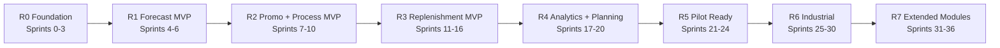

# План Выполнения Проекта OPEN FNR

## 1. Введение

Документ описывает подробный план выполнения проекта OPEN FNR по спринтам. План предназначен для управления разработкой, тестированием, настройкой бизнес-процессов, запуском пилота и последующим промышленным масштабированием.

Проект OPEN FNR реализует промышленную систему прогнозирования спроса и пополнения запасов торговой сети масштаба:

- до `30 000` магазинов;
- средний ассортимент `5 500 SKU`;
- прогнозирование на уровне `магазин x SKU x дата`;
- ежедневный расчет;
- целевой production-контур на `AMD EPYC cluster`;
- стек только из бесплатных self-hosted open-source инструментов с permissive-лицензиями, совместимыми с `Apache License 2.0`.

Ключевая архитектурная установка: бизнес-процессы не хардкодятся в backend/UI, а настраиваются и исполняются через **OPEN FNR Process Engine** на базе:

- Flowable OSS;
- BPMN 2.0;
- DMN;
- CMMN.

## 2. Проверка Документов На Противоречия

Перед составлением плана сверены документы:

- [PROJECT_CHARTER.md](PROJECT_CHARTER.md)
- [TECHNICAL_SPEC.md](TECHNICAL_SPEC.md)
- [TECHNOLOGY_ARCHITECTURE.md](TECHNOLOGY_ARCHITECTURE.md)
- [BUSINESS_PROCESS_DETAILED_SPEC.md](BUSINESS_PROCESS_DETAILED_SPEC.md)
- [BUSINESS_PROCESSES_UI_SPEC.md](BUSINESS_PROCESSES_UI_SPEC.md)
- [UI_TESTING_SPEC.md](UI_TESTING_SPEC.md)
- [DEVELOPMENT_SPRINT_PLAN.md](DEVELOPMENT_SPRINT_PLAN.md)
- [FUNCTIONAL_COVERAGE_MATRIX.md](FUNCTIONAL_COVERAGE_MATRIX.md)
- [DATA_GOVERNANCE.md](DATA_GOVERNANCE.md)
- [PROCESS_ENGINE_GOVERNANCE.md](PROCESS_ENGINE_GOVERNANCE.md)
- [INTEGRATION_STRATEGY.md](INTEGRATION_STRATEGY.md)
- [ML_GOVERNANCE.md](ML_GOVERNANCE.md)
- [TESTING_STRATEGY.md](TESTING_STRATEGY.md)
- [SECURITY_STRATEGY.md](SECURITY_STRATEGY.md)

Результат проверки:

| Область | Статус |
| --- | --- |
| Стек | согласован: Spark, Polars, ClickHouse, PostgreSQL, Airflow, Flowable, FastAPI, React |
| Лицензии | согласовано: Apache-2.0/MIT/BSD/PostgreSQL License; GPL/AGPL/SSPL/BUSL/proprietary исключены |
| Инфраструктура | согласовано: AMD EPYC cluster, GPU не обязателен для первой промышленной версии |
| Process Engine | согласовано: Flowable OSS, BPMN/DMN/CMMN |
| Scope | согласовано: BP-01 - BP-20, extended modules включены в sprint plan |
| Functional coverage | согласовано: `FUNCTIONAL_COVERAGE_MATRIX.md` покрывает raw-бенчмарк |

Противоречий, требующих правки, на текущем проходе не выявлено.

## 3. Принципы Планирования

1. Каждый спринт дает работающий вертикальный инкремент.
2. Любой бизнес-статус или переход, который относится к процессу, должен идти через Process Engine.
3. ML-функциональность не считается завершенной без baseline, метрик и fallback.
4. UI не считается завершенным без E2E, RBAC, audit и visual smoke.
5. Интеграция не считается завершенной без idempotency, retry и error handling.
6. Нагрузочные проверки начинаются на ранних shard-объемах и постепенно растут.
7. Все изменения фиксируются в документации, API contracts, migrations и тестах.
8. Спринты идут по пути: platform -> data -> forecast -> promo -> replenishment -> process -> UI -> integrations -> scale.

## 4. Карта Релизов

| Release | Спринты | Основной результат |
| --- | --- | --- |
| R0 Foundation | 0-3 | dev-контур, ingestion, DQ, active matrix, feature mart |
| R1 Forecast MVP | 4-6 | regular forecast, Forecast Workbench, ML model V1 |
| R2 Promo + Process MVP | 7-10 | promo data, uplift, Flowable, promo approval process |
| R3 Replenishment MVP | 11-16 | projected stock, order proposals, exceptions, export |
| R4 Analytics + Planning | 17-20 | KPI, fresh, lifecycle, multi-echelon |
| R5 Pilot Ready | 21-24 | performance gate, security, stage rehearsal, business pilot |
| R6 Industrial | 25-30 | production hardening, scale, DR, support |
| R7 Extended Modules | 31-36 | procurement, shelf, capacity, diagnostics, supplier, store, true inventory |

## 5. Таблица Всех Спринтов

| Спринт | Название | Ключевой результат |
| --- | --- | --- |
| 0 | Project Bootstrap | инженерный каркас и dev-инфраструктура |
| 1 | Data Ingestion Foundation | загрузка базовых доменов |
| 2 | Data Quality Console | управляемое качество данных |
| 3 | Active Matrix And Feature Mart | активная матрица и признаки |
| 4 | Regular Forecast Baseline | baseline regular forecast |
| 5 | Forecast Workbench V1 | просмотр прогноза в UI |
| 6 | ML Regular Model V1 | первая ML-модель regular forecast |
| 7 | Promo Data Model And Validation | промо как управляемый объект |
| 8 | Promo Uplift Forecast V1 | расчет promo uplift |
| 9 | Process Engine Foundation | Flowable подключен |
| 10 | Promo Approval Process | end-to-end согласование промо |
| 11 | Replenishment Foundation | projected stock и demand projection |
| 12 | Order Proposal V1 | первые предложения заказов |
| 13 | Replenishment Workbench V1 | рабочее место заказов |
| 14 | Exception Center V1 | управление исключениями |
| 15 | Manual Adjustments Framework | ручные корректировки с audit |
| 16 | Publication And Export V1 | публикация в mock ERP/WMS/DWH |
| 17 | Accuracy And KPI Dashboards | метрики качества и эффекта |
| 18 | Fresh V1 | shelf-life, spoilage, fresh workbench |
| 19 | Lifecycle SKU V1 | phase-in/phase-out SKU |
| 20 | Multi-Echelon V1 | потребность РЦ и allocation |
| 21 | Performance Gate 1 | pilot-scale нагрузка |
| 22 | Security And RBAC Hardening | безопасность и доступы |
| 23 | Stage Rehearsal | полный stage-прогон |
| 24 | Business Pilot Release | запуск бизнес-пилота |
| 25 | Production Data Scale | industrial data scale |
| 26 | Production ML And Retraining | retraining и model governance |
| 27 | Production Replenishment Scale | масштабирование заказов |
| 28 | Production Process Governance | управление BPMN/DMN/CMMN |
| 29 | Observability And Support | поддержка и наблюдаемость |
| 30 | Industrial Release Gate | industrial acceptance |
| 31 | Procurement Optimization | закупки и выбор поставщика |
| 32 | Shelf Space Optimization | полка, выкладка, direct-to-shelf |
| 33 | Capacity And Workload | capacity smoothing и workload forecast |
| 34 | Supply Chain Diagnostics | root cause diagnostics |
| 35 | Supplier Collaboration | взаимодействие с поставщиками |
| 36 | True Inventory And Store Management | виртуальный остаток и задачи магазина |

## 6. Подробное Описание Спринтов

## Sprint 0. Project Bootstrap

### Цель

Подготовить инженерный фундамент проекта, локальный dev-контур и правила разработки.

### Функциональность

- структура проекта;
- локальный dev-compose;
- PostgreSQL, ClickHouse, Flowable, Airflow, OpenSearch, Superset;
- базовые health endpoints;
- шаблоны миграций;
- OpenAPI skeleton;
- React skeleton;
- CI skeleton;
- wiki-навигация.

### Затрагиваемые Модули

| Модуль | Изменения |
| --- | --- |
| Infra | local dev stack |
| Backend | health API skeleton |
| UI | стартовый shell |
| Process Engine | Flowable доступен |
| Docs | README/wiki обновлены |

### Process Engine

| Элемент | Настройка |
| --- | --- |
| BPMN | `dev_healthcheck_process` как smoke-процесс |
| DMN | не требуется |
| CMMN | не требуется |
| Роли | Admin, Developer |
| Статусы | `started`, `completed`, `failed` |
| SLA | запуск процесса до 5 секунд |
| События | process started/completed |
| Audit | логируется запуск smoke-процесса |

### UI

- стартовый экран dev shell;
- ссылки на сервисы;
- health panel;
- error state для недоступного API;
- read-only доступ для dev viewer.

### Тесты

| Тип | Проверки |
| --- | --- |
| UI | smoke открытия shell, health panel, error state |
| Process | BPMN smoke happy path, failed service path |
| Performance | старт dev stack, health API latency до 1 сек |
| Data | PostgreSQL и ClickHouse init scripts |
| Integration | сервисы доступны по локальным URL |
| Security | секреты не в коде, `.env.example` без production secrets |

### Acceptance Criteria

- `docker compose` поднимает dev-контур;
- PostgreSQL/ClickHouse/Flowable/Airflow/OpenSearch/Superset доступны;
- есть документация запуска;
- health checks проходят.

### Артефакты

- `infra/dev/compose.yaml`;
- init SQL;
- README;
- health endpoints;
- smoke tests.

### Demo

Запустить dev-контур, открыть сервисы, показать health panel и smoke-процесс.

### Зависимости И Риски

| Риск | Митигация |
| --- | --- |
| конфликт портов | альтернативные порты в `.env.example` |
| тяжелые образы | предварительный `docker compose pull` |

## Sprint 1. Data Ingestion Foundation

### Цель

Реализовать загрузку базовых доменов данных.

### Функциональность

- inbound sales;
- inbound stock;
- inbound prices;
- inbound product MDM;
- inbound store MDM;
- batch metadata;
- raw/clean storage layout;
- ingestion status API.

### Затрагиваемые Модули

| Модуль | Изменения |
| --- | --- |
| Data Platform | ingestion jobs |
| Airflow | DAG `daily_ingestion` |
| PostgreSQL | batch metadata |
| ClickHouse | staging facts, если нужно для dev |
| UI | ingestion status read-only |

### Process Engine

| Элемент | Настройка |
| --- | --- |
| BPMN | `data_load_monitoring_process` |
| DMN | `data_load_severity_decision` |
| CMMN | `data_load_incident_case` skeleton |
| Роли | Data Engineer, Data Owner |
| Статусы | `waiting`, `loaded`, `failed`, `partial`, `accepted` |
| Переходы | load completed -> DQ ready; failed -> incident |
| SLA | все базовые домены до daily forecast cutoff |
| События | batch loaded, batch rejected |
| Audit | batch id, source, row count, checksum |

### UI

- Data Load Status;
- таблица источников;
- фильтр по business date;
- статус загрузки;
- карточка batch;
- ошибка источника.

### Тесты

| Тип | Проверки |
| --- | --- |
| UI | открыть список загрузок, фильтр даты, карточка batch |
| Process | happy path загрузки, failed path, partial path |
| Performance | загрузка synthetic files заданного объема |
| Data | schema, row count, duplicate batch, checksum |
| Integration | POS/ERP/WMS/MDM mocks |
| Security | Data Engineer видит детали, Viewer только статус |

### Acceptance Criteria

- все базовые домены загружаются в clean layer;
- загрузки имеют статусы и audit;
- ошибка загрузки создает incident case.

### Артефакты

- Airflow DAG;
- ingestion code;
- metadata migrations;
- API contract;
- UI status screen;
- tests.

### Demo

Загрузить тестовые продажи/остатки/цены/MDM, показать статусы и failed batch.

### Зависимости И Риски

| Риск | Митигация |
| --- | --- |
| нет реального источника | использовать mocks и file contracts |
| разные схемы источников | schema registry в metadata |

## Sprint 2. Data Quality Console

### Цель

Сделать качество данных управляемым и видимым.

### Функциональность

- DQ checks;
- severity;
- blocking/non-blocking errors;
- DQ incident case;
- Data Quality Console;
- DQ reports;
- DQ audit.

### Process Engine

| Элемент | Настройка |
| --- | --- |
| BPMN | `dq_check_process` |
| DMN | `dq_severity_decision`, `publication_block_decision` |
| CMMN | `data_quality_incident_case` |
| Роли | Data Engineer, Data Owner, Forecast Planner |
| Статусы | `new`, `in_review`, `fixed`, `waived`, `blocking`, `closed` |
| Переходы | critical -> block; medium -> warning; fixed -> recheck |
| SLA | critical incident review до 30 минут |
| События | dq failed, dq waived, dq fixed |
| Audit | правило, affected rows, waiver reason |

### UI

- Data Quality Console;
- список ошибок;
- severity badges;
- affected scope;
- карточка ошибки;
- кнопка re-run;
- waiver form;
- export error rows.

### Тесты

| Тип | Проверки |
| --- | --- |
| UI | список ошибок, фильтры, waiver, re-run |
| Process | critical блокирует публикацию, waiver требует роли |
| Performance | DQ на пилотном объеме в лимит |
| Data | nulls, duplicates, referential integrity, freshness |
| Integration | reject report для источника |
| Security | waiver доступен только Data Owner/Admin |

### Acceptance Criteria

- DQ ошибки классифицируются;
- critical errors блокируют расчет/публикацию;
- waiver версионируется и аудируется.

### Артефакты

- DQ rules;
- DMN tables;
- CMMN case;
- API;
- UI;
- tests.

### Demo

Показать critical DQ error, blocking behavior, waiver и повторную проверку.

### Риски

- слишком много false positives: нужен режим warning и tuning.

## Sprint 3. Active Matrix And Feature Mart

### Цель

Сформировать активную матрицу и первые признаки для прогнозирования.

### Функциональность

- active `store x SKU` matrix;
- assortment validity;
- calendar features;
- lag features;
- rolling features;
- price features;
- stock availability flags;
- feature versioning.

### Process Engine

| Элемент | Настройка |
| --- | --- |
| BPMN | `feature_build_process` |
| DMN | `active_matrix_inclusion_decision` |
| CMMN | `feature_build_incident_case` |
| Роли | Data Engineer, Data Scientist |
| Статусы | `queued`, `building`, `validated`, `failed`, `published` |
| SLA | feature build для pilot shard до 30 минут |
| События | feature version published |
| Audit | feature version, input batch ids, row counts |

### UI

- Feature Mart status;
- active matrix summary;
- filters by region/category;
- feature version card;
- failed partition view.

### Тесты

| Тип | Проверки |
| --- | --- |
| UI | active matrix summary и failed partitions |
| Process | build happy/error/retry path |
| Performance | Spark/Polars build на shard |
| Data | point-in-time correctness, row count, MDM validity |
| ML | feature leakage checks |
| Security | DS read-only, DE rerun permission |

### Acceptance Criteria

- активная матрица исключает закрытые магазины/SKU;
- признаки версионируются;
- feature build воспроизводим.

### Demo

Показать активную матрицу, feature version и failed partition retry.

### Риски

- утечка будущих данных: golden point-in-time tests.

## Sprint 4. Regular Forecast Baseline

### Цель

Получить первый регулярный прогноз спроса без промо.

### Функциональность

- seasonal naive / rolling median baseline;
- forecast schema;
- forecast version;
- WAPE/Bias calculation;
- ClickHouse write;
- Forecast API read.

### Process Engine

| Элемент | Настройка |
| --- | --- |
| BPMN | `regular_forecast_run_process` |
| DMN | `forecast_publish_eligibility_decision` |
| CMMN | `forecast_run_failure_case` |
| Роли | Data Scientist, Forecast Planner |
| Статусы | `queued`, `running`, `scored`, `validated`, `published`, `failed` |
| SLA | pilot baseline run до 30 минут |
| События | forecast version created/published |
| Audit | model version, data version, run id |

### UI

- Forecast version list;
- basic forecast table;
- filters by date/category/store/SKU;
- quality flag;
- empty/error states.

### Тесты

| Тип | Проверки |
| --- | --- |
| UI | открыть forecast latest, фильтры, empty state |
| Process | scoring happy path, DQ block path |
| Performance | baseline scoring на shard |
| Data | forecast rows = active matrix x horizon |
| ML | WAPE/Bias formulas, baseline reproducibility |
| Security | read permissions |

### Acceptance Criteria

- baseline forecast доступен через API/UI;
- WAPE/Bias считаются;
- forecast записан в ClickHouse.

### Demo

Запустить baseline DAG, открыть forecast latest и WAPE.

## Sprint 5. Forecast Workbench V1

### Цель

Дать Forecast Planner рабочий интерфейс просмотра прогноза.

### Функциональность

- таблица forecast;
- график fact vs forecast;
- filters;
- drill-down;
- WAPE/Bias panel;
- version compare read-only.

### Process Engine

| Элемент | Настройка |
| --- | --- |
| BPMN | `forecast_review_process` skeleton |
| DMN | `forecast_review_required_decision` |
| CMMN | `forecast_anomaly_case` skeleton |
| Роли | Forecast Planner, Category Manager |
| Статусы | `no_review`, `review_required`, `in_review`, `accepted` |
| SLA | review critical anomalies до cutoff |
| События | forecast opened, review started |
| Audit | user, filters, review action |

### UI

- Forecast Workbench;
- sticky table columns;
- graph panel;
- version selector;
- anomaly flag;
- drill-down breadcrumbs;
- export slice async.

### Тесты

| Тип | Проверки |
| --- | --- |
| UI | smoke, filters, drill-down, chart, visual regression |
| Process | review_required decision creates task |
| Performance | UI filter до 5 секунд |
| Data | UI totals match API |
| Security | Viewer read-only, Planner review action |
| Accessibility | keyboard navigation in table |

### Acceptance Criteria

- Forecast Planner может анализировать прогноз;
- фильтры работают;
- графики не ломаются на длинных SKU.

### Demo

Открыть категорию, провалиться до SKU-магазина, показать факт vs forecast.

## Sprint 6. ML Regular Model V1

### Цель

Ввести первую ML-модель регулярного спроса.

### Функциональность

- LightGBM/CatBoost training;
- MLflow registry;
- rolling backtesting;
- model approval draft;
- batch inference;
- fallback to baseline.

### Process Engine

| Элемент | Настройка |
| --- | --- |
| BPMN | `model_candidate_review_process` |
| DMN | `model_approval_decision` |
| CMMN | `model_degradation_case` skeleton |
| Роли | Data Scientist, Forecast Owner |
| Статусы | `candidate`, `backtested`, `approved`, `rejected`, `promoted` |
| SLA | model review в течение 2 рабочих дней |
| События | model registered/promoted |
| Audit | metrics, approver, reason |

### UI

- Model Monitoring V1;
- model version card;
- backtesting metrics;
- baseline comparison;
- promote/reject action для разрешенной роли.

### Тесты

| Тип | Проверки |
| --- | --- |
| UI | model card, metrics, approve/reject |
| Process | model approval happy/reject path |
| Performance | inference runtime на shard |
| Data | training set point-in-time |
| ML | WAPE better than baseline, Bias threshold, fallback |
| Security | только ML Owner/Forecast Owner approval |

### Acceptance Criteria

- модель зарегистрирована в MLflow;
- backtesting воспроизводим;
- fallback работает.

### Demo

Показать candidate model, сравнение с baseline и promotion.

## Sprint 7. Promo Data Model And Validation

### Цель

Сделать промо управляемым объектом с обязательными полями и validation.

### Функциональность

- promo entity;
- SKU/store/date/mechanic/price/discount/display fields;
- promo status model;
- overlap detection;
- Promo Workbench draft;
- mandatory field validation.

### Process Engine

| Элемент | Настройка |
| --- | --- |
| BPMN | `promo_draft_validation_process` |
| DMN | `promo_completeness_decision`, `promo_overlap_decision` |
| CMMN | `promo_data_issue_case` |
| Роли | Promo Planner, Category Manager |
| Статусы | `draft`, `data_incomplete`, `ready_for_forecast`, `conflict` |
| Переходы | draft -> validate -> ready/conflict |
| SLA | validation immediately after save |
| События | promo created/validated |
| Audit | changed fields, validation result |

### UI

- Promo Workbench;
- promo create/edit form;
- SKU selector;
- store selector;
- price/discount fields;
- mechanic selector;
- display location/capacity;
- validation summary.

### Тесты

| Тип | Проверки |
| --- | --- |
| UI | promo without SKU/price/discount/display fails |
| Process | validation happy/conflict/incomplete |
| Performance | validation for large store list |
| Data | promo overlaps, date validity, price positivity |
| Integration | promo import mock |
| Security | Promo Planner edit, Viewer read-only |

### Acceptance Criteria

- промо без обязательных полей не проходит;
- DMN решает completeness;
- UI показывает ошибки понятно.

### Demo

Создать валидное промо и промо без места выкладки, показать разные статусы.

## Sprint 8. Promo Uplift Forecast V1

### Цель

Рассчитать promo uplift отдельно от regular forecast.

### Функциональность

- promo feature set;
- reference promo selection;
- uplift baseline/model;
- total forecast;
- post-promo stock draft;
- promo forecast visualization.

### Process Engine

| Элемент | Настройка |
| --- | --- |
| BPMN | `promo_forecast_process` |
| DMN | `promo_forecast_quality_decision` |
| CMMN | `promo_forecast_anomaly_case` |
| Роли | Promo Planner, Forecast Planner |
| Статусы | `ready_for_forecast`, `forecasting`, `forecasted`, `forecast_warning` |
| SLA | расчет pilot promo до 20 минут |
| События | uplift calculated |
| Audit | regular version, uplift version, references |

### UI

- график regular/uplift/total;
- reference promo list;
- promo day curve;
- post-promo stock preview;
- uplift manual adjustment draft.

### Тесты

| Тип | Проверки |
| --- | --- |
| UI | regular/uplift/total chart, reference list |
| Process | forecast process happy/failure path |
| Performance | uplift scoring на промо shard |
| Data | promo features, no regular contamination |
| ML | uplift accuracy smoke, fallback to analog/category |
| Security | uplift adjustment rights |

### Acceptance Criteria

- uplift хранится отдельно;
- total forecast считается;
- UI объясняет промо-эффект.

### Demo

Открыть промо, запустить forecast, показать uplift и total.

## Sprint 9. Process Engine Foundation

### Цель

Подключить Flowable как обязательный слой исполнения бизнес-процессов.

### Функциональность

- Flowable deployment pipeline;
- BPMN/DMN deployment API;
- task list API;
- process audit API;
- UI task inbox;
- process definitions versioning.

### Process Engine

| Элемент | Настройка |
| --- | --- |
| BPMN | deployment of `promo_planning`, `forecast_review`, `replenishment_approval` skeletons |
| DMN | deployment of `promo_completeness`, `order_auto_approval` skeletons |
| CMMN | deployment of `exception_case` skeleton |
| Роли | Promo Planner, Forecast Planner, Replenishment Planner, Admin |
| Статусы | process-defined, not UI-hardcoded |
| SLA | task inbox latency до 2 секунд |
| События | task created/completed |
| Audit | process instance history |

### UI

- Task Inbox;
- process instance card;
- available actions from backend;
- process history;
- task comments.

### Тесты

| Тип | Проверки |
| --- | --- |
| UI | task inbox, complete task, comments |
| Process | BPMN happy path, DMN call, CMMN case lifecycle |
| Performance | Flowable task creation throughput smoke |
| Integration | backend calls Flowable REST |
| Security | task visible only to assigned role |
| Audit | task completion in history |

### Acceptance Criteria

- минимум один процесс исполняется через Flowable;
- UI не хардкодит переходы;
- process audit доступен.

### Demo

Запустить процесс, увидеть задачу, выполнить задачу, показать историю.

## Sprint 10. Promo Approval Process

### Цель

Реализовать end-to-end процесс согласования промо.

### Функциональность

- BPMN Promo Planning;
- Category Manager approval;
- Supply Chain approval;
- risk classification;
- rework path;
- reject path;
- publication readiness.

### Process Engine

| Элемент | Настройка |
| --- | --- |
| BPMN | `promo_planning_process` full V1 |
| DMN | `promo_risk_classification`, `promo_approval_route` |
| CMMN | `promo_shortage_case` |
| Роли | Promo Planner, Category Manager, Supply Chain Manager |
| Статусы | `draft`, `forecasted`, `category_review`, `supply_review`, `approved`, `rework`, `rejected` |
| Переходы | approve, reject, request rework, escalate |
| SLA | category review 1 day, supply review before cutoff |
| События | approval requested, approved, rejected |
| Audit | every decision with user/comment/reason |

### UI

- promo approval card;
- decision buttons from process engine;
- risk panel;
- comments;
- approval timeline;
- blocking errors.

### Тесты

| Тип | Проверки |
| --- | --- |
| UI | approve/reject/rework, blocking state |
| Process | happy path, rework path, reject path, SLA escalation |
| Performance | 1k promo tasks creation smoke |
| Data | required promo fields before approval |
| Integration | promo status export mock |
| Security | only assigned role approves |

### Acceptance Criteria

- промо проходит полный маршрут;
- rework и reject работают;
- все решения аудируются.

### Demo

Создать промо, посчитать uplift, провести через Category и Supply approvals.

## Sprint 11. Replenishment Foundation

### Цель

Рассчитать projected stock и demand projection.

### Функциональность

- current stock;
- open orders;
- in-transit;
- lead time;
- projected stock;
- demand projection;
- inventory projection API/UI.

### Process Engine

| Элемент | Настройка |
| --- | --- |
| BPMN | `replenishment_calculation_process` skeleton |
| DMN | `stock_projection_quality_decision` |
| CMMN | `stock_projection_issue_case` |
| Роли | Replenishment Planner |
| Статусы | `queued`, `projected`, `projection_warning`, `failed` |
| SLA | pilot projection до 30 минут |
| События | projection calculated |
| Audit | stock snapshot version, forecast version |

### UI

- Inventory Projection;
- projected stock graph;
- open orders layer;
- forecast demand layer;
- safety threshold;
- stock-out warning.

### Тесты

| Тип | Проверки |
| --- | --- |
| UI | projection graph, layers, filters |
| Process | projection happy/failure path |
| Performance | projected stock calculation shard |
| Data | stock/open order joins, referential integrity |
| Integration | WMS open orders mock |
| Security | replenishment roles |

### Acceptance Criteria

- projected stock считается по дням;
- demand projection доступен;
- UI показывает риск stock-out.

### Demo

Открыть SKU-магазин, показать future stock и open orders.

## Sprint 12. Order Proposal V1

### Цель

Сформировать объяснимые предложения заказов.

### Функциональность

- gross requirement;
- net requirement;
- safety stock;
- presentation stock;
- MOQ/rounding;
- order proposal;
- explanation.

### Process Engine

| Элемент | Настройка |
| --- | --- |
| BPMN | `order_proposal_generation_process` |
| DMN | `order_auto_approval_decision`, `order_constraint_decision` |
| CMMN | `supplier_constraint_case` skeleton |
| Роли | Replenishment Planner |
| Статусы | `draft`, `auto_approved`, `manual_review`, `blocked` |
| SLA | generation within replenishment run window |
| События | proposal created |
| Audit | formula components and constraints |

### UI

- order proposal table;
- explanation drawer;
- formula breakdown;
- constraint flags;
- raw vs rounded order;
- status badge.

### Тесты

| Тип | Проверки |
| --- | --- |
| UI | explanation, formula, constraint flags |
| Process | auto-approved/manual/blocked routing |
| Performance | order proposals на shard |
| Data | net requirement formula |
| Integration | supplier constraints mock |
| Security | read/approve separation |

### Acceptance Criteria

- заказ объясним;
- constraints видны;
- auto/manual/blocked статусы работают.

### Demo

Показать proposal с safety stock, rounding и explanation.

## Sprint 13. Replenishment Workbench V1

### Цель

Дать планировщику рабочее место заказов.

### Функциональность

- proposals list;
- filters by supplier/DC/store/category;
- approve/reject/adjust;
- preview impact;
- final order;
- audit trail.

### Process Engine

| Элемент | Настройка |
| --- | --- |
| BPMN | `replenishment_approval_process` |
| DMN | `manual_review_required_decision` |
| CMMN | `order_exception_case` |
| Роли | Replenishment Planner, Supply Chain Manager |
| Статусы | `manual_review`, `adjusted`, `approved`, `rejected`, `blocked` |
| Переходы | approve, adjust, reject, escalate |
| SLA | review before order cutoff |
| События | proposal adjusted/approved |
| Audit | old/new order, reason, comment |

### UI

- Replenishment Workbench;
- editable final order;
- adjustment modal;
- preview projected stock;
- mass approve;
- async export preparation.

### Тесты

| Тип | Проверки |
| --- | --- |
| UI | adjust, approve, mass action, preview |
| Process | approval happy/adjust/reject/escalate |
| Performance | filter до 5 секунд, mass action async |
| Data | final order does not overwrite proposal |
| Integration | no export before approval |
| Security | Planner changes order, Viewer cannot |

### Acceptance Criteria

- order proposals можно согласовать;
- ручное изменение аудируется;
- preview показывает эффект.

### Demo

Изменить заказ, увидеть projected stock impact, подтвердить.

## Sprint 14. Exception Center V1

### Цель

Собрать исключения в единый рабочий центр.

### Функциональность

- exception model;
- stock-out risk;
- overstock risk;
- promo shortage risk;
- supplier constraint;
- exception statuses;
- owner assignment;
- Exception Center UI.

### Process Engine

| Элемент | Настройка |
| --- | --- |
| BPMN | `exception_escalation_process` |
| DMN | `exception_severity_decision`, `exception_owner_routing` |
| CMMN | `generic_exception_case` full V1 |
| Роли | Process-specific owner |
| Статусы | `new`, `in_review`, `resolved`, `ignored`, `escalated`, `auto_resolved` |
| SLA | by severity |
| События | exception created/resolved/escalated |
| Audit | reason, owner, action history |

### UI

- Exception Center;
- filters by type/severity/owner;
- exception card;
- recommended action;
- comments;
- escalation;
- linked objects.

### Тесты

| Тип | Проверки |
| --- | --- |
| UI | take, resolve, ignore, escalate |
| Process | CMMN lifecycle, SLA escalation |
| Performance | list до 3 секунд |
| Data | linked forecast/order/promo ids |
| Integration | exception from export failure mock |
| Security | owner/scope-based visibility |

### Acceptance Criteria

- исключения имеют владельца и статус;
- CMMN lifecycle работает;
- действия аудируются.

### Demo

Создать promo shortage, эскалировать, закрыть с комментарием.

## Sprint 15. Manual Adjustments Framework

### Цель

Создать безопасный слой ручных корректировок.

### Функциональность

- adjustment entity;
- reason codes;
- validity period;
- scope;
- preview impact;
- apply/cancel;
- adjustment effect report.

### Process Engine

| Элемент | Настройка |
| --- | --- |
| BPMN | `manual_adjustment_process` |
| DMN | `adjustment_approval_required_decision` |
| CMMN | `adjustment_dispute_case` skeleton |
| Роли | Forecast Planner, Replenishment Planner, Category Manager |
| Статусы | `draft`, `previewed`, `approved`, `applied`, `cancelled`, `expired` |
| SLA | approval before publication cutoff |
| События | adjustment requested/applied |
| Audit | old/new values, reason, impact |

### UI

- adjustment modal;
- percent/absolute change;
- reason required;
- validity dates;
- impact preview;
- undo before publish;
- audit timeline.

### Тесты

| Тип | Проверки |
| --- | --- |
| UI | reason required, preview, cancel |
| Process | adjustment approval/no-approval paths |
| Performance | mass adjustment preview async |
| Data | final values layered over ML result |
| ML | ML forecast not overwritten |
| Security | object-level access for adjustments |

### Acceptance Criteria

- корректировки не затирают исходный прогноз/заказ;
- все изменения аудируются;
- effect visible.

### Demo

Массово поднять forecast на 10%, показать preview и audit.

## Sprint 16. Publication And Export V1

### Цель

Сделать управляемую публикацию прогнозов и заказов во внешние контуры.

### Функциональность

- publication package;
- export status;
- idempotency key;
- ERP/WMS/DWH mocks;
- retry;
- export failure exception;
- publication audit.

### Process Engine

| Элемент | Настройка |
| --- | --- |
| BPMN | `publication_process` |
| DMN | `publication_eligibility_decision` |
| CMMN | `export_failure_case` |
| Роли | Integration Owner, Replenishment Planner |
| Статусы | `prepared`, `sent`, `accepted`, `rejected`, `failed`, `superseded` |
| SLA | export before ERP/WMS cutoff |
| События | export sent/accepted/failed |
| Audit | payload version, idempotency key, response |

### UI

- Publication Console;
- export package list;
- status badges;
- retry action;
- error details;
- linked exceptions.

### Тесты

| Тип | Проверки |
| --- | --- |
| UI | export status, retry, failure details |
| Process | publish happy/reject/fail/retry paths |
| Performance | export package generation |
| Data | no duplicate export with same idempotency key |
| Integration | ERP/WMS/DWH mocks, retry, error handling |
| Security | service account export access |

### Acceptance Criteria

- forecast/order exports are idempotent;
- failures create exceptions;
- accepted status stored.

### Demo

Опубликовать заказ в mock WMS, затем показать failed export и retry.

## Sprint 17. Accuracy And KPI Dashboards

### Цель

Сделать видимыми качество прогноза и бизнес-эффект.

### Функциональность

- WAPE/Bias;
- service level;
- out-of-stock;
- overstock;
- proposal acceptance;
- manual adjustment effect;
- business value draft;
- Superset/React dashboards.

### Process Engine

| Элемент | Настройка |
| --- | --- |
| BPMN | `weekly_kpi_review_process` |
| DMN | `kpi_alert_decision` |
| CMMN | `kpi_degradation_case` |
| Роли | Executive, Process Owner, Data Scientist |
| Статусы | `calculated`, `review_required`, `reviewed`, `action_created` |
| SLA | weekly review |
| События | KPI threshold breached |
| Audit | reviewed by, actions |

### UI

- Accuracy Dashboard;
- Replenishment Analytics;
- KPI drill-down;
- network/region/category/SKU filters;
- ML vs final forecast;
- trend charts.

### Тесты

| Тип | Проверки |
| --- | --- |
| UI | drill-down, filters, chart visual |
| Process | KPI alert creates review task |
| Performance | dashboard до 5 секунд |
| Data | KPI formulas match golden dataset |
| ML | WAPE/Bias by segment |
| Security | executive read-only access |

### Acceptance Criteria

- KPI считаются по утвержденным формулам;
- drill-down работает;
- threshold breach создает задачу.

### Demo

Показать WAPE по сети, провалиться до SKU, открыть review task.

## Sprint 18. Fresh V1

### Цель

Добавить базовую поддержку fresh и shelf-life.

### Функциональность

- shelf-life fields;
- batches;
- FEFO;
- expected waste;
- fresh projected stock;
- spoilage risk;
- Fresh Workbench.

### Process Engine

| Элемент | Настройка |
| --- | --- |
| BPMN | `fresh_order_review_process` |
| DMN | `fresh_spoilage_risk_decision` |
| CMMN | `high_spoilage_risk_case` |
| Роли | Fresh Manager, Replenishment Planner |
| Статусы | `calculated`, `spoilage_risk`, `reviewed`, `approved`, `adjusted` |
| SLA | review before fresh cutoff |
| События | spoilage risk created |
| Audit | waste impact before/after |

### UI

- Fresh Workbench;
- batch/shelf-life table;
- expected waste graph;
- availability vs waste preview;
- fresh adjustment.

### Тесты

| Тип | Проверки |
| --- | --- |
| UI | shelf-life, waste preview, adjustment |
| Process | high spoilage case lifecycle |
| Performance | fresh shard calculation |
| Data | batch dates, expiration, FEFO ordering |
| ML | fresh forecast smoke, waste estimation |
| Security | Fresh Manager permissions |

### Acceptance Criteria

- fresh order shows waste impact;
- high spoilage risk creates case;
- FEFO data displayed.

### Demo

Показать fresh SKU, риск списания, снижение заказа и эффект.

## Sprint 19. Lifecycle SKU V1

### Цель

Поддержать ввод, замену и вывод SKU.

### Функциональность

- phase-in;
- reference product;
- phase-out;
- termination date;
- replacement link;
- clearance risk.

### Process Engine

| Элемент | Настройка |
| --- | --- |
| BPMN | `sku_phase_in_process`, `sku_phase_out_process` |
| DMN | `lifecycle_order_allowed_decision` |
| CMMN | `clearance_risk_case` |
| Роли | Category Manager, Forecast Planner, Replenishment Planner |
| Статусы | `planned`, `active`, `replacing`, `phase_out`, `terminated` |
| SLA | phase-in before launch date |
| События | SKU introduced/terminated |
| Audit | lifecycle dates and links |

### UI

- lifecycle panel;
- reference product selector;
- termination date;
- replacement link;
- clearance risk warning.

### Тесты

| Тип | Проверки |
| --- | --- |
| UI | phase-in form, phase-out warning |
| Process | phase-in/phase-out paths |
| Performance | lifecycle rules on active matrix |
| Data | reference product validity |
| ML | cold-start fallback |
| Security | Category Manager edit rights |

### Acceptance Criteria

- new SKU gets fallback forecast;
- order after termination date blocked;
- lifecycle changes audited.

### Demo

Ввести новый SKU с аналогом и вывести старый SKU с запретом заказа.

## Sprint 20. Multi-Echelon V1

### Цель

Связать потребность магазинов, РЦ и поставщиков.

### Функциональность

- store demand aggregation;
- DC demand projection;
- DC stock;
- DC shortage;
- basic allocation;
- Supply Chain Dashboard.

### Process Engine

| Элемент | Настройка |
| --- | --- |
| BPMN | `dc_replenishment_process` |
| DMN | `dc_allocation_priority_decision` |
| CMMN | `dc_shortage_case` |
| Роли | Supply Chain Manager |
| Статусы | `calculated`, `shortage`, `allocated`, `approved` |
| SLA | allocation before store order cutoff |
| События | DC shortage detected |
| Audit | allocation rule and affected stores |

### UI

- Supply Chain Dashboard;
- DC demand view;
- drill-down DC -> stores;
- allocation preview;
- shortage reason.

### Тесты

| Тип | Проверки |
| --- | --- |
| UI | drill-down, allocation preview |
| Process | shortage case lifecycle |
| Performance | aggregation on shard |
| Data | DC demand = lower-level demand |
| Integration | WMS DC stock mock |
| Security | region/DC scope |

### Acceptance Criteria

- DC need calculated from stores;
- shortage triggers allocation;
- allocation is explainable.

### Demo

Показать дефицит РЦ и распределение товара по магазинам.

## Sprint 21. Performance Gate 1

### Цель

Проверить pilot-scale производительность.

### Функциональность

- synthetic load generator;
- shard runner;
- Spark/Polars profiling;
- ClickHouse benchmarks;
- API latency baseline;
- UI performance baseline;
- bottleneck report.

### Process Engine

| Элемент | Настройка |
| --- | --- |
| BPMN | `performance_test_run_process` |
| DMN | `performance_gate_decision` |
| CMMN | `performance_regression_case` |
| Роли | Performance Engineer, Architect |
| Статусы | `planned`, `running`, `passed`, `failed`, `waived` |
| SLA | performance report within sprint |
| События | performance gate failed |
| Audit | test profile, result, waiver |

### UI

- Performance report page;
- run status;
- bottleneck list;
- benchmark charts.

### Тесты

| Тип | Проверки |
| --- | --- |
| UI | benchmark report renders |
| Process | gate passed/failed/waived |
| Performance | batch runtime, API latency, UI latency |
| Data | synthetic data scale validation |
| Integration | Airflow DAG runtime |
| Security | performance data read access |

### Acceptance Criteria

- pilot-scale benchmark выполнен;
- bottlenecks documented;
- gate decision зафиксирован.

### Demo

Показать performance run и решение gate.

## Sprint 22. Security And RBAC Hardening

### Цель

Довести безопасность до уровня бизнес-пилота.

### Функциональность

- RBAC;
- scope-based access;
- service accounts;
- audit log;
- admin console basics;
- secret handling policy checks.

### Process Engine

| Элемент | Настройка |
| --- | --- |
| BPMN | `access_request_process` |
| DMN | `role_assignment_decision` |
| CMMN | `security_incident_case` skeleton |
| Роли | Admin, Security Owner, User Manager |
| Статусы | `requested`, `approved`, `rejected`, `provisioned`, `revoked` |
| SLA | access request review 1 business day |
| События | role assigned/revoked |
| Audit | every access change |

### UI

- Admin Console V1;
- roles;
- scopes;
- user permissions;
- audit viewer;
- denied states.

### Тесты

| Тип | Проверки |
| --- | --- |
| UI | admin role management, denied pages |
| Process | access request paths |
| Performance | auth overhead smoke |
| Data | user/role consistency |
| Integration | IdP mock or local auth |
| Security | RBAC, object-level access, secrets, audit |

### Acceptance Criteria

- критичные действия защищены;
- audit complete;
- object-level access works.

### Demo

Показать пользователя без доступа, затем access request и выдачу роли.

## Sprint 23. Stage Rehearsal

### Цель

Провести полный stage-прогон ежедневного цикла.

### Функциональность

- DQ -> forecast -> promo -> replenishment -> exceptions -> publish;
- stage snapshot;
- runbooks draft;
- release checklist;
- UAT scripts.

### Process Engine

| Элемент | Настройка |
| --- | --- |
| BPMN | all MVP processes end-to-end |
| DMN | all MVP decisions |
| CMMN | all MVP cases |
| Роли | pilot roles |
| Статусы | full lifecycle |
| SLA | stage run within target |
| События | stage run started/completed |
| Audit | end-to-end trace |

### UI

- Control Tower;
- cross-links across workbenches;
- stage run banner;
- UAT checklist.

### Тесты

| Тип | Проверки |
| --- | --- |
| UI | full E2E user journey |
| Process | all happy and critical error paths |
| Performance | stage cycle runtime |
| Data | stage data snapshot integrity |
| Integration | ERP/WMS/DWH mocks |
| Security | role matrix UAT |

### Acceptance Criteria

- full stage run successful;
- critical defects closed or accepted;
- pilot go/no-go decision possible.

### Demo

Показать полный daily cycle от загрузки до export.

## Sprint 24. Business Pilot Release

### Цель

Запустить пилот на ограниченной зоне бизнеса.

### Функциональность

- pilot categories/users;
- daily operations;
- feedback collection;
- defect triage;
- KPI tracking;
- support channel.

### Process Engine

| Элемент | Настройка |
| --- | --- |
| BPMN | pilot operational processes |
| DMN | pilot thresholds |
| CMMN | pilot exceptions |
| Роли | real pilot users |
| Статусы | production-like |
| SLA | pilot operational SLA |
| События | pilot issue, feedback, acceptance |
| Audit | user decisions |

### UI

- pilot dashboard;
- feedback widget/form;
- business KPI panel;
- known issues view.

### Тесты

| Тип | Проверки |
| --- | --- |
| UI | user UAT scripts |
| Process | real role assignment |
| Performance | pilot daily volume |
| Data | pilot domain quality |
| Integration | pilot external exports or mocks |
| Security | real user scopes |

### Acceptance Criteria

- бизнес работает в системе;
- KPI измеряются;
- feedback captured;
- пилотная приемка подписана.

### Demo

Пилотный пользователь проходит сценарий forecast review и order approval.

## Sprint 25. Production Data Scale

### Цель

Расширить data platform на industrial объемы.

### Функциональность

- partitioning hardening;
- sharding strategy;
- larger historical loads;
- raw/clean/mart retention;
- data lineage;
- DQ at scale.

### Process Engine

| Элемент | Настройка |
| --- | --- |
| BPMN | `industrial_data_load_process` |
| DMN | `industrial_dq_gate_decision` |
| CMMN | `large_scale_data_incident_case` |
| Роли | Data Platform Owner |
| SLA | production data cutoff |
| Audit | source lineage and partitions |

### UI

- data volume dashboard;
- partition status;
- lineage view.

### Тесты

| Тип | Проверки |
| --- | --- |
| UI | large partition status view |
| Process | large data incident |
| Performance | industrial data load profile |
| Data | freshness, lineage, partition counts |
| Integration | source batch compatibility |
| Security | data owner access |

### Acceptance Criteria

- data platform handles industrial pilot volume;
- DQ remains within SLA.

### Demo

Показать large load, partitions, DQ and lineage.

## Sprint 26. Production ML And Retraining

### Цель

Автоматизировать ML governance для production.

### Функциональность

- retraining DAG;
- model monitoring;
- drift detection;
- model approval process;
- rollback;
- shadow run.

### Process Engine

| Элемент | Настройка |
| --- | --- |
| BPMN | `model_release_process` |
| DMN | `model_release_gate_decision` |
| CMMN | `model_drift_case` |
| Роли | Data Scientist, Forecast Owner |
| SLA | drift review by severity |
| Audit | model approval and rollback |

### UI

- Model Monitoring V2;
- drift panel;
- shadow comparison;
- rollback action.

### Тесты

| Тип | Проверки |
| --- | --- |
| UI | drift alert, model comparison |
| Process | release/rollback paths |
| Performance | training/inference runtime |
| Data | training snapshot integrity |
| ML | backtesting, WAPE/Bias, drift smoke, fallback |
| Security | model promotion rights |

### Acceptance Criteria

- model release controlled;
- rollback tested;
- drift cases created.

### Demo

Показать drift alert, model candidate, approval and rollback.

## Sprint 27. Production Replenishment Scale

### Цель

Масштабировать replenishment на industrial объем.

### Функциональность

- large-scale projected stock;
- order proposal partitioning;
- constraint performance;
- mass approval at scale;
- proposal retention.

### Process Engine

| Элемент | Настройка |
| --- | --- |
| BPMN | `industrial_replenishment_process` |
| DMN | `bulk_auto_approval_decision` |
| CMMN | replenishment exceptions at scale |
| Роли | Replenishment Owner |
| SLA | within daily replenishment window |
| Audit | partitioned run ids |

### UI

- high-volume workbench improvements;
- saved filters;
- bulk actions;
- async exports.

### Тесты

| Тип | Проверки |
| --- | --- |
| UI | high-volume filters, bulk actions |
| Process | bulk approval task handling |
| Performance | order proposal full pilot volume |
| Data | proposal counts, formula consistency |
| Integration | export package scale |
| Security | bulk action permissions |

### Acceptance Criteria

- replenishment runtime meets pilot target;
- UI remains usable;
- bulk audit works.

### Demo

Показать bulk approval на большом срезе и export package.

## Sprint 28. Production Process Governance

### Цель

Оформить управление процессами как production discipline.

### Функциональность

- BPMN/DMN/CMMN versioning;
- deployment approval;
- process migration;
- process rollback;
- process test suite;
- release notes.

### Process Engine

| Элемент | Настройка |
| --- | --- |
| BPMN | `process_change_management_process` |
| DMN | `process_change_risk_decision` |
| CMMN | `process_incident_case` |
| Роли | BPM Owner, Process Owner, Release Manager |
| SLA | process change review |
| Audit | deployment package and approver |

### UI

- process admin view;
- process versions;
- deployment history;
- migration status.

### Тесты

| Тип | Проверки |
| --- | --- |
| UI | process version list, deployment history |
| Process | change request paths |
| Performance | process deployment time |
| Integration | backend reads process versions |
| Security | only Process Admin deploys |
| Regression | existing instances continue |

### Acceptance Criteria

- process releases are governed;
- rollback documented and tested;
- no unmanaged process changes.

### Demo

Опубликовать новую DMN version через change process.

## Sprint 29. Observability And Support

### Цель

Подготовить эксплуатационный контур.

### Функциональность

- metrics;
- logs;
- traces;
- alerts;
- runbooks;
- incident severity;
- support dashboard.

### Process Engine

| Элемент | Настройка |
| --- | --- |
| BPMN | `incident_management_process` |
| DMN | `incident_severity_decision` |
| CMMN | `production_incident_case` |
| Роли | L1, L2, L3, Incident Manager |
| SLA | severity-based |
| Audit | incident timeline |

### UI

- Ops dashboard;
- alert list;
- runbook links;
- incident card.

### Тесты

| Тип | Проверки |
| --- | --- |
| UI | alert and incident screens |
| Process | incident lifecycle and escalation |
| Performance | OpenSearch logging load |
| Integration | alert webhook/mock |
| Security | ops role access |
| Resilience | service restart visibility |

### Acceptance Criteria

- critical alerts fire;
- incidents managed;
- logs searchable.

### Demo

Сымитировать failed export, увидеть alert, incident и runbook.

## Sprint 30. Industrial Release Gate

### Цель

Провести industrial acceptance.

### Функциональность

- release candidate;
- full regression;
- production readiness checklist;
- DR smoke;
- support handover;
- go/no-go.

### Process Engine

| Элемент | Настройка |
| --- | --- |
| BPMN | `release_go_no_go_process` |
| DMN | `release_readiness_decision` |
| CMMN | `release_risk_case` |
| Роли | Product Owner, Architecture, Business Owners, IT Ops |
| SLA | gate decision date |
| Audit | approvals and risk acceptances |

### UI

- release readiness dashboard;
- checklist;
- defect summary;
- risk acceptance form.

### Тесты

| Тип | Проверки |
| --- | --- |
| UI | readiness dashboard |
| Process | go/no-go approvals |
| Performance | industrial-scale projection |
| Data | full regression datasets |
| Integration | external mock suite |
| Security | release access and audit |

### Acceptance Criteria

- all critical gates passed;
- known risks accepted;
- release ready for industrial pilot.

### Demo

Показать release readiness, defects, risks and go/no-go decision.

## Sprint 31. Procurement Optimization

### Цель

Добавить оптимизацию закупок и выбор поставщика.

### Функциональность

- multi-supplier SKU;
- supplier selection;
- target supplier shares;
- purchase proposals;
- supplier constraints.

### Process Engine

| Элемент | Настройка |
| --- | --- |
| BPMN | `purchase_proposal_process` |
| DMN | `supplier_selection_decision`, `supplier_share_exception_decision` |
| CMMN | `supplier_constraint_case` full |
| Роли | Supply Chain Manager, Procurement Planner |
| Статусы | `calculated`, `supplier_selected`, `review_required`, `approved`, `blocked` |
| SLA | before supplier order cutoff |
| Audit | selected supplier and reason |

### UI

- Purchase Proposal view;
- supplier comparison;
- lead time/fill rate panel;
- target share warning;
- supplier override.

### Тесты

| Тип | Проверки |
| --- | --- |
| UI | supplier comparison, override, warning |
| Process | supplier selection and exception |
| Performance | supplier decision for large SKU set |
| Data | supplier contracts and calendars |
| Integration | ERP supplier mock |
| Security | procurement role |

### Acceptance Criteria

- supplier choice is explainable;
- purchase proposals generated;
- constraint exceptions work.

### Demo

SKU с двумя поставщиками: система выбирает лучшего и объясняет причину.

## Sprint 32. Shelf Space Optimization

### Цель

Учитывать полку, выкладку и store zones.

### Функциональность

- shelf capacity;
- display capacity;
- direct-to-shelf;
- store zone consolidation;
- shelf exceptions.

### Process Engine

| Элемент | Настройка |
| --- | --- |
| BPMN | `shelf_space_review_process` |
| DMN | `display_capacity_decision`, `direct_to_shelf_decision` |
| CMMN | `shelf_capacity_exception_case` |
| Роли | Category Manager, Store Operations |
| Статусы | `valid`, `capacity_warning`, `review_required`, `approved` |
| SLA | before promo/order approval |
| Audit | shelf/display values changed |

### UI

- shelf panel in Promo/Replenishment;
- store zone filters;
- capacity warnings;
- direct-to-shelf recommendation.

### Тесты

| Тип | Проверки |
| --- | --- |
| UI | display location/capacity validation |
| Process | capacity warning review |
| Performance | shelf validation at promo scale |
| Data | shelf hierarchy, planogram fields |
| Integration | planogram/shelf mock |
| Security | edit rights for Category/Store roles |

### Acceptance Criteria

- display capacity enforced;
- direct-to-shelf recommendations visible;
- shelf exceptions auditable.

### Demo

Промо с display stock выше capacity создает blocking warning.

## Sprint 33. Capacity And Workload

### Цель

Добавить capacity smoothing и workload forecasting.

### Функциональность

- DC capacity;
- transport capacity;
- store receiving capacity;
- workload forecast;
- smoothing recommendations;
- affected orders preview.

### Process Engine

| Элемент | Настройка |
| --- | --- |
| BPMN | `capacity_smoothing_process` |
| DMN | `capacity_overload_decision`, `order_shift_priority_decision` |
| CMMN | `capacity_overload_case` |
| Роли | Supply Chain Manager, Store Operations |
| Статусы | `ok`, `overload`, `smoothing_proposed`, `approved`, `waived` |
| SLA | before publication |
| Audit | moved orders and reason |

### UI

- Capacity Workbench;
- overload calendar;
- workload chart;
- smoothing preview;
- affected orders list.

### Тесты

| Тип | Проверки |
| --- | --- |
| UI | overload calendar, smoothing preview |
| Process | overload case and approval |
| Performance | weekly delivery plan load |
| Data | capacity calendars |
| Integration | TMS/capacity mock |
| Security | capacity approval role |

### Acceptance Criteria

- overload detected;
- smoothing preview works;
- order moves auditable.

### Demo

День перегружен, система переносит часть поставок и показывает эффект.

## Sprint 34. Supply Chain Diagnostics

### Цель

Показывать root cause проблем цепочки поставок.

### Функциональность

- diagnostic rules/model;
- root cause card;
- evidence collection;
- linked objects;
- create exception from insight.

### Process Engine

| Элемент | Настройка |
| --- | --- |
| BPMN | `diagnostic_insight_review_process` |
| DMN | `root_cause_classification_decision` |
| CMMN | `diagnostic_case` |
| Роли | Supply Chain Manager, Forecast Planner, Data Engineer |
| Статусы | `detected`, `classified`, `reviewed`, `converted_to_exception`, `closed` |
| SLA | critical diagnostic review |
| Audit | evidence and decision |

### UI

- Supply Chain Diagnostics;
- root cause card;
- evidence tabs;
- recommended action;
- linked forecast/order/promo.

### Тесты

| Тип | Проверки |
| --- | --- |
| UI | root cause card, evidence links |
| Process | diagnostic case lifecycle |
| Performance | root cause batch runtime |
| Data | evidence consistency |
| Integration | linked WMS/ERP facts |
| Security | scope-based diagnostics access |

### Acceptance Criteria

- shortage/overstock/waste root causes shown;
- user can create exception;
- evidence is traceable.

### Demo

Открыть дефицит магазина, увидеть late delivery as probable root cause.

## Sprint 35. Supplier Collaboration

### Цель

Настроить контур взаимодействия с поставщиками.

### Функциональность

- forecast sharing;
- order forecast export;
- supplier dashboard;
- supplier confirmation;
- supplier performance;
- supply exceptions.

### Process Engine

| Элемент | Настройка |
| --- | --- |
| BPMN | `supplier_collaboration_process` |
| DMN | `supplier_risk_decision` |
| CMMN | `supplier_shortage_case` |
| Роли | Supply Chain Manager, Supplier User/Internal Supplier Coordinator |
| Статусы | `forecast_sent`, `confirmed`, `risk_reported`, `resolved`, `escalated` |
| SLA | supplier confirmation before cutoff |
| Audit | sent forecast, confirmation, changes |

### UI

- Supplier Dashboard;
- forecast/order forecast view;
- confirmation form;
- fill rate chart;
- supplier exceptions.

### Тесты

| Тип | Проверки |
| --- | --- |
| UI | supplier view, confirmation, exception |
| Process | supplier confirmation/risk paths |
| Performance | supplier export package |
| Data | supplier KPI formulas |
| Integration | SFTP/API/CSV mock |
| Security | external/internal supplier scope |

### Acceptance Criteria

- supplier forecast can be shared;
- confirmation changes supply risk;
- supplier performance visible.

### Demo

Отправить forecast поставщику, получить shortage response, создать exception.

## Sprint 36. True Inventory And Store Management

### Цель

Добавить виртуальный остаток и задачи магазина.

### Функциональность

- virtual stock calculation;
- confidence score;
- stock correction suggestion;
- store task list;
- promo display confirmation;
- stock-out feedback.

### Process Engine

| Элемент | Настройка |
| --- | --- |
| BPMN | `store_task_process` |
| DMN | `true_inventory_confidence_decision`, `store_task_priority_decision` |
| CMMN | `inventory_mismatch_case` |
| Роли | Store Operations, Inventory Data Owner |
| Статусы | `calculated`, `low_confidence`, `task_created`, `checked`, `corrected`, `closed` |
| SLA | store task by severity |
| Audit | virtual stock inputs, store feedback |

### UI

- True Inventory view;
- virtual stock calculation;
- confidence badge;
- Store Tasks mobile-friendly screen;
- task completion form;
- photo/comment optional placeholder.

### Тесты

| Тип | Проверки |
| --- | --- |
| UI | virtual stock, task list, completion |
| Process | inventory mismatch case lifecycle |
| Performance | virtual stock calculation shard |
| Data | POS movements, deliveries, corrections |
| Integration | store app mock |
| Security | store can access only own tasks |

### Acceptance Criteria

- virtual stock has confidence score;
- low confidence creates store task;
- store feedback affects quality flags.

### Demo

Показать SKU с низкой уверенностью остатка, создать задачу магазина и закрыть ее.

## 7. Сквозная Матрица Тестирования

| Слой | Обязательные проверки |
| --- | --- |
| Data | schema validation, row counts, duplicates, referential integrity, freshness, DQ severity |
| ML | baseline comparison, WAPE, Bias, backtesting, drift smoke, fallback |
| API | OpenAPI contract, filtering, pagination, idempotency, error schema |
| UI | smoke, validation, E2E, RBAC, audit, visual regression, accessibility |
| Process | BPMN happy/alternative/error paths, DMN tests, CMMN lifecycle, SLA, audit |
| Performance | Spark/Polars runtime, Airflow DAG runtime, ClickHouse read/write, API/UI latency |
| Integration | mocks, retry, idempotency, error handling, export status |
| Security | RBAC, object-level access, service accounts, audit, secrets |

## 8. Контрольные Точки Проекта

| Gate | После Спринта | Решение |
| --- | --- | --- |
| G1 Platform Ready | 0 | можно начинать ingestion |
| G2 Data Ready | 3 | можно строить forecast |
| G3 Forecast Valuable | 6 | ML лучше baseline |
| G4 Promo Process Ready | 10 | promo управляется Flowable |
| G5 Orders Explainable | 13 | replenishment понятен пользователю |
| G6 Export Ready | 16 | forecast/orders можно публиковать |
| G7 Pilot Functional Ready | 20 | есть core бизнес-функции |
| G8 Pilot Technical Ready | 23 | stage rehearsal пройден |
| G9 Business Pilot Accepted | 24 | пилот принят бизнесом |
| G10 Industrial Ready | 30 | можно промышленно масштабировать |
| G11 Extended Coverage Ready | 36 | покрыты raw benchmark modules |

## 9. Definition Of Ready

Спринт готов к старту, если:

- scope спринта согласован;
- есть владельцы business/process/tech;
- входные данные доступны или есть mock;
- API contracts согласованы;
- для BPMN/DMN/CMMN понятен владелец;
- acceptance criteria определены;
- тестовые данные подготовлены;
- риски известны.

## 10. Definition Of Done

Спринт завершен, если:

- код реализован;
- миграции применяются;
- API documented;
- BPMN/DMN/CMMN deployed или versioned;
- UI доступен;
- data/API/UI/process/performance/security tests выполнены по scope;
- audit работает для бизнес-действий;
- документация обновлена;
- demo проведено;
- known limitations записаны.

## 11. Риски Выполнения

| Риск | Влияние | Митигация |
| --- | --- | --- |
| Низкое качество данных | прогноз и заказ недостоверны | ранние DQ gates |
| Scope creep | срыв сроков | release gates и BASE/INDUSTRIAL/ADD-ON классификация |
| Сложность Flowable | задержка process layer | начинать с skeleton и минимальных BPMN |
| Производительность | SLA не выполнен | shard tests с ранних спринтов |
| Интеграции задерживаются | нет end-to-end | mocks и idempotent contracts |
| Пользователи не принимают UI | низкая adoption | UAT и demo в каждом release |
| ML не лучше baseline | нет business value | baseline/fallback и segment analysis |
| Security переделки | задержка пилота | RBAC и audit с ранних спринтов |

## 12. Следующие Шаги

1. Зафиксировать этот документ как базовый execution plan.
2. Создать backlog по Sprint 0-3.
3. Подготовить репозиторную структуру к разработке сервисов.
4. Завести первые BPMN/DMN skeletons.
5. Подготовить тестовые data contracts для sales/stock/prices/MDM.
6. Настроить CI для lint/test/build.
7. Начать Sprint 0.

