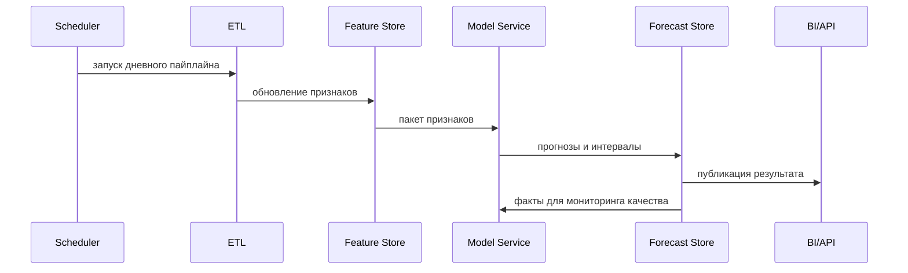

# OPEN FNR

> Платформа прогнозирования продаж и пополнения запасов торговой сети до **30 000 магазинов** и среднего ассортимента **5 500 SKU**.

<p>
  
  
</p>

## Назначение

OPEN FNR решает задачу кратко-, средне- и долгосрочного прогнозирования продаж и расчета пополнения для крупной розничной сети. Система рассчитана на промышленный контур, где нужно ежедневно формировать прогнозы по связкам `магазин x SKU`, рассчитывать потребность, проекцию запасов и предложения заказов, учитывать промо, сезонность, остатки, цены, календарь, локальные события и жизненный цикл товара.

## Wiki

Навигационный wiki-слой проекта находится в [wiki/README.md](wiki/README.md).

Быстрый вход:

- [Wiki Home](wiki/HOME.md)
- [Documentation Map](wiki/MAP.md)
- [Architecture Decisions](wiki/DECISIONS.md)
- [Glossary](wiki/GLOSSARY.md)
- [Open Questions](wiki/OPEN_QUESTIONS.md)

Подробное техническое задание доступно в документе [TECHNICAL_SPEC.md](TECHNICAL_SPEC.md).

Проектный устав и ключевые архитектурные решения зафиксированы в [PROJECT_CHARTER.md](PROJECT_CHARTER.md).

Технологическая архитектура и рекомендуемый стек вынесены в отдельный документ [TECHNOLOGY_ARCHITECTURE.md](TECHNOLOGY_ARCHITECTURE.md).

Бизнес-процессы и требования к UI описаны в документе [BUSINESS_PROCESSES_UI_SPEC.md](BUSINESS_PROCESSES_UI_SPEC.md).

Детальное описание покрываемых бизнес-процессов вынесено в [BUSINESS_PROCESS_DETAILED_SPEC.md](BUSINESS_PROCESS_DETAILED_SPEC.md).

Требования к UI-тестированию по бизнес-процессам описаны в [UI_TESTING_SPEC.md](UI_TESTING_SPEC.md).

Стек подбирается только из бесплатных self-hosted open-source инструментов с permissive-лицензиями, совместимыми с выпуском итогового кода под Apache License 2.0.

## Локальная Разработка

Локальный dev-контур описан в [infra/dev/README.md](infra/dev/README.md).

Запуск:

```powershell
docker compose --env-file infra/dev/.env.example -f infra/dev/compose.yaml up -d
```

## Стратегические Документы

| Документ | Назначение |
| --- | --- |
| [PRODUCT_VISION.md](PRODUCT_VISION.md) | видение продукта, ценность, пользователи, принципы и границы |
| [ROADMAP.md](ROADMAP.md) | этапы MVP, pilot, industrial pilot и full production |
| [TARGET_OPERATING_MODEL.md](TARGET_OPERATING_MODEL.md) | операционная модель, владельцы, RACI и support model |
| [KPI_BUSINESS_VALUE_FRAMEWORK.md](KPI_BUSINESS_VALUE_FRAMEWORK.md) | KPI, business value, forecast/replenishment/fresh/promo metrics |
| [DATA_GOVERNANCE.md](DATA_GOVERNANCE.md) | владельцы данных, DQ, SLA, MDM, lineage и правила исправлений |
| [PROCESS_ENGINE_GOVERNANCE.md](PROCESS_ENGINE_GOVERNANCE.md) | управление BPMN/DMN/CMMN, Flowable, версиями и релизами процессов |
| [INTEGRATION_STRATEGY.md](INTEGRATION_STRATEGY.md) | интеграции с ERP, WMS, DWH, POS, MDM и промо-системой |
| [DATA_INTEGRATION_SPEC.md](DATA_INTEGRATION_SPEC.md) | детальный контракт загрузки продаж, остатков, товаров в пути, заказов и MDM |
| [ML_GOVERNANCE.md](ML_GOVERNANCE.md) | жизненный цикл моделей, approval, monitoring, drift, retraining, rollback |
| [TESTING_STRATEGY.md](TESTING_STRATEGY.md) | общая стратегия тестирования data, ML, API, UI, process, performance |
| [SECURITY_STRATEGY.md](SECURITY_STRATEGY.md) | RBAC, audit, secrets, service security и security testing |
| [DEVELOPMENT_SPRINT_PLAN.md](DEVELOPMENT_SPRINT_PLAN.md) | план разработки по спринтам, вертикальные инкременты и тестовые слои |
| [PROJECT_EXECUTION_PLAN.md](PROJECT_EXECUTION_PLAN.md) | подробный план выполнения проекта по спринтам с процессами и тестами |
| [FUNCTIONAL_COVERAGE_MATRIX.md](FUNCTIONAL_COVERAGE_MATRIX.md) | матрица покрытия функциональности из raw-бенчмарка |
| [DOCUMENTATION_AUDIT_AND_SYNC.md](DOCUMENTATION_AUDIT_AND_SYNC.md) | post-sprint audit: фактически реализованные модули, расхождения и следующие действия |
| [NEXT_DELIVERY_PLAN.md](NEXT_DELIVERY_PLAN.md) | следующий план работ: industrial hardening, production deployment, real integrations, pilot |
| [DEPLOYMENT_ENVIRONMENTS_STRATEGY.md](DEPLOYMENT_ENVIRONMENTS_STRATEGY.md) | стратегия DEV/TEST/STAGE/PROD контуров и команды запуска |
| [REAL_DATA_INGESTION_PIPELINES.md](REAL_DATA_INGESTION_PIPELINES.md) | переход от mock-данных к реальным POS/ERP/WMS/DWH/MDM/promo pipelines |
| [PRODUCTION_SECURITY_HARDENING_PLAN.md](PRODUCTION_SECURITY_HARDENING_PLAN.md) | production-ready security: OIDC, RBAC/ABAC, secrets, audit, service accounts |
| [UI_PRODUCTIZATION_PLAN.md](UI_PRODUCTIZATION_PLAN.md) | перевод demo control tower в полноценный routed API-backed UI |
| [PILOT_LAUNCH_PLAN.md](PILOT_LAUNCH_PLAN.md) | план пилота на ограниченной выборке магазинов/SKU |

Ключевой масштаб:

- магазины: до `30 000`;
- средний ассортимент: `5 500 SKU`;
- потенциальный объем связок: до `165 000 000 store-SKU`;
- горизонт прогноза: настраиваемый, обычно `1-90` дней;
- частота пересчета: ежедневно или по расписанию бизнес-процесса.

## Цели

- Повысить точность прогнозирования спроса на уровне магазина и SKU.
- Снизить out-of-stock и избыточные остатки.
- Поддержать планирование закупок, распределения, пополнения и промо.
- Обеспечить воспроизводимость моделей и прозрачность качества прогнозов.
- Масштабировать расчет без ручной сегментации сети.

## Цветовой Образ

Проект оформляется в стиле **VSCode / Благородный красный**.

| Токен | Значение | Назначение |
| --- | --- | --- |
| `--vscode-bg` | `#1E1E1E` | базовый темный фон |
| `--noble-red` | `#8B1E2D` | основной акцент |
| `--noble-red-light` | `#B83A4B` | hover, активные элементы |
| `--noble-red-dark` | `#5E1420` | глубокий акцент |
| `--text-main` | `#D4D4D4` | основной текст |
| `--text-muted` | `#9DA3AE` | вторичный текст |
| `--border-soft` | `#3A3A3A` | тонкие разделители |

Пример CSS-токенов:

```css
:root {
  --vscode-bg: #1e1e1e;
  --noble-red: #8b1e2d;
  --noble-red-light: #b83a4b;
  --noble-red-dark: #5e1420;
  --text-main: #d4d4d4;
  --text-muted: #9da3ae;
  --border-soft: #3a3a3a;
}
```

## Основные Сценарии

1. Ежедневный прогноз продаж по магазинам и SKU.
2. Прогноз с учетом промо, цены, скидки и механики акции.
3. Прогноз новых товаров и товаров с короткой историей.
4. Коррекция прогноза при дефиците остатков и закрытых продажах.
5. Агрегированные прогнозы по кластеру, региону, категории и сети.
6. Мониторинг качества модели и дрейфа данных.
7. Экспорт прогноза в системы пополнения, закупок и аналитики.

## Архитектура


## Данные

| Домен | Примеры полей |
| --- | --- |
| Продажи | дата, магазин, SKU, количество, сумма, возвраты |
| Остатки | доступный остаток, транзит, резерв, stock-out-флаг |
| Товары | категория, бренд, размер, упаковка, жизненный цикл |
| Магазины | формат, регион, площадь, кластер, календарь работы |
| Цены | регулярная цена, промо-цена, скидка, эластичность |
| Промо | механика, период, глубина скидки, медиа-поддержка |
| Календарь | праздники, выходные, сезонные события, payday-факторы |
| Внешние факторы | погода, локальные события, макроиндикаторы |

## Модельный Подход

Система может использовать гибридную стратегию:

- базовые статистические модели для стабильных рядов;
- gradient boosting / tree-based модели для массового batch-прогноза;
- deep learning модели для сложной сезонности и больших категорий;
- hierarchical reconciliation для согласования прогнозов между уровнями;
- cold-start эвристики для новых магазинов и SKU;
- post-processing с учетом остатков, минимальных партий и бизнес-ограничений.

Рекомендуемый baseline:

```text
sales_qty ~ lag_features + rolling_features + price_features
          + promo_features + calendar_features + store_features
          + sku_features + availability_features
```

## Метрики Качества

| Метрика | Назначение |
| --- | --- |
| `WAPE` | основная бизнес-метрика ошибки по объему |
| `MAPE / sMAPE` | контроль относительной ошибки |
| `RMSE` | штраф за крупные промахи |
| `Bias` | контроль систематического завышения или занижения |
| `Service Level Impact` | влияние прогноза на доступность товара |
| `Stock Cost Impact` | влияние прогноза на избыточный запас |

## Производственный Контур



## Масштабирование

Для объема до `165M+` связок `магазин x SKU` важны:

- партиционирование по дате, региону, категории или кластеру;
- инкрементальный расчет признаков;
- батчевый inference с контролем памяти;
- хранение sparse-рядов без раздувания пустых комбинаций;
- отдельная обработка long-tail SKU;
- контроль SLA по времени пересчета.

## Риски

| Риск | Компенсация |
| --- | --- |
| Неполные остатки и закрытые продажи | availability-флаги, censoring adjustment |
| Новые SKU без истории | аналоги, категорийные профили, атрибутные модели |
| Резкие промо-эффекты | отдельные промо-признаки и uplift-модели |
| Дрейф спроса | мониторинг ошибки, retraining policy |
| Слишком большой feature set | feature pruning, offline profiling |
| Несогласованные иерархии | reconciliation и контроль агрегатов |

## Минимальный План Реализации

1. Согласовать целевые горизонты, SLA и уровни агрегации.
2. Подготовить витрины продаж, остатков, цен, промо, календаря и справочников.
3. Собрать baseline-прогноз и backtesting.
4. Добавить признаки доступности, цены, промо и календаря.
5. Внедрить batch inference и хранилище прогнозов.
6. Настроить мониторинг качества, bias и дрейфа.
7. Подключить экспорт в планирование и BI.

## Ожидаемый Результат

На выходе система формирует прогноз продаж с прозрачной историей версий, метриками качества, объяснимыми факторами и готовностью к интеграции с операционными процессами торговой сети.
