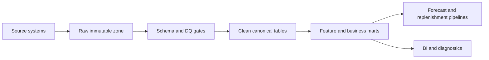

# OPEN FNR Real Data Ingestion Pipelines

Date: 2026-05-28

## Purpose

Define the transition from mock data to real ingestion pipelines for POS, ERP, WMS, DWH, MDM and promo systems.

## Pipeline Principles

- Every inbound batch has source system, business date, schema version, row count, checksum and correlation id.
- Every batch is idempotent.
- Raw data is immutable.
- Clean data is produced only after schema and DQ checks.
- Rejected rows are stored and visible to Data Owner.
- DQ blockers prevent downstream publication.
- All source contracts are versioned.

## Source Pipelines

| Source | Data | Frequency | Landing | Critical DQ |
| --- | --- | --- | --- | --- |
| POS | sales, returns, receipts | daily or intraday | raw sales | store_id, sku_id, date, qty, amount |
| WMS | DC stock, store stock, in-transit, open orders | daily/intraday | raw stock/orders | location_id, sku_id, qty, status |
| ERP | prices, suppliers, order export statuses | daily/intraday | raw ERP | price validity, supplier terms, order status |
| DWH | history, reference aggregates | daily | raw DWH | date range, duplicates, totals |
| MDM/PIM | product, store, hierarchy, lifecycle | daily/on change | raw MDM | keys, hierarchy, active flags |
| Promo system | promo plan, price, discount, display | daily/on change | raw promo | SKU/store/date overlap, price, discount |
| Store app | stock feedback, display confirmation | event/batch | raw store feedback | store scope, task id, counted qty |

## Target Layers

## Canonical Contracts

| Contract | Primary key | Required fields |
| --- | --- | --- |
| `sales_fact` | source_id + receipt_id + line_id | date, store_id, sku_id, qty, net_amount |
| `stock_snapshot` | date + location_id + sku_id | on_hand_qty, reserved_qty, available_qty |
| `open_order` | order_id + line_id | source, target, sku_id, ordered_qty, expected_date, status |
| `in_transit` | shipment_id + line_id | source, target, sku_id, qty, eta, status |
| `price` | sku_id + location_scope + valid_from | regular_price, promo_price, currency |
| `promo_plan` | promo_id + sku_id + store_scope | date_from, date_to, discount, display, capacity |
| `product_mdm` | sku_id | hierarchy, lifecycle_status, shelf_life, supplier |
| `store_mdm` | store_id | region, format, opening_date, status |

## Implementation Plan

| Step | Output |
| --- | --- |
| 1 | Collect sample files/API specs from all source systems |
| 2 | Create source-specific landing contracts |
| 3 | Add Airflow DAGs for POS, WMS, ERP, MDM and promo |
| 4 | Add schema validation and row count checks |
| 5 | Add DQ rules and severity routing |
| 6 | Add clean canonical tables |
| 7 | Add lineage and batch audit tables |
| 8 | Replace API mock data with repositories reading marts |
| 9 | Run shadow load on pilot data |
| 10 | Enable daily production-like schedule |

## Current Implementation Status

| Pipeline | Status | Implemented artifacts |
| --- | --- | --- |
| POS sales | in progress | `PosSalesLine`, POS manifest API, Airflow DAG skeleton, ClickHouse raw POS sales table |
| WMS stock/orders/in-transit | in progress | WMS stock/open order/in-transit contracts, manifest APIs, Airflow DAG skeleton, ClickHouse raw WMS tables |
| ERP prices/order statuses | in progress | ERP price/export-status contracts, manifest APIs, Airflow DAG skeleton, ClickHouse raw ERP tables |
| MDM/PIM | in progress | MDM product/store contracts, manifest APIs, Airflow DAG skeleton, ClickHouse raw MDM tables |
| Promo system | planned | promo plan source contract and overlap DQ to be added before promo pilot |

## Acceptance Criteria

- All source systems have signed contracts.
- Daily pilot data load finishes before forecast/replenishment cutoff.
- DQ blockers are visible in UI and Process Engine.
- Reprocessing is idempotent.
- Lineage connects source batch to forecast/order output.
- Mock data is disabled for pilot runs except explicit fallback mode.
