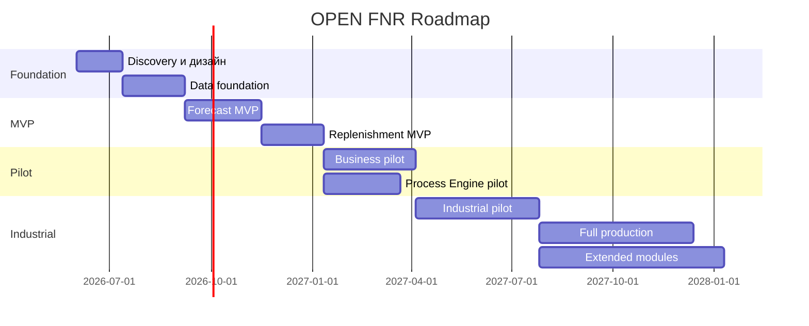

# Roadmap OPEN FNR

## 0. Post-Sprint Status Update

As of 2026-05-28, the repository contains a completed functional prototype across 37 sprint checkpoints. The implemented scope covers forecasting, promo, replenishment, process engine, procurement, shelf space, capacity, diagnostics, supplier collaboration and true inventory/store management.

This does not mean production readiness. The roadmap is now re-baselined:

- completed: functional prototype and process/UI/API coverage;
- current phase: industrial hardening, real integrations, security and UI productization;
- next business milestone: controlled pilot on limited stores/SKU;
- next technical milestone: DEV/TEST/STAGE contours with real ingestion pipelines and production security foundation.

The detailed next delivery plan is maintained in [NEXT_DELIVERY_PLAN.md](NEXT_DELIVERY_PLAN.md).

## 1. Назначение

Roadmap фиксирует поэтапное развитие OPEN FNR от MVP до промышленного контура полной сети.

Основной принцип: сначала доказать ценность на ограниченном контуре, затем масштабировать данные, процессы, UI, интеграции и инфраструктуру.

## 2. Этапы

Даты являются ориентировочными и должны быть уточнены после discovery.

## 3. Этап 0. Discovery И Проектирование

### Цель

Подтвердить бизнес-цели, источники данных, ограничения и целевую архитектуру.

### Scope

- аудит текущих процессов;
- карта источников данных;
- карта интеграций;
- выбор пилотных категорий;
- определение KPI;
- согласование целевого стека;
- high-level sizing EPYC-кластера;
- подтверждение лицензий;
- финализация проектного устава.

### Выходы

- согласованный charter;
- target architecture;
- pilot scope;
- data availability report;
- risk register;
- roadmap baseline.

### Exit Criteria

- определены пилотные категории;
- подтверждены источники продаж, остатков, цен, промо, MDM;
- утверждены KPI;
- согласован целевой стек.

## 4. Этап 1. Data Foundation

### Цель

Построить надежную основу данных.

### Scope

- ingestion продаж;
- ingestion остатков;
- ingestion цен;
- ingestion промо;
- MDM товаров и магазинов;
- справочники поставщиков и РЦ;
- базовые DQ checks;
- lakehouse raw/clean/mart;
- ClickHouse forecast/replenishment schemas;
- PostgreSQL metadata schemas.

### Exit Criteria

- данные доступны ежедневно;
- DQ показывает ошибки;
- активная матрица формируется;
- история готова для baseline.

## 5. Этап 2. Forecast MVP

### Цель

Построить первый промышленно воспроизводимый прогноз.

### Scope

- regular baseline;
- LightGBM/CatBoost модель;
- промо-uplift baseline;
- backtesting;
- WAPE/Bias dashboards;
- Forecast Workbench basic;
- forecast export в DWH/ClickHouse.

### Ограничения MVP

- ограниченные категории;
- ограниченный набор магазинов или регионов;
- горизонт `14/30`;
- без full multi-echelon;
- минимум ручных корректировок.

### Exit Criteria

- прогноз считается ежедневно;
- WAPE лучше baseline;
- прогноз разделен на regular и promo;
- результаты доступны в BI.

## 6. Этап 3. Replenishment MVP

### Цель

Рассчитать первые order proposals на базе прогноза.

### Scope

- projected stock;
- demand projection;
- basic order proposal;
- safety stock;
- presentation stock;
- MOQ/кратность;
- open orders;
- Replenishment Workbench basic;
- export mock в ERP/WMS.

### Exit Criteria

- order proposals объяснимы;
- пользователь видит расчет;
- заказы можно подтверждать в тестовом контуре;
- создаются исключения stock-out/overstock.

## 7. Этап 4. Business Pilot

### Цель

Проверить систему в реальном бизнес-процессе.

### Scope

- пилотные категории;
- реальные пользователи;
- ручные корректировки;
- исключения;
- промо-процесс;
- operational dashboards;
- сравнение с текущим процессом.

### Exit Criteria

- бизнес использует систему в пилоте;
- измерен эффект;
- список доработок приоритизирован;
- принято решение о масштабировании.

## 8. Этап 5. Process Engine Pilot

### Цель

Вынести ключевые процессы в Flowable.

### Scope

- Promo Planning BPMN;
- Replenishment Approval BPMN;
- Exception Resolution CMMN;
- Promo Completeness DMN;
- Order Auto-Approval DMN;
- UI tasks из process engine;
- process audit.

### Exit Criteria

- минимум 3 процесса исполняются через Flowable;
- DMN управляет обязательными правилами промо;
- UI не хардкодит статусы для пилотных процессов.

## 9. Этап 6. Industrial Pilot

### Цель

Расширить систему до промышленного масштаба части сети.

### Scope

- расширение категорий и регионов;
- EPYC-кластер;
- Airflow production DAGs;
- ClickHouse cluster;
- PostgreSQL HA;
- MLflow registry;
- OpenSearch logs;
- Prometheus/Alertmanager;
- ERP/WMS интеграции;
- fresh pilot;
- lifecycle SKU.

### Exit Criteria

- SLA выдерживается;
- интеграции работают;
- monitoring и support model готовы;
- бизнес подтверждает эффект.

## 10. Этап 7. Full Production

### Цель

Масштабировать OPEN FNR на целевую сеть.

### Scope

- полный перечень магазинов;
- полный scope категорий;
- горизонты `14/30/60/90`;
- multi-echelon;
- fresh production;
- process governance;
- DR;
- support 2/3 line;
- регулярный retraining;
- continuous improvement.

### Exit Criteria

- ежедневный расчет в production;
- order proposals передаются в ERP/WMS;
- SLA выполняется;
- KPI измеряются;
- владелец процесса и support model работают.

## 11. Этап 8. Extended Functional Modules

### Цель

Закрыть расширенные функциональные модули, выявленные при сверке с `raw/RELEX Modules and functionality RU.csv`.

### Scope

- procurement optimization;
- shelf space optimization;
- capacity optimization;
- supply chain diagnostics;
- supplier collaboration;
- true inventory;
- store management;
- workload forecasting;
- wholesale/B2B channel planning, если подтверждено бизнесом.

### Exit Criteria

- функции отражены в ТЗ и процессах;
- UI и UI-тесты покрывают новые сценарии;
- функции включены в sprint plan;
- бизнес определил, какие из модулей являются industrial, а какие add-on.

## 12. Основные Зависимости

- качество данных POS/ERP/WMS;
- доступность MDM;
- готовность промо-плана;
- готовность ERP/WMS принимать заказы;
- инфраструктура EPYC;
- готовность пользователей к пилоту;
- юридическое подтверждение лицензий.

## 13. Основные Риски Roadmap

| Риск | Компенсация |
| --- | --- |
| плохое качество данных | Data Foundation до ML |
| недоступность промо-данных | отдельный промо-data track |
| задержка интеграций | mock/export в MVP |
| перегрузка scope | strict MVP scope |
| сопротивление пользователей | пилот, обучение, explainability |
| нарушение SLA | performance gates на каждом этапе |
