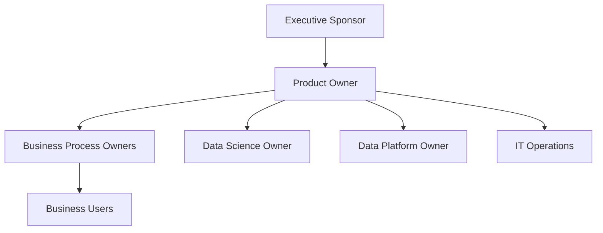

# Target Operating Model OPEN FNR

## 1. Назначение

Target Operating Model описывает, как организация будет работать с OPEN FNR после внедрения: роли, ответственность, процессы владения, принятие решений, поддержка и операционный ритм.

## 2. Операционная Модель

## 3. Владение Областями

| Область | Владелец | Ответственность |
| --- | --- | --- |
| Product | Product Owner | roadmap, scope, value, приоритеты |
| Forecast | Forecast Process Owner | качество прогноза, review, корректировки |
| Replenishment | Replenishment Process Owner | order proposals, параметры, исключения |
| Promo | Promo Process Owner | промо-процесс, обязательные данные, согласования |
| Fresh | Fresh Process Owner | списания, shelf-life, fresh-заказы |
| Data | Data Owner / Data Steward | качество данных, MDM, SLA |
| ML | ML Owner | модели, monitoring, retraining |
| Process Engine | Process Owner + BPM Owner | BPMN/DMN/CMMN, версии, релизы |
| Integrations | Integration Owner | ERP/WMS/DWH/POS/MDM |
| Security | Security Owner | RBAC, audit, access |
| Operations | IT Operations | availability, incidents, backups |

## 4. RACI

| Процесс | Business Owner | Planner | DS | DE | IT | Admin |
| --- | --- | --- | --- | --- | --- | --- |
| Регулярный прогноз | A | R | R | C | C | I |
| Промо-прогноз | A | R | C | C | I | I |
| Пополнение | A | R | C | C | C | I |
| Fresh | A | R | C | C | I | I |
| DQ incident | C | I | I | R | C | I |
| Model release | A | C | R | C | C | I |
| Process change | A | C | C | C | C | R |
| Integration incident | C | I | I | C | R | I |
| Access request | C | I | I | I | C | R |

R = Responsible, A = Accountable, C = Consulted, I = Informed.

## 5. Ежедневный Операционный Ритм

| Время | Действие | Владелец |
| --- | --- | --- |
| Ночь | загрузка данных, DQ, расчет прогнозов и заказов | IT/DE |
| Утро | проверка Control Tower | Process Owners |
| Утро | разбор критичных исключений | Planners |
| День | корректировки, согласования, публикация | Business Users |
| День | контроль ERP/WMS export | Integration/IT |
| Вечер | review инцидентов и SLA | Operations |

## 6. Еженедельный Ритм

- review WAPE/Bias;
- review service level/out-of-stock;
- review overstock/waste;
- review промо-эффективности;
- review ручных корректировок;
- review DQ проблем;
- backlog refinement;
- decision по retraining.

## 7. Ежемесячный Ритм

- business value review;
- model performance review;
- replenishment parameter review;
- process change board;
- capacity review;
- security access review;
- roadmap review.

## 8. Change Advisory Board

Для изменений промышленного контура создается Change Advisory Board.

Состав:

- Product Owner;
- Forecast Owner;
- Replenishment Owner;
- Promo Owner;
- Data Owner;
- ML Owner;
- IT Operations;
- Security Owner.

Рассматривает:

- изменения BPMN/DMN/CMMN;
- релизы моделей;
- изменения интеграций;
- изменения параметров пополнения;
- изменения прав;
- изменения SLA.

## 9. Support Model

| Линия | Ответственность |
| --- | --- |
| L1 | пользовательская поддержка, доступы, базовые вопросы |
| L2 | бизнес-процессы, DQ, исключения, интеграции |
| L3 | разработка, ML, архитектура, сложные дефекты |

## 10. Принципы Операционной Модели

- бизнес владеет решениями, IT владеет платформой;
- forecast и order имеют разных владельцев;
- DQ имеет явного Data Owner;
- каждое исключение имеет владельца;
- каждое ручное изменение имеет причину;
- каждый process change проходит версионирование;
- каждая модель имеет владельца и критерии допуска.

