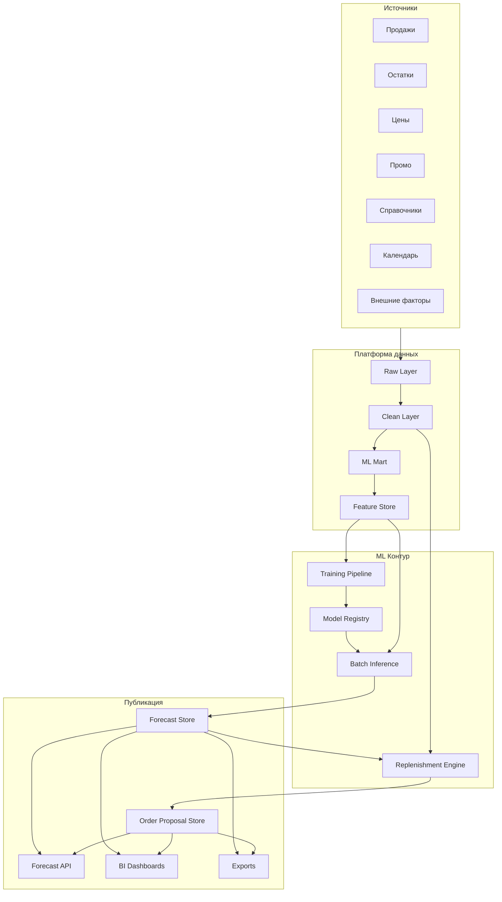
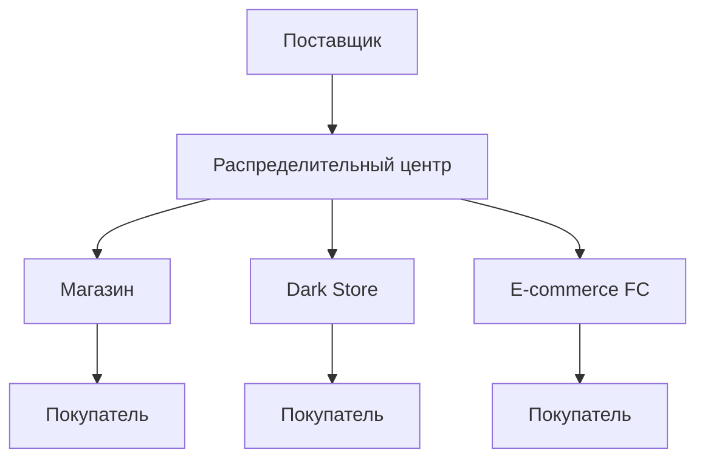
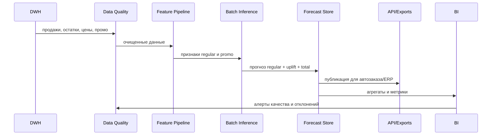

# Техническое Задание

## Проект

**OPEN FNR**: промышленная ML/AI-система прогнозирования продаж и пополнения запасов торговой сети.

Система строит ежедневные прогнозы продаж на уровне:

```text
магазин x SKU x дата
```

На базе прогноза система также рассчитывает потребность, проекцию запасов и предложения заказов для магазинов, распределительных центров, e-commerce-локаций и других уровней цепочки поставок.

Масштаб целевого контура:

| Параметр | Значение |
| --- | --- |
| Количество магазинов | до `30 000` |
| Средний ассортимент магазина | `5 500 SKU` |
| Потенциальный объем связок `магазин x SKU` | до `165 000 000` |
| Горизонты прогноза | `14 / 30 / 60 / 90` дней |
| Частота пересчета | ежедневно |
| Основная метрика приемки | `WAPE` |
| Потребители прогноза | автозаказ, ERP, DWH, BI |

## Визуальная Концепция

Документация, интерфейсы мониторинга и BI-представления проекта оформляются в стиле **VSCode / благородный красный**.

| Токен | Цвет | Назначение |
| --- | --- | --- |
| `--vscode-bg` | `#1E1E1E` | основной темный фон |
| `--vscode-panel` | `#252526` | панели и рабочие области |
| `--noble-red` | `#8B1E2D` | основной акцент |
| `--noble-red-light` | `#B83A4B` | активные состояния |
| `--noble-red-dark` | `#5E1420` | глубокий акцент |
| `--text-main` | `#D4D4D4` | основной текст |
| `--text-muted` | `#9DA3AE` | вторичный текст |
| `--border-soft` | `#3A3A3A` | разделители |

## 1. Цели Проекта

Основная цель проекта: создать масштабируемую промышленную систему прогнозирования продаж, которая ежедневно формирует качественные прогнозы регулярного и промо-спроса для дальнейшего использования в автозаказе, планировании поставок, ERP, DWH и BI.

Цели:

- повысить точность прогнозирования спроса на уровне магазина, SKU и даты;
- разделить прогноз регулярного спроса и прогноз промо-продаж;
- учитывать сезонность, календарь, цены, скидки, остатки, доступность товара и жизненный цикл SKU;
- обеспечить расчет прогноза в промышленном SLA не более `2 часов`;
- обеспечить воспроизводимость моделей, данных и результатов;
- обеспечить прозрачный мониторинг качества прогноза;
- подготовить систему к расширению на новые каналы продаж, регионы, форматы магазинов и внешние факторы.

## 2. Бизнес-Задачи

| Задача | Описание | Ожидаемый эффект |
| --- | --- | --- |
| Автозаказ | Передача прогнозов в систему пополнения | снижение out-of-stock и излишков |
| Закупки | Прогнозирование потребности по горизонту `30-90` дней | более точное планирование закупок |
| Промо-планирование | Оценка ожидаемых продаж во время акции | снижение ошибок промо-заказа |
| Распределение | Поддержка аллокации товара по магазинам | лучшее распределение запасов |
| Финансовое планирование | Агрегированный прогноз продаж | повышение точности бюджетирования |
| Аналитика | BI-контроль качества, отклонений и bias | управляемость процесса |

## 3. Границы Проекта

### 3.1. Входит В Проект

- построение регулярного прогноза продаж;
- построение промо-прогноза продаж;
- подготовка витрин данных для ML;
- расчет признаков;
- обучение, валидация и регистрация моделей;
- ежедневный batch inference;
- хранение прогнозов, фактов, метрик качества и версий моделей;
- API и файловые выгрузки для потребителей;
- BI-дашборды мониторинга качества и операционного статуса;
- контроль SLA, логирование, алертинг;
- документация методологии, данных и интеграций.

### 3.2. Не Входит В Первую Версию

- автоматическое принятие решений о заказе без внешней системы автозаказа;
- ручное редактирование прогноза бизнес-пользователями в интерфейсе планирования;
- оптимизация цен;
- оптимизация промо-календаря;
- прогнозирование маржинальности и прибыли;
- realtime-прогноз на каждый чек;
- замена ERP, DWH или MDM-систем.

## 4. Пользователи И Роли

| Роль | Зона ответственности |
| --- | --- |
| Бизнес-владелец | цели, KPI, приемка результата |
| Категорийный менеджер | интерпретация прогноза, промо-эффекты, ограничения |
| Supply Chain / Автозаказ | использование прогноза для пополнения |
| Data Scientist | модели, метрики, backtesting, мониторинг качества |
| Data Engineer | пайплайны данных, витрины, качество данных |
| ML Engineer | обучение, inference, model registry, деплой |
| Backend Engineer | API, интеграции, сервисные контракты |
| BI Analyst | дашборды, отчеты, диагностика |
| DevOps / Platform Engineer | инфраструктура, расписание, мониторинг, безопасность |
| Data Steward | справочники, MDM, качество мастер-данных |

## 5. Основные Сценарии Использования

1. Ежедневный расчет регулярного прогноза на горизонты `14 / 30 / 60 / 90` дней.
2. Ежедневный расчет промо-прогноза с учетом механики промо, глубины скидки и календаря акции.
3. Передача прогнозов в автозаказ, ERP, DWH и BI.
4. Контроль качества прогноза по сети, регионам, магазинам, категориям, SKU и промо.
5. Диагностика систематического завышения или занижения прогноза.
6. Пересчет прогноза после обновления промо-плана, цен или товарной матрицы.
7. Backtesting новых моделей перед выпуском в промышленный контур.
8. Мониторинг дрейфа данных, сбоев загрузки, аномалий и нарушения SLA.

## 6. Разделение На Регулярный И Промо-Прогноз

Прогнозирование разделяется на два связанных направления:

```text
Итоговый прогноз = регулярный спрос + промо uplift
```

### 6.1. Прогноз Регулярного Ассортимента

Регулярный прогноз описывает ожидаемые продажи без воздействия промо-механик.

Требования:

- строить прогноз по активным связкам `магазин x SKU`;
- учитывать историю продаж, сезонность, календарь, цену, доступность и жизненный цикл товара;
- корректировать историю на stock-out и закрытые продажи;
- поддерживать товары с редкой продажей и длинный хвост ассортимента;
- обеспечивать согласование с агрегированными уровнями: магазин, категория, регион, сеть.

Основные признаки:

- лаги продаж;
- rolling-статистики;
- календарные признаки;
- признаки цены;
- признаки остатков и доступности;
- признаки магазина;
- признаки SKU;
- признаки товарной матрицы;
- признаки жизненного цикла.

### 6.2. Прогноз Промо-Продаж

Промо-прогноз оценивает дополнительный спрос, возникающий из-за промо-активности.

Требования:

- учитывать тип промо, механику, скидку, длительность, дату начала и окончания;
- учитывать промо-историю аналогичных SKU, категорий, магазинов и регионов;
- прогнозировать uplift относительно регулярного спроса;
- учитывать каннибализацию и пост-промо спад, если данные позволяют;
- поддерживать промо для новых SKU через аналоги и атрибутные модели;
- хранить разложение итогового прогноза на регулярную часть и промо-эффект.

Основные признаки:

- глубина скидки;
- тип промо-механики;
- номер дня внутри промо;
- длительность промо;
- промо-поддержка;
- история uplift по SKU, категории и магазину;
- пересечения с праздниками и сезонными событиями;
- наличие конкурирующих промо внутри категории.

## 7. Связь Прогноза И Пополнения

Система должна явно разделять понятия **прогноз спроса** и **проекция потребности для пополнения**.

| Понятие | Смысл | Использование |
| --- | --- | --- |
| `forecast` | сколько покупатели, вероятно, купят при наличии товара | DS, BI, планирование продаж |
| `demand_projection` | сколько товара потребуется с учетом запасов, заказов в пути, lead time, календарей, партий и ограничений | автозаказ, РЦ, поставщики |
| `order_proposal` | рекомендуемое количество к заказу или перемещению | ERP, WMS, автозаказ, планировщик |

Логическая цепочка:


Итоговый заказ не должен быть равен прогнозу напрямую. Он рассчитывается с учетом:

- текущего остатка;
- открытых заказов;
- ожидаемых поставок;
- сроков поставки;
- календарей заказа и доставки;
- минимальной выкладки;
- страхового запаса;
- партийности заказа;
- кратности упаковки;
- ограничений поставщика;
- ограничений склада, транспорта и полки;
- срока годности;
- промо-выкладки и дополнительных display-запасов;
- вместимости полки и прямой поставки на полку;
- нагрузки на приемку, выкладку, РЦ и транспорт.

## 8. Требования К Данным

### 7.1. Продажи

| Поле | Тип | Обязательность | Описание |
| --- | --- | --- | --- |
| `date` | date | да | дата продажи |
| `store_id` | string/int | да | идентификатор магазина |
| `sku_id` | string/int | да | идентификатор SKU |
| `sales_qty` | numeric | да | количество проданных единиц |
| `sales_amount` | numeric | да | сумма продаж |
| `return_qty` | numeric | желательно | возвраты |
| `receipt_count` | numeric | желательно | количество чеков |
| `channel` | string | желательно | канал продаж |

Требования:

- история не менее `24 месяцев`, желательно `36 месяцев`;
- ежедневная гранулярность;
- отдельное хранение возвратов или корректное отражение в факте;
- отсутствие дублей по ключу `date, store_id, sku_id, channel`.

### 7.2. Остатки

| Поле | Тип | Обязательность | Описание |
| --- | --- | --- | --- |
| `date` | date | да | дата остатка |
| `store_id` | string/int | да | магазин |
| `sku_id` | string/int | да | SKU |
| `stock_qty` | numeric | да | доступный остаток |
| `in_transit_qty` | numeric | желательно | товар в пути |
| `reserved_qty` | numeric | желательно | резерв |
| `stockout_flag` | boolean | желательно | признак отсутствия товара |

Требования:

- остатки на конец дня или на начало дня должны иметь единое правило;
- отрицательные остатки должны маркироваться и обрабатываться;
- stock-out должен использоваться для коррекции закрытых продаж.

### 7.3. Цены

| Поле | Тип | Обязательность | Описание |
| --- | --- | --- | --- |
| `date` | date | да | дата действия цены |
| `store_id` | string/int | да | магазин или зона цены |
| `sku_id` | string/int | да | SKU |
| `regular_price` | numeric | да | регулярная цена |
| `actual_price` | numeric | да | фактическая цена |
| `discount_pct` | numeric | желательно | процент скидки |

### 7.4. Промо

| Поле | Тип | Обязательность | Описание |
| --- | --- | --- | --- |
| `promo_id` | string/int | да | идентификатор промо |
| `store_id` | string/int | да | магазин, кластер или регион |
| `sku_id` | string/int | да | SKU |
| `start_date` | date | да | дата начала |
| `end_date` | date | да | дата окончания |
| `mechanic` | string | да | механика акции |
| `discount_pct` | numeric | желательно | скидка |
| `media_support` | string/bool | желательно | поддержка в медиа |

### 7.5. Календарь

Необходимы:

- день недели;
- выходной или рабочий день;
- федеральные и региональные праздники;
- предпраздничные и постпраздничные дни;
- школьные каникулы, если доступны;
- payday-факторы, если релевантны;
- сезонные периоды.

### 7.6. Справочник Магазинов

Поля:

- `store_id`;
- формат магазина;
- регион;
- город;
- площадь;
- дата открытия;
- дата закрытия;
- кластер;
- ценовая зона;
- график работы;
- активность магазина.

### 7.7. Справочник Товаров

Поля:

- `sku_id`;
- категория;
- подкатегория;
- бренд;
- размер;
- упаковка;
- единица измерения;
- дата ввода;
- дата вывода;
- статус SKU;
- признак СТМ;
- аналоги и замены, если доступны.

### 7.8. Внешние Факторы

Внешние данные подключаются при наличии подтвержденного бизнес-эффекта:

- погода;
- локальные события;
- макроэкономические индикаторы;
- данные конкурентов;
- трафик ТЦ или района;
- региональные ограничения и события.

### 7.9. Данные Для Пополнения

Для расчета заказов и проекций запасов дополнительно требуются:

| Домен | Обязательные данные |
| --- | --- |
| Открытые заказы | `order_id`, `store_id`, `sku_id`, `ordered_qty`, `confirmed_qty`, `expected_delivery_date`, статус |
| Поставщики | поставщик, lead time, минимальный заказ, кратность, календарь заказов, календарь поставок |
| РЦ и склады | остатки РЦ, доступный запас, inbound, outbound, capacity, зона обслуживания |
| Транспорт | дни доставки, cutoff time, ограничения машины, паллеты, вес, объем |
| Упаковки | единицы в коробе, слое, паллете, минимальная партия, кратность заказа |
| Полка | минимальная выкладка, вместимость полки, presentation stock, display stock |
| Срок годности | дата производства, срок годности, остаточный срок, batch-id, FIFO/FEFO |
| Ассортимент | дата ввода, дата вывода, замены, phase-in/phase-out, статус матрицы |
| Ограничения | MOQ, MOV, max stock, min stock, запреты заказа, квоты поставщика |

Система должна поддерживать разные типы локаций:

- магазин;
- распределительный центр;
- dark store;
- e-commerce fulfillment center;
- транзитная точка;
- поставщик;
- customer group или B2B-клиент, если требуется.

## 9. Требования К Качеству Данных

| Проверка | Требование |
| --- | --- |
| Полнота продаж | не менее `99%` дней по активным магазинам |
| Дубли | отсутствие дублей по бизнес-ключам |
| Целостность справочников | все `store_id` и `sku_id` должны маппиться на MDM |
| Остатки | ежедневная доступность по активной матрице |
| Промо | отсутствие пересекающихся промо без правила приоритета |
| Цены | отсутствие нулевых и отрицательных цен для активных продаж |
| Запаздывание данных | в рамках SLA загрузки |
| Аномалии | флаги резких всплесков, провалов, закрытий магазинов |

Критичные ошибки данных должны блокировать публикацию прогноза или переводить расчет в degraded mode с алертингом.

## 10. Методология Прогнозирования

### 9.1. Baseline

Baseline нужен для первичной приемки, сравнения моделей и fallback-сценариев.

Допустимые baseline-подходы:

- seasonal naive;
- moving average;
- медиана продаж по аналогичным дням недели;
- простая модель на лаговых и календарных признаках;
- категорийный прогноз для sparse-SKU.

### 9.2. Регулярный Спрос

Рекомендуемый подход:

- feature-based модели на уровне `магазин x SKU x дата`;
- сегментация по категориям, частоте продаж и стабильности ряда;
- отдельная обработка fast movers, medium movers и slow movers;
- использование LightGBM / CatBoost / XGBoost или их распределенных аналогов;
- опционально: neural forecasting для крупных категорий с устойчивой сезонностью.

Целевая переменная:

```text
regular_sales_qty
```

Рекомендуемые признаки:

- `lag_1`, `lag_7`, `lag_14`, `lag_28`, `lag_56`;
- rolling mean / median / std за `7 / 14 / 28 / 56` дней;
- день недели, неделя года, месяц;
- праздник, предпраздничный день, постпраздничный день;
- цена, относительное изменение цены;
- наличие товара;
- возраст SKU в магазине;
- возраст магазина;
- магазинные и товарные кластеры.

### 9.3. Промо Uplift

Промо-модель должна прогнозировать дополнительный спрос относительно регулярного baseline.

Целевая переменная:

```text
promo_uplift_qty = actual_sales_qty - expected_regular_sales_qty
```

или относительная форма:

```text
promo_uplift_ratio = actual_sales_qty / expected_regular_sales_qty
```

Рекомендуемые признаки:

- тип промо;
- глубина скидки;
- длительность промо;
- день промо;
- промо-поддержка;
- категория и бренд;
- регион и формат магазина;
- история uplift для SKU, категории, магазина и промо-механики;
- праздники и сезонные периоды;
- пересечения промо.

Итоговый прогноз:

```text
forecast_qty = regular_forecast_qty + promo_uplift_forecast_qty
```

### 9.4. Cold Start

Cold start требуется для:

- новых SKU;
- новых магазинов;
- новых связок `магазин x SKU`;
- новых промо-механик.

Подходы:

- аналоги по товарным атрибутам;
- категорийные профили;
- кластеризация магазинов;
- перенос спроса из похожих магазинов;
- экспертные ограничения;
- fallback на агрегированный уровень.

### 9.5. Stock-Out Correction

Если товар отсутствовал на полке, фактические продажи не равны спросу. Система должна:

- определять периоды stock-out;
- исключать или корректировать такие наблюдения при обучении;
- использовать остатки и продажи для оценки закрытого спроса;
- хранить флаг качества факта;
- не считать нулевую продажу нулевым спросом при отсутствии товара.

### 9.6. Иерархическое Согласование

Система должна поддерживать контроль согласованности прогнозов на уровнях:

- `магазин x SKU`;
- `магазин x категория`;
- `регион x SKU`;
- `регион x категория`;
- `сеть x SKU`;
- `сеть x категория`;
- `сеть всего`.

Методы:

- bottom-up;
- top-down;
- middle-out;
- reconciliation с весами по точности и объему.

## 11. Требования К ML-Пайплайну

ML-пайплайн должен включать:

1. загрузку исходных данных;
2. проверки качества;
3. построение обучающих выборок;
4. расчет признаков;
5. backtesting;
6. обучение моделей;
7. расчет метрик;
8. регистрацию модели;
9. публикацию модели в batch inference;
10. мониторинг результата.


Требования:

- все датасеты должны версионироваться;
- каждая модель должна иметь версию, параметры, дату обучения и набор метрик;
- inference должен быть воспроизводимым;
- пайплайн должен поддерживать ручной и автоматический запуск;
- ошибки должны логироваться и передаваться в мониторинг.

## 12. Требования К Batch Inference

Batch inference должен ежедневно рассчитывать прогнозы для активной матрицы.

Вход:

- дата расчета;
- горизонт прогноза;
- активная матрица `store_id x sku_id`;
- признаки на будущие даты;
- промо-план;
- цены и календарь.

Выход:

- регулярный прогноз;
- промо uplift;
- итоговый прогноз;
- доверительный интервал или квантильные прогнозы;
- версия модели;
- версия данных;
- флаги качества.

Требования к производительности:

- полный промышленный расчет должен завершаться не более чем за `2 часа`;
- расчет должен поддерживать партиционирование по дате, категории, региону или кластеру;
- inference должен выполняться без ручной сегментации;
- сбой одной партиции не должен разрушать весь расчет;
- должна быть возможность повторного расчета выбранной даты, категории, региона или модели.

## 13. API И Интеграции

### 12.1. Потребители

| Система | Формат взаимодействия |
| --- | --- |
| Автозаказ | API / таблица DWH / batch-файл |
| ERP | API / регламентная выгрузка |
| DWH | запись в целевые таблицы |
| BI | витрины и агрегаты |
| Data Science Sandbox | доступ к историческим прогнозам и фактам |

### 12.2. API

Минимальные методы:

| Метод | Назначение |
| --- | --- |
| `GET /forecast` | получить прогноз по фильтрам |
| `GET /forecast/latest` | получить последнюю опубликованную версию |
| `GET /forecast/metrics` | получить метрики качества |
| `GET /forecast/status` | получить статус расчетов |
| `POST /forecast/recalculate` | инициировать пересчет выбранного среза |

Пример фильтров:

```json
{
  "date_from": "2026-06-01",
  "date_to": "2026-06-30",
  "store_ids": ["1001", "1002"],
  "sku_ids": ["SKU001", "SKU002"],
  "forecast_type": "total"
}
```

## 14. BI-Дашборды И Мониторинг

### 13.1. BI-Дашборды

Обязательные страницы:

- качество прогноза по сети;
- качество по регионам;
- качество по магазинам;
- качество по категориям;
- качество по SKU;
- сравнение регулярного и промо-прогноза;
- bias и систематические отклонения;
- топ ошибок;
- статус ежедневного расчета;
- SLA и время выполнения пайплайнов.

### 13.2. Технический Мониторинг

Показатели:

- время загрузки данных;
- время feature engineering;
- время inference;
- количество обработанных строк;
- количество ошибок данных;
- количество fallback-прогнозов;
- статус публикации;
- задержка данных;
- потребление CPU, RAM, GPU, диска.

## 15. Метрики Качества

| Метрика | Формула / смысл | Использование |
| --- | --- | --- |
| `WAPE` | `sum(abs(fact - forecast)) / sum(fact)` | основная метрика приемки |
| `MAPE` | средняя относительная ошибка | диагностика на стабильных рядах |
| `Bias` | `sum(forecast - fact) / sum(fact)` | контроль завышения или занижения |
| `Service Level Impact` | влияние на доступность товара | бизнес-эффект |
| `Stock Cost Impact` | влияние на избыточный запас | бизнес-эффект |

Метрики должны считаться отдельно для:

- регулярного прогноза;
- промо-прогноза;
- итогового прогноза;
- fast / medium / slow movers;
- категорий;
- регионов;
- форматов магазинов;
- новых SKU;
- SKU с stock-out.

## 16. Нефункциональные Требования

### 15.1. Масштабируемость

- поддержка до `165M` активных или потенциальных связок `store-SKU`;
- поддержка горизонта до `90` дней;
- горизонтальное масштабирование расчета по партициям;
- возможность добавления новых магазинов, SKU, регионов и каналов.

### 15.2. Производительность

- ежедневный расчет полного прогноза не более `2 часов`;
- критичные проверки данных до `30 минут`;
- публикация результата после завершения inference до `15 минут`;
- API-ответы для агрегированных запросов до `3 секунд`;
- API-ответы для детальных запросов до `10 секунд` при разумных лимитах.

### 15.3. Отказоустойчивость

- повторный запуск упавших задач;
- идемпотентность пайплайнов;
- fallback на предыдущую модель или baseline;
- алертинг при нарушении SLA;
- хранение последнего успешного прогноза.

### 15.4. Безопасность

- разграничение доступа по ролям;
- аудит доступа к данным;
- шифрование секретов;
- сервисные учетные записи для интеграций;
- запрет прямого изменения опубликованных прогнозов без версионирования.

### 15.5. Наблюдаемость

- централизованные логи;
- метрики пайплайнов;
- трассировка задач;
- алерты по данным, моделям и инфраструктуре;
- журнал публикаций прогнозов.

### 15.6. Воспроизводимость

- версия исходных данных;
- версия feature pipeline;
- версия модели;
- версия параметров;
- версия прогноза;
- неизменяемое хранение опубликованных результатов.

## 17. Архитектура Решения



## 18. Хранилища Данных И Витрины

| Слой | Назначение | Пример технологии |
| --- | --- | --- |
| Raw Layer | исходные данные без бизнес-преобразований | Apache Ozone / SeaweedFS / HDFS |
| Clean Layer | очищенные и нормализованные данные | Iceberg / Delta / Parquet |
| ML Mart | обучающие и inference-витрины | Spark / Polars / DuckDB |
| Feature Store | признаки моделей | Feast / собственная витрина |
| Model Registry | версии моделей | MLflow |
| Forecast Store | опубликованные прогнозы | ClickHouse / PostgreSQL |
| Replenishment Mart | проекции запасов, потребность, предложения заказов | ClickHouse / PostgreSQL |
| BI Layer | агрегаты для отчетности | ClickHouse / Apache Superset |

## 19. Форматы Входных И Выходных Данных

### 18.1. Входная Витрина Для Inference

Ключ:

```text
run_date, forecast_date, store_id, sku_id
```

Минимальные поля:

| Поле | Описание |
| --- | --- |
| `run_date` | дата запуска прогноза |
| `forecast_date` | прогнозируемая дата |
| `store_id` | магазин |
| `sku_id` | SKU |
| `horizon_day` | номер дня горизонта |
| `regular_price` | регулярная цена |
| `actual_price` | фактическая или плановая цена |
| `promo_flag` | признак промо |
| `promo_id` | идентификатор промо |
| `stock_available_flag` | признак доступности товара |
| `calendar_features` | календарные признаки |

### 18.2. Выходная Таблица Прогноза

| Поле | Описание |
| --- | --- |
| `forecast_version` | версия прогноза |
| `run_date` | дата запуска |
| `forecast_date` | прогнозируемая дата |
| `store_id` | магазин |
| `sku_id` | SKU |
| `regular_forecast_qty` | прогноз регулярного спроса |
| `promo_uplift_forecast_qty` | прогноз промо-uplift |
| `total_forecast_qty` | итоговый прогноз |
| `forecast_p10` | нижний квантиль |
| `forecast_p50` | медианный прогноз |
| `forecast_p90` | верхний квантиль |
| `model_version` | версия модели |
| `data_version` | версия данных |
| `quality_flag` | флаг качества |
| `created_at` | дата и время записи |

## 20. SLA И Расписание Расчетов

Пример ежедневного регламента:

| Время | Этап | SLA |
| --- | --- | --- |
| `00:00-00:30` | загрузка фактов продаж и остатков | 30 минут |
| `00:30-01:00` | проверки качества данных | 30 минут |
| `01:00-01:40` | расчет признаков | 40 минут |
| `01:40-03:20` | batch inference | 100 минут |
| `03:20-03:35` | публикация в Forecast Store | 15 минут |
| `03:35-04:00` | агрегации, BI, экспорт | 25 минут |

Целевой SLA полного расчета прогноза:

```text
не более 2 часов на расчет признаков и inference
```

Общий ночной цикл с загрузкой, проверками и публикацией может занимать до `4 часов`, если бизнес-процесс это допускает.

## 21. Рекомендуемый Технологический Стек

Цель стека: ежедневно рассчитывать прогнозы на масштабе до `165M` связок `store-SKU` и горизонте до `90` дней, удерживая основной расчет в пределах `2 часов` на мощном современном сервере.

Лицензионное ограничение: все обязательные компоненты должны быть бесплатными для self-hosted использования и совместимыми с выпуском итогового кода проекта под **Apache License 2.0**. Предпочтительные лицензии зависимостей: `Apache-2.0`, `MIT`, `BSD`, `PostgreSQL License`. Компоненты с `GPL`, `AGPL`, `SSPL`, `BUSL`, source-available или proprietary-лицензиями не входят в целевой стек без отдельного юридического решения.

### 21.1. Базовый Стек

| Зона | Рекомендуемые технологии |
| --- | --- |
| Язык разработки | Python 3.11+ |
| Batch processing | Polars, Apache Spark local/standalone, DuckDB |
| ML | LightGBM, CatBoost, XGBoost, scikit-learn |
| Deep learning, опционально | PyTorch, PyTorch Forecasting, Darts |
| Оркестрация | Apache Airflow |
| Feature pipeline | Polars + Parquet / Spark + Iceberg |
| Model registry | MLflow |
| Хранилище файлов | Apache Ozone S3 Gateway / SeaweedFS / локальный NVMe RAID |
| Формат данных | Parquet, Apache Arrow |
| Forecast Store | ClickHouse |
| Операционная БД API | PostgreSQL |
| API | FastAPI |
| Очереди, опционально | Kafka / Redpanda / RabbitMQ |
| BI | Apache Superset / Apache ECharts frontend |
| Мониторинг | Prometheus, Alertmanager, OpenTelemetry, OpenSearch |
| Контейнеризация | Kubernetes + containerd / nerdctl |

### 21.2. Рекомендуемый Сервер Для SLA До 2 Часов

Минимальный промышленный сервер для batch-расчета:

| Компонент | Требование |
| --- | --- |
| CPU | `2 x AMD EPYC 9004/9005`, суммарно `128-192` физических ядра |
| RAM | `1 TB` целевой минимум, `512 GB` допустимо только для ограниченного контура |
| Диск | `8-16 TB NVMe`, желательно RAID 10 |
| Сеть | `100 GbE` для production-кластера, `25 GbE` допустимо для пилота |
| GPU | не обязательно для LightGBM/CatBoost CPU-контура |

Рекомендуемый сервер с запасом:

| Компонент | Требование |
| --- | --- |
| CPU | `2 x AMD EPYC 9005`, суммарно `192-384` физических ядра |
| RAM | `1-3 TB` |
| Диск | `16-32 TB NVMe RAID 10` |
| Сеть | `25/100 GbE` |
| GPU | `1-2 x NVIDIA L40S / A100 / H100` только при использовании deep learning или GPU-ускоренного бустинга |

### 21.3. Нужны Ли Видеоускорители

GPU не является обязательным, если основной промышленный контур строится на:

- LightGBM CPU;
- CatBoost CPU;
- Polars / Spark;
- Parquet / Arrow;
- ClickHouse.

GPU рекомендуется, если:

- используется deep learning для временных рядов;
- требуется частое переобучение больших нейросетевых моделей;
- используется CatBoost/LightGBM GPU на больших dense-матрицах;
- нужно быстро считать квантильные или ансамблевые модели.

Для MVP предпочтительнее CPU-first подход: он проще в эксплуатации, дешевле, стабильнее и легче масштабируется по партициям.

### 21.4. Производительная Стратегия Расчета

Чтобы уложиться в `2 часа`, система должна:

- считать только активную матрицу, а не полный декартов продукт всех магазинов и SKU;
- хранить признаки в Parquet с партиционированием;
- использовать columnar processing: Polars, Spark, DuckDB, Arrow;
- избегать Python loops по строкам;
- выполнять inference батчами по категории, региону или shard-id;
- держать модели компактными и сегментированными;
- кэшировать признаки, которые не меняются ежедневно;
- считать промо-прогноз только для SKU и магазинов с промо-планом;
- использовать ClickHouse для быстрой публикации и агрегаций;
- измерять время каждого этапа и иметь профилировочный отчет.

## 22. Система Пополнения Запасов

### 22.1. Назначение

Модуль пополнения запасов рассчитывает оптимальные предложения заказов на базе прогноза спроса, текущих остатков, заказов в пути, сроков поставки, календарей, партийности, ограничений поставщиков, РЦ, транспорта и полки.

Основной результат модуля:

```text
order_proposal_qty по локации, SKU и дате заказа
```

Модуль должен поддерживать автоматический расчет ежедневных предложений заказов, но сохранять возможность ручной проверки, массовой корректировки и объяснения причин заказа для планировщика.

### 22.2. Функциональные Требования

| Блок | Требование |
| --- | --- |
| Daily order proposals | ежедневный расчет предложений заказов для магазинов, РЦ и других локаций |
| Inventory projection | расчет будущих остатков на каждый день горизонта |
| Demand projection | расчет потребности с учетом прогноза, запасов, in-transit, lead time и календарей |
| Safety stock | расчет и оптимизация страхового запаса |
| Presentation stock | учет минимальной выкладки и display-запаса |
| Order batching | учет MOQ, кратности коробов, слоев, паллет и минимальных сумм заказа |
| Supplier constraints | учет календарей заказа, поставки, cutoff time, lead time и ограничений поставщика |
| DC constraints | учет доступного остатка РЦ, входящих поставок, пропускной способности и приоритетов распределения |
| Direct-to-shelf | расчет поставки с учетом вместимости полки, минимизации backroom storage и трудозатрат выкладки |
| Capacity planning | сглаживание поставок по РЦ, транспорту и магазинам для предотвращения перегрузки |
| Fresh optimization | учет срока годности, projected spoilage и списаний |
| Lifecycle | phase-in, phase-out, замены, termination date, end-of-season clearance |
| Exceptions | выявление ситуаций, требующих внимания планировщика |
| Explainability | объяснение, почему система предлагает конкретный заказ |

### 22.3. Формула Проекции Запаса

Для каждой связки `location x SKU x date` система должна рассчитывать:

```text
projected_stock_t
    = stock_on_hand_t
    + expected_receipts_t
    + planned_transfers_in_t
    - forecast_demand_t
    - planned_transfers_out_t
    - expected_waste_t
```

Где:

- `stock_on_hand_t` - текущий доступный остаток;
- `expected_receipts_t` - ожидаемые поставки по открытым заказам;
- `planned_transfers_in_t` - планируемые перемещения в локацию;
- `forecast_demand_t` - прогнозируемый спрос;
- `planned_transfers_out_t` - планируемые перемещения из локации;
- `expected_waste_t` - ожидаемые списания, особенно для fresh-категорий.

### 22.4. Формула Предложения Заказа

Базовый расчет:

```text
gross_requirement
    = demand_during_lead_time
    + demand_during_review_period
    + safety_stock
    + presentation_stock
    + promo_display_stock

net_requirement
    = gross_requirement
    - stock_on_hand
    - open_orders
    - available_in_transit

order_proposal_qty
    = round_to_order_batch(max(0, net_requirement))
```

Затем результат должен проходить бизнес-ограничения:

- минимальная партия заказа;
- кратность коробу, слою или паллете;
- минимальная сумма заказа поставщику;
- максимальный запас магазина или РЦ;
- вместимость полки;
- остаточный срок годности;
- доступность товара на РЦ;
- приоритет промо и критичных SKU;
- лимиты транспорта и поставщика.

### 22.5. Методы Пополнения

Система должна поддерживать несколько методов пополнения и выбор метода по SKU, категории, поставщику, локации или бизнес-сценарию.

| Метод | Назначение |
| --- | --- |
| ROP | заказ при достижении точки перезаказа |
| Min/Max | поддержание запаса между минимальным и максимальным уровнем |
| Order-up-to | заказ до целевого уровня запаса |
| MRP | расчет потребности по прогнозу, lead time и календарям |
| CO-MRP | совместное планирование заказов с учетом ограничений поставщика и группы товаров |
| Cross-docking | распределение входящего потока через РЦ без длительного хранения |
| Allocation | распределение ограниченного запаса по магазинам |
| Push replenishment | централизованная отправка товара по плану |
| Pull replenishment | пополнение по фактической и прогнозной потребности локации |

### 22.6. Multi-Echelon Planning

Пополнение должно поддерживать несколько уровней цепочки поставок:



Требования:

- прогноз магазинов должен агрегироваться в потребность РЦ;
- открытые заказы РЦ должны влиять на доступность для магазинов;
- при дефиците на РЦ система должна распределять товар по приоритетам;
- должны поддерживаться разные lead time для поставщик -> РЦ и РЦ -> магазин;
- система должна различать потребность конечного спроса и потребность пополнения верхнего уровня;
- для e-commerce и dark store должны поддерживаться отдельные правила пополнения.

### 22.7. Fresh И Скоропортящиеся Категории

Для fresh-категорий система должна дополнительно учитывать:

- срок годности;
- остаточный срок годности на дату поставки;
- ожидаемые списания;
- FEFO/FIFO-логику;
- ограничение заказа по ожидаемой реализации до порчи;
- баланс между доступностью и списаниями;
- daily или intra-day пересчет для чувствительных категорий;
- разные правила для ультрафреш, fresh, chilled и frozen.

Расчет fresh-заказа должен минимизировать:

```text
total_cost = lost_sales_cost + waste_cost + holding_cost + order_cost
```

При этом система должна позволять задавать разные целевые уровни сервиса для категорий и магазинов.

### 22.8. Жизненный Цикл Товара

Система должна поддерживать:

- `phase-in` - ввод нового товара;
- `replacement` - замена старого SKU новым;
- `phase-out` - постепенное снижение заказов;
- `termination date` - запрет заказа после даты вывода;
- `end-of-season clearance` - сценарии распродажи сезонных остатков;
- перенос истории с reference products;
- контроль распродажи остатка перед выводом.

Правила:

- перед датой вывода товара заказ должен снижаться с учетом остатка, прогноза и сроков поставки;
- для сезонных товаров должен рассчитываться риск остатка после конца сезона;
- для замены товара должна поддерживаться связь `old_sku -> new_sku`;
- для новинок стартовый заказ должен учитывать аналоги, кластер магазина и плановую выкладку.

### 22.9. Автооптимизация Параметров Пополнения

Система должна автоматически рекомендовать или пересчитывать параметры:

- safety stock;
- reorder point;
- order-up-to level;
- service level target;
- review period;
- min/max stock;
- presentation stock;
- параметры для slow movers;
- параметры для fresh-категорий.

Оптимизация должна использовать:

- ошибку прогноза;
- вариативность спроса;
- lead time variability;
- уровень сервиса;
- стоимость хранения;
- стоимость списаний;
- стоимость lost sales;
- ограничения поставщика и полки.

### 22.10. Exception Management

Планировщик не должен просматривать все заказы вручную. Система должна выделять только исключения.

Обязательные alert views:

| Исключение | Описание |
| --- | --- |
| High lost sales risk | прогнозируемый stock-out до следующей поставки |
| High overstock risk | запас выше целевого уровня |
| High spoilage risk | риск списания fresh-товара |
| Order blocked | заказ запрещен из-за MDM, поставщика или календаря |
| Supplier constraint hit | заказ уперся в MOQ, MOV, capacity или cutoff |
| Forecast anomaly | резкое изменение прогноза |
| Promo shortage risk | дефицит на период промо |
| Termination risk | остаток не успеет распродаться до даты вывода |
| DC shortage | РЦ не сможет покрыть потребность магазинов |
| Manual review required | заказ требует подтверждения планировщика |

### 22.11. Объяснимость Заказа

Для каждого предложения заказа система должна показывать расчетную декомпозицию:

| Компонент | Пример |
| --- | --- |
| Прогноз спроса до следующей поставки | `120 шт.` |
| Прогноз спроса на review period | `80 шт.` |
| Safety stock | `35 шт.` |
| Presentation stock | `20 шт.` |
| Promo display stock | `50 шт.` |
| Текущий остаток | `90 шт.` |
| Открытые заказы | `40 шт.` |
| Net requirement | `175 шт.` |
| Округление до короба | `180 шт.` |
| Итоговое предложение заказа | `180 шт.` |

Пользователь должен видеть не только итоговое число, но и причину:

```text
Заказ увеличен из-за промо 10-16 июня, страхового запаса 35 шт.
и округления до кратности короба 12 шт.
```

### 22.12. Ручные Корректировки

Система должна поддерживать ручные корректировки с обязательным аудитом.

Пользователь может:

- изменить прогноз;
- изменить заказ;
- применить массовую корректировку к группе SKU или магазинов;
- зафиксировать заказ;
- отклонить предложение;
- добавить комментарий;
- выгрузить историю изменений.

Требования:

- все ручные изменения версионируются;
- сохраняются пользователь, время, причина и старое значение;
- ручная корректировка не должна затирать исходный ML-прогноз;
- BI должен показывать влияние ручных корректировок на качество и запасы.

### 22.13. Выходная Таблица Order Proposal

| Поле | Описание |
| --- | --- |
| `proposal_version` | версия расчета заказа |
| `run_date` | дата расчета |
| `order_date` | дата заказа |
| `expected_delivery_date` | ожидаемая дата поставки |
| `source_location_id` | поставщик или РЦ |
| `target_location_id` | магазин, РЦ или другая локация |
| `sku_id` | SKU |
| `forecast_demand_qty` | прогноз спроса на период покрытия |
| `projected_stock_qty` | прогнозный остаток |
| `safety_stock_qty` | страховой запас |
| `presentation_stock_qty` | минимальная выкладка |
| `promo_display_stock_qty` | дополнительная промо-выкладка |
| `open_order_qty` | открытые заказы |
| `net_requirement_qty` | чистая потребность |
| `raw_order_qty` | заказ до округления |
| `order_proposal_qty` | итоговое предложение заказа |
| `rounded_by` | правило округления |
| `constraint_flags` | сработавшие ограничения |
| `explanation` | объяснение заказа |
| `status` | draft, approved, exported, rejected |

### 22.14. API Пополнения

Минимальные методы:

| Метод | Назначение |
| --- | --- |
| `GET /replenishment/proposals` | получить предложения заказов |
| `GET /replenishment/proposals/latest` | получить последнюю опубликованную версию |
| `GET /replenishment/projection` | получить проекцию запасов |
| `GET /replenishment/exceptions` | получить исключения |
| `POST /replenishment/proposals/recalculate` | пересчитать выбранный срез |
| `POST /replenishment/proposals/{id}/approve` | подтвердить заказ |
| `POST /replenishment/proposals/{id}/adjust` | скорректировать заказ |
| `POST /replenishment/proposals/export` | выгрузить заказы в ERP/WMS |

### 22.15. BI Для Пополнения

Обязательные страницы:

- статус заказов;
- прогнозный остаток;
- риск stock-out;
- риск overstock;
- риск списаний;
- заказы по поставщикам;
- заказы по РЦ;
- выполнение SLA поставки;
- влияние промо на заказы;
- ручные корректировки;
- качество параметров пополнения;
- экономический эффект: lost sales, списания, излишки, доступность.

### 22.16. Метрики Пополнения

| Метрика | Назначение |
| --- | --- |
| `Availability / Service Level` | доступность товара |
| `Out-of-stock rate` | доля дней или SKU с отсутствием товара |
| `Lost sales estimate` | оценка потерянных продаж |
| `Overstock value` | стоимость избыточного запаса |
| `Waste / Spoilage` | списания fresh-категорий |
| `Inventory turnover` | оборачиваемость |
| `Days of supply` | дни запаса |
| `Order fill rate` | исполнение заказов поставщиком или РЦ |
| `Manual adjustment rate` | доля ручных корректировок |
| `Proposal acceptance rate` | доля принятых предложений заказа |

### 22.17. Функциональный Бенчмарк По RELEX

При проектировании учтены публично описанные функциональные классы RELEX: ML/AI forecasting, очистка outliers и stockouts, учет промо, цен, погоды, локальных событий, reference products для новинок, ручные корректировки, alert views, daily order proposals, safety stock, presentation stock, ROP/MRP/CO-MRP, cross-docking, multi-echelon planning, fresh optimization, shelf-life monitoring, phase-in/phase-out и clearance.

Целевая система OPEN FNR должна быть не хуже по покрытию функциональных блоков и лучше в следующих аспектах:

- явное разделение `forecast`, `demand_projection` и `order_proposal`;
- прозрачная декомпозиция каждого заказа;
- отдельный расчет регулярного спроса и промо-uplift;
- обязательное версионирование данных, моделей, прогнозов и заказов;
- CPU-first промышленный контур с понятным SLA до `2 часов`;
- расширенные BI-страницы по качеству прогноза и качеству пополнения;
- аудит ручных корректировок и оценка их эффекта;
- единый контур для магазинов, РЦ, dark store и e-commerce.

### 22.18. Использованные Публичные Источники По RELEX

Для функционального бенчмарка использованы публичные материалы RELEX:

- `https://www.relexsolutions.com/relex-forecasting-and-replenishment-rfp/`
- `https://www.relexsolutions.com/solutions/automatic-replenishment-system/`
- `https://www.relexsolutions.com/solutions/fresh-inventory-software/`
- `https://www.relexsolutions.com/solutions/inventory-planning-software/`
- `https://www.relexsolutions.com/solutions-overview/`

### 22.19. Дополнительные Функциональные Модули Из Raw-Бенчмарка

По результатам сверки с `raw/RELEX Modules and functionality RU.csv` в целевую функциональную карту OPEN FNR добавляются следующие модули.

| Модуль | Scope | Требование |
| --- | --- | --- |
| Integrated Supply Chain | Industrial | прогноз РЦ строится на прогнозе заказов магазинов, а не только на прошлых отгрузках |
| Cross-Docking Flow Planning | Industrial | система поддерживает планирование flow-through/cross-dock поставок через РЦ |
| Seasonal Planning | Industrial | сезонное распределение, закупка, пополнение и end-of-season clearance согласуются в одном контуре |
| Multi-Channel Demand Planning | Industrial | поддерживаются магазины, РЦ, dark store, e-commerce и оптовые/B2B каналы |
| Procurement Optimization | Industrial | поддерживается выбор поставщика, целевые доли, графики поставок и закупочные ограничения |
| Shelf Space Optimization | Industrial | учитываются место выкладки, мощность выкладки, shelf capacity и direct-to-shelf replenishment |
| Capacity Optimization | Industrial | система сглаживает поток поставок с учетом ограничений РЦ, транспорта, приемки и выкладки |
| Supply Chain Diagnostics | Industrial | система выявляет root cause дефицита, списаний, overstock, DC shortage и supplier failures |
| Promo Evaluation | Industrial | система оценивает cannibalization, stockpiling, halo effect, post-promo dip, best/worst promo |
| True Inventory | Add-on | система может рассчитывать виртуальный остаток из POS-транзакций при отсутствии надежных stock balances |
| Store Management | Add-on | мобильные store workflows: задачи пополнения, подтверждение выкладки, feedback по наличию |
| Supplier Collaboration | Industrial | поставщики получают forecast/order forecast, supply exceptions и performance dashboards |
| Workload Forecasting | Add-on | прогноз рабочей нагрузки магазинов и РЦ на основе продаж, поставок, промо и выкладки |
| Configuration Kit | Base | бизнес-правила, процессы и дашборды должны настраиваться без изменения ядра кода |

Полная матрица покрытия ведется в [FUNCTIONAL_COVERAGE_MATRIX.md](FUNCTIONAL_COVERAGE_MATRIX.md).

### 22.20. Integrated Supply Chain

Система должна поддерживать планирование цепочки поставок по уровням:

```text
поставщик -> РЦ -> магазин / dark store / e-commerce / B2B channel
```

Требования:

- прогноз РЦ строится на основании прогнозов заказов и потребности нижних уровней;
- прошлые поставки не должны быть единственным источником прогноза РЦ;
- cross-docking поставки должны планироваться отдельно от складского хранения;
- upstream visibility должна показывать поставщикам будущую потребность;
- изменения промо, заказов и ограничений должны распространяться вверх по цепочке;
- дефицит РЦ должен запускать allocation и exception workflow.

### 22.21. Procurement Optimization

Система должна поддерживать закупочные решения для РЦ и поставщиков.

Требования:

- поддержка нескольких поставщиков для одного SKU;
- выбор поставщика с учетом lead time, графика, MOQ, MOV, цены, fill rate и целевых долей;
- поддержка временной смены поставщика;
- учет закупочных календарей;
- учет ограничений поставщика по capacity;
- формирование purchase proposals для РЦ;
- объяснение выбора поставщика.

### 22.22. Shelf Space And Store Area Optimization

Система должна учитывать полку и зону магазина при расчете заказа и поставки.

Требования:

- учет места выкладки: полка, торец, остров, паллета, касса, холодильник, промо-зона;
- учет мощности выкладки: фейсинги, короб, слой, паллета, shelf capacity;
- отдельный учет presentation stock и display stock;
- поддержка direct-to-shelf replenishment;
- консолидация поставок товаров, расположенных в одной зоне магазина, к выбранным дням;
- предупреждение, если заказ превышает физическую вместимость полки или зоны.

### 22.23. Capacity Optimization

Система должна сглаживать поток заказов и поставок.

Учитываемые ограничения:

- capacity РЦ;
- capacity транспорта;
- capacity приемки магазина;
- workload выкладки;
- supplier capacity;
- сезонные пики;
- промо-пики.

Методы:

- сглаживание внутри недели;
- сглаживание по лимитам;
- перенос части поставок на допустимые даты;
- приоритизация критичных SKU;
- предупреждение о нарушении capacity до публикации заказа.

### 22.24. Supply Chain Diagnostics

Система должна анализировать причины проблем в цепочке поставок.

Диагностируемые проблемы:

- дефицит в магазине;
- дефицит на РЦ;
- списания fresh;
- overstock магазина;
- overstock РЦ;
- недопоставка поставщика;
- поздняя поставка;
- ошибка прогноза;
- ошибка промо-плана;
- ошибка MDM/ассортимента;
- некорректный остаток.

Для каждой проблемы система должна показывать:

- probable root cause;
- affected scope;
- business impact;
- recommended action;
- linked exceptions;
- data evidence.

### 22.25. Promo Evaluation

После завершения промо система должна выполнять post-promo evaluation.

Оцениваемые эффекты:

- baseline sales;
- promo uplift;
- cannibalization;
- stockpiling;
- halo effect;
- post-promo dip;
- shortage during promo;
- post-promo overstock;
- promo forecast error;
- supplier/DC readiness.

UI должен позволять:

- ранжировать лучшие и худшие промо;
- сравнивать промо с аналогами;
- анализировать причины отклонений;
- использовать результат как learning signal для будущих промо.

### 22.26. True Inventory

True Inventory является add-on модулем для ситуаций, где надежный баланс остатков отсутствует или запаздывает.

Требования:

- расчет виртуального остатка на основе POS-транзакций, поставок, списаний и корректировок;
- confidence score виртуального остатка;
- выявление вероятных ошибок баланса;
- рекомендации по проверке или корректировке остатка;
- использование true inventory в прогнозе и пополнении только с quality flags.

### 22.27. Store Management

Store Management является add-on модулем для работы магазина.

Требования:

- mobile-friendly список задач магазина;
- задачи на пополнение полки;
- задачи на проверку stock-out;
- задачи на подтверждение промо-выкладки;
- feedback по фактическому месту и мощности выкладки;
- подтверждение выполнения store tasks;
- передача feedback в прогноз, промо и пополнение.

### 22.28. Supplier Collaboration

Система должна поддерживать контур взаимодействия с поставщиками.

Требования:

- публикация forecast/order forecast поставщику;
- supplier performance dashboard;
- fill rate;
- on-time delivery;
- rejected/partial deliveries;
- supply shortage alerts;
- совместная обработка supplier exceptions;
- экспорт в CSV/SFTP/API в зависимости от интеграционного контура.

### 22.29. Workload Forecasting

Workload Forecasting является add-on модулем для планирования нагрузки магазинов и РЦ.

Источники workload:

- прогноз продаж;
- прогноз поставок;
- order proposals;
- промо-выкладка;
- shelf replenishment;
- fresh operations;
- приемка товара;
- перемещения.

Выходы:

- прогноз трудозатрат по дням;
- workload by store/DC;
- capacity risk;
- рекомендации по сглаживанию поставок.

## 23. Риски И Ограничения

| Риск | Влияние | Компенсация |
| --- | --- | --- |
| Неполная история продаж | падение точности | baseline и аналоги |
| Неточные остатки | ошибка спроса при stock-out | флаги доступности и коррекция |
| Плохой промо-план | ошибка промо-прогноза | контроль полноты промо-данных |
| Новые SKU | cold start | товарные аналоги и категорийные модели |
| Рост объема данных | нарушение SLA | партиционирование и профилирование |
| Дрейф спроса | деградация качества | мониторинг и retraining |
| Изменения MDM | ошибки маппинга | контроль справочников |
| Недоступность DWH | срыв расчета | staging и повторный запуск |

## 24. Этапы Реализации

### 24.1. Этап 0. Обследование

Результаты:

- согласованы бизнес-KPI;
- описаны источники данных;
- определены SLA;
- выбраны пилотные категории и регионы;
- подготовлена карта интеграций.

### 24.2. Этап 1. MVP

Состав MVP:

- витрина продаж, остатков, цен, календаря и справочников;
- регулярный baseline;
- простая промо-модель uplift;
- backtesting;
- расчет горизонта `14 / 30` дней;
- публикация в DWH или файл;
- базовый BI-дашборд качества.

Критерий MVP:

- прогноз считается ежедневно;
- WAPE лучше baseline на согласованном пилотном срезе;
- есть разложение `regular + promo uplift`;
- результат можно использовать в тестовом контуре автозаказа или BI.

### 24.3. Этап 2. Industrial Pilot

Состав:

- расширение на большее число категорий и магазинов;
- улучшенный feature engineering;
- stock-out correction;
- cold start;
- MLflow registry;
- Apache Airflow orchestration;
- Forecast Store в ClickHouse;
- API для потребителей.

### 24.4. Этап 3. Промышленная Версия

Состав:

- полный расчет по целевому объему сети;
- SLA до `2 часов` для основного расчета;
- мониторинг качества и инфраструктуры;
- алертинг;
- fallback-механизмы;
- иерархическое согласование;
- регулярный retraining;
- документация и регламент сопровождения.

## 25. Критерии Приемки

| Критерий | Требование |
| --- | --- |
| Гранулярность | прогноз на уровне `магазин x SKU x дата` |
| Горизонты | `14 / 30 / 60 / 90` дней |
| Разделение прогноза | отдельно регулярный спрос, промо uplift и итог |
| Пополнение | рассчитаны demand projection, projected stock и order proposal |
| Методы пополнения | поддержаны ROP, Min/Max, MRP, cross-docking, allocation |
| Fresh | учтены сроки годности, риск списаний и баланс lost sales / waste |
| Multi-echelon | поддержана цепочка поставщик -> РЦ -> магазин / e-commerce |
| Объяснимость заказа | доступна декомпозиция причины заказа и сработавших ограничений |
| Частота | ежедневный расчет |
| SLA | основной расчет не более `2 часов` |
| Метрика | WAPE лучше согласованного baseline |
| Интеграции | выгрузка прогноза и order proposals в автозаказ, ERP, WMS, DWH, BI |
| Версионирование | версия данных, модели и прогноза |
| Мониторинг | BI и технический мониторинг доступны |
| Повторяемость | возможен повторный расчет выбранного периода |
| Безопасность | доступы разделены по ролям |

## 26. Открытые Вопросы Для Бизнеса И IT

### 24.1. Бизнес

- Какая целевая WAPE считается приемлемой по сети, категориям и промо?
- Какие категории являются приоритетными для MVP?
- Какие горизонты реально используются автозаказом и закупками?
- Как бизнес трактует промо-продажи: весь объем в промо или только uplift?
- Нужно ли учитывать каннибализацию между SKU?
- Нужны ли ручные корректировки прогноза?
- Нужны ли ручные корректировки order proposals и кто их утверждает?
- Какие целевые уровни сервиса нужны по категориям, ABC/XYZ и форматам магазинов?
- Какой допустимый уровень списаний по fresh-категориям?
- Какие правила приоритизации дефицита на РЦ?
- Какие товары исключаются из прогнозирования?
- Как учитывать локальные события и региональные праздники?

### 24.2. IT И Данные

- Где находится источник истины по продажам, остаткам, ценам и промо?
- Какой SLA доступности данных после закрытия дня?
- Есть ли единый MDM для магазинов и SKU?
- Как передается промо-план и насколько он стабилен?
- Какой целевой контур: on-premise, cloud или hybrid?
- Доступен ли ClickHouse, Spark, Airflow, Kubernetes?
- Какие требования к информационной безопасности?
- Каким способом автозаказ принимает прогноз?
- Каким способом ERP/WMS принимает предложения заказов?
- Есть ли надежные данные по открытым заказам, in-transit и ожидаемым датам поставки?
- Есть ли календарь поставщиков, календарь заказов, cutoff time, MOQ, MOV и кратности упаковки?
- Есть ли данные по срокам годности, партиям, FIFO/FEFO и списаниям?
- Можно ли получить актуальные остатки РЦ и ограничения по capacity?

## 27. Приложение. Логическая Формула Прогноза

```text
total_forecast_qty
    = regular_forecast_qty
    + promo_uplift_forecast_qty
    + business_adjustment_qty
```

Где:

- `regular_forecast_qty` - ожидаемый спрос без промо;
- `promo_uplift_forecast_qty` - дополнительный спрос от промо;
- `business_adjustment_qty` - опциональная корректировка по бизнес-правилам;
- `total_forecast_qty` - итоговый прогноз для передачи в потребляющие системы.

## 28. Приложение. Sequence Diagram Ежедневного Расчета


