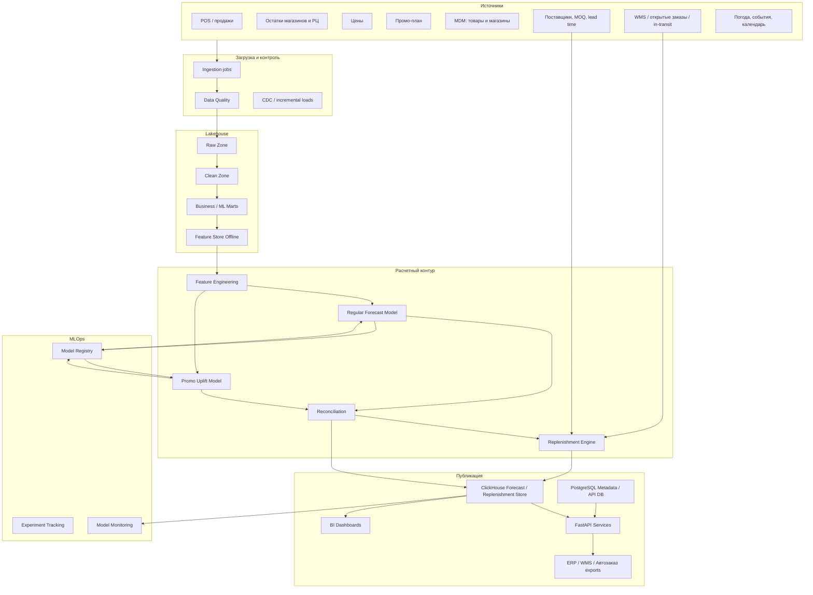
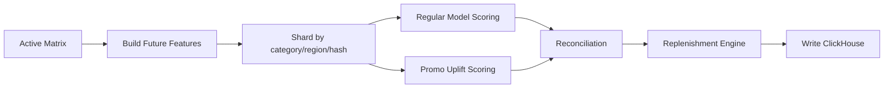
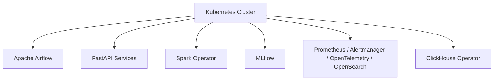

# Технологическая Архитектура И Стек

## 1. Вывод По Анализу ТЗ

Проект OPEN FNR должен решать две связанные задачи:

1. Прогнозирование спроса:
   - регулярный спрос;
   - промо-uplift;
   - итоговый прогноз.
2. Пополнение запасов:
   - demand projection;
   - projected stock;
   - order proposals;
   - multi-echelon planning;
   - fresh / shelf-life / spoilage;
   - exception management.

Ключевой расчетный масштаб:

| Показатель | Значение |
| --- | --- |
| Магазины | до `30 000` |
| Средний ассортимент | `5 500 SKU` |
| Потенциальные связки `store x SKU` | до `165 000 000` |
| Горизонт | `14 / 30 / 60 / 90` дней |
| Полная сетка на 90 дней | `14 850 000 000` строк |
| Частота | ежедневно |
| Целевой SLA основного расчета | до `2 часов` |

Главный архитектурный вывод: система не должна ежедневно считать и хранить полный декартов продукт без фильтрации. Для SLA до 2 часов требуется считать **активную матрицу**, использовать **партиционирование**, **инкрементальные признаки**, **columnar storage**, **batch scoring без Python loops** и отдельный контур для краткосрочного и долгосрочного горизонта.

## 2. Целевая Архитектура



## 3. Расчетные Контуры

### 3.1. Контур D+1 / Оперативный

Назначение: ежедневно рассчитать прогноз и заказы для автозаказа.

| Параметр | Решение |
| --- | --- |
| Горизонт | `14 / 30` дней |
| Использование | автозаказ, пополнение, промо-дефицит |
| SLA | основной расчет до `2 часов` |
| Детальность | `store x SKU x day` |
| Движок | Spark + Polars для отдельных быстрых задач |

### 3.2. Контур Планирования

Назначение: долгосрочный прогноз и планирование закупок.

| Параметр | Решение |
| --- | --- |
| Горизонт | `60 / 90` дней |
| Использование | закупки, capacity, сезонное планирование |
| SLA | может считаться отдельно от D+1 |
| Детальность | `store x SKU x day`, но с агрегациями и sparse-подходом |
| Движок | Spark / ClickHouse materialized aggregates |

### 3.3. Контур Backtesting / Training

Назначение: обучение моделей, сравнение версий, расчет WAPE/Bias.

| Параметр | Решение |
| --- | --- |
| Горизонт backtesting | rolling windows |
| Расписание | отдельно от ежедневного inference |
| Изоляция | отдельные ресурсы от production inference |
| Движок | Spark, LightGBM/CatBoost, MLflow |

## 4. Принципы Масштабирования

### 4.1. Не Считать Пустые Комбинации

Вместо полного декартова произведения:

```text
30 000 магазинов x полный справочник SKU x 90 дней
```

нужно использовать активную матрицу:

```text
active_store_sku_matrix x forecast_horizon
```

Активная матрица строится по:

- текущей товарной матрице;
- истории продаж;
- наличию товара;
- активным промо;
- плану ввода/вывода SKU;
- магазинам, работающим в период прогноза.

### 4.2. Партиционирование

Основные ключи партиционирования:

| Данные | Партиции |
| --- | --- |
| Продажи | `date`, `region_id`, `category_id` |
| Остатки | `date`, `location_type`, `region_id` |
| Features | `run_date`, `category_id`, `region_id`, `shard_id` |
| Forecast | `run_date`, `forecast_date`, `horizon_bucket`, `category_id`, `region_id` |
| Order proposals | `run_date`, `order_date`, `source_location_id`, `target_region_id` |

Для равномерной нагрузки нужен технический `shard_id`:

```text
shard_id = hash(store_id, sku_id) % N
```

### 4.3. Инкрементальные Признаки

Ежедневно пересчитываются только изменившиеся окна:

- лаги и rolling features;
- последние факты продаж;
- последние остатки;
- цены;
- промо-план;
- in-transit и открытые заказы.

Долгие исторические признаки кэшируются.

### 4.4. Разделение Hot / Warm / Cold

| Слой | Данные | Хранение |
| --- | --- | --- |
| Hot | последние прогнозы, заказы, метрики | ClickHouse NVMe |
| Warm | история прогнозов и фактов 12-24 месяца | Iceberg/Parquet + ClickHouse TTL |
| Cold | архив, старые backtests | Apache Ozone / SeaweedFS + Iceberg |

## 5. Рекомендуемый Технологический Стек

### 5.0. Лицензионное Ограничение

Все инструменты промышленного контура должны быть бесплатными для self-hosted использования и совместимыми с выпуском собственного кода проекта под лицензией **Apache License 2.0**.

Разрешенные типы лицензий для зависимостей:

- `Apache-2.0`;
- `MIT`;
- `BSD / PostgreSQL License`;
- другие permissive-лицензии только после отдельной проверки.

Исключаются из целевого стека:

| Инструмент | Причина исключения | Замена |
| --- | --- | --- |
| Grafana OSS | `AGPL-3.0` с сетевыми copyleft-обязательствами | Apache Superset, Apache ECharts frontend, Prometheus UI |
| Grafana Loki | `AGPL-3.0` | OpenSearch |
| MinIO Community | `AGPL-3.0` | Apache Ozone S3 Gateway или SeaweedFS |
| Power BI | коммерческий proprietary-продукт | Apache Superset |
| Docker Desktop | коммерческие ограничения для части организаций | Kubernetes + containerd / nerdctl |

Запрещено добавлять в production-стек компоненты с `GPL`, `AGPL`, `SSPL`, `BUSL`, source-available или proprietary-лицензиями без отдельного юридического решения.

### 5.1. Итоговая Рекомендация

| Зона | Основной выбор | Зачем |
| --- | --- | --- |
| Data Lakehouse | Apache Iceberg + Parquet + Apache Ozone S3 Gateway или SeaweedFS | большие таблицы, schema/partition evolution, дешево хранить историю |
| Batch compute | Apache Spark 4.x | распределенная обработка больших витрин |
| Fast local compute | Polars | быстрые локальные пайплайны, lazy execution, Arrow |
| OLAP / BI / Forecast Store | ClickHouse | быстрые агрегации, dashboards, хранение прогнозов и заказов |
| Metadata / транзакции | PostgreSQL | статусы, версии, конфигурации, права, ручные корректировки |
| ML модели | LightGBM + CatBoost | производительные tabular-модели, CPU-first, поддержка категориальных признаков |
| Feature Store | Feast или собственный offline feature mart | контроль признаков и point-in-time training |
| MLOps | MLflow | experiments, model registry, lineage |
| Business Process Engine | Flowable OSS | BPMN/DMN/CMMN, human tasks, SLA, process audit |
| Оркестрация | Apache Airflow 3.x | DAG, расписание, мониторинг batch jobs |
| API | FastAPI | быстрый backend для forecast/replenishment API |
| Контейнеризация | Kubernetes | управление сервисами, batch jobs, масштабирование |
| Container runtime | containerd + nerdctl | бесплатный runtime без Docker Desktop |
| Метрики и алерты | Prometheus + Alertmanager + OpenTelemetry | метрики, алерты, трассировка |
| Логи | OpenSearch | централизованные логи без AGPL |
| Data Quality | Spark SQL checks + custom validation framework | контроль входных данных без лицензионного риска |
| BI | Apache Superset / Apache ECharts frontend | бизнес-дашборды |

### 5.2. Почему Не Только PostgreSQL

PostgreSQL нужен, но не как основное хранилище прогнозов на миллиарды строк.

PostgreSQL подходит для:

- метаданных;
- конфигураций;
- пользователей и ролей;
- workflow state;
- ручных корректировок;
- статусов выгрузки.

Для forecast/order-фактов нужен ClickHouse, потому что workload аналитический: много строк, мало колонок в запросе, агрегации, BI, append-mostly запись.

### 5.3. Почему Spark + Polars

Spark нужен для:

- больших таблиц;
- распределенного feature engineering;
- backtesting;
- join больших витрин;
- масштабирования beyond single server.

Polars нужен для:

- быстрых локальных transformations;
- небольших партиций;
- генерации признаков внутри shard;
- подготовки inference batch;
- tooling для DS-команды.

## 6. ML-Архитектура

### 6.1. Модельная Стратегия

| Слой | Модель |
| --- | --- |
| Baseline | seasonal naive, rolling median, category fallback |
| Регулярный спрос | LightGBM / CatBoost по сегментам |
| Промо uplift | отдельная uplift-модель |
| Fresh | отдельная модель спроса + оптимизация списаний |
| Slow movers | intermittent demand / Poisson / negative binomial / fallback |
| Cold start | reference products + атрибутная модель |
| Reconciliation | bottom-up + weighted reconciliation |

### 6.2. Сегментация Моделей

Не рекомендуется одна гигантская модель на все данные.

Рекомендуется сегментация:

- категория;
- тип товара: fast / medium / slow mover;
- regular / promo;
- fresh / non-fresh;
- формат магазина;
- страна/регион, если паттерны сильно отличаются.

### 6.3. Inference

Inference должен работать так:



Запрещенные практики:

- row-by-row Python scoring;
- pandas на full dataset;
- монолитный CSV export;
- полная перезапись всех исторических прогнозов;
- join без партиционирования на десятках миллиардов строк.

## 7. Replenishment Engine

Модуль пополнения лучше реализовать как отдельный расчетный слой, а не смешивать с ML-моделью.

### 7.1. Входы

- прогноз спроса;
- текущие остатки;
- открытые заказы;
- in-transit;
- lead time;
- календарь заказов;
- календарь поставок;
- MOQ/MOV;
- кратность упаковки;
- safety stock;
- presentation stock;
- shelf capacity;
- срок годности;
- ограничения РЦ и поставщиков.

### 7.2. Выходы

- projected stock;
- demand projection;
- net requirement;
- order proposal;
- constraint flags;
- exception alerts;
- explanation.

### 7.3. Движок

Рекомендуется гибрид:

| Компонент | Технология |
| --- | --- |
| массовый расчет проекций | Spark / Polars |
| правила и constraints | Python rules engine / собственный DSL |
| оптимизация fresh / allocation | OR-Tools для отдельных задач, не для всей сети сразу |
| хранение результата | ClickHouse |
| ручные корректировки | PostgreSQL |

OR-Tools не должен решать всю сеть целиком. Его следует использовать для ограниченных задач:

- распределение дефицита РЦ;
- оптимизация fresh-заказа внутри категории/региона;
- транспортные ограничения;
- capacity smoothing.

## 8. Инфраструктурные Профили

### 8.1. MVP / Пилот

Для пилота на части сети:

| Компонент | Рекомендация |
| --- | --- |
| CPU | `32-64` физических ядра |
| RAM | `256-512 GB` |
| Disk | `4-8 TB NVMe` |
| GPU | не требуется |
| Compute | single-node Polars + local Spark |
| DB | ClickHouse single node + PostgreSQL |

### 8.2. Один Мощный Сервер Для Production

Возможен, но рискован для полного масштаба и SLA `2 часа`.

| Компонент | Рекомендация |
| --- | --- |
| CPU | `2 x AMD EPYC 9005`, суммарно `192-384` физических ядра |
| RAM | `1.5-3 TB DDR5` |
| Disk | `30-60 TB NVMe`, RAID 10 |
| Network | `25/100 GbE` |
| GPU | опционально `1-2 x NVIDIA L40S 48GB` или `1-2 x H100/H200` |
| ОС | Linux, желательно Ubuntu Server / Rocky Linux |

Такой профиль подходит, если:

- активная матрица существенно меньше `165M`;
- основной горизонт для автозаказа `14/30`, а `60/90` считается отдельным контуром;
- модели компактные;
- признаки инкрементальные;
- ClickHouse и Spark/Polars настроены на NVMe.

### 8.3. Рекомендуемый Production-Кластер

Для надежного SLA лучше использовать кластер.

| Компонент | Рекомендация |
| --- | --- |
| Compute nodes | `8-12` узлов |
| CPU на узел | `64-96` физических ядер |
| RAM на узел | `512 GB - 1 TB` |
| NVMe на узел | `8-16 TB` |
| Сеть | `100 GbE` желательно |
| ClickHouse | `3-6` узлов, sharding + replication |
| Spark | Kubernetes или standalone/YARN |
| PostgreSQL | self-hosted HA-кластер |
| Object Storage | Apache Ozone S3 Gateway или SeaweedFS, replication |

Итоговый compute budget:

```text
512-1152 физических CPU cores
4-12 TB RAM
64-192 TB NVMe raw
```

### 8.4. GPU

GPU не обязателен для первой промышленной версии.

GPU нужен, если:

- используется deep learning forecasting;
- требуется GPU CatBoost/LightGBM training;
- строятся большие ensemble-модели;
- нужно резко ускорять training/backtesting.

GPU не решает главную проблему сам по себе, если bottleneck находится в:

- join больших таблиц;
- чтении Parquet;
- записи миллиардов строк;
- плохом партиционировании;
- row-wise Python.

Для CPU-first архитектуры лучше вложиться в:

- больше RAM;
- быстрый NVMe;
- 100 GbE;
- ClickHouse cluster;
- правильные партиции.

## 9. Оценка Нагрузки

### 9.1. Forecast Output

Если считать весь 90-дневный горизонт для всех потенциальных связок:

```text
165M x 90 = 14.85B строк
```

При 20-30 числовых/строковых полях это может быть:

```text
~1-5 TB compressed на один run
```

Вывод:

- хранить полный detailed forecast на 90 дней каждый день дорого;
- нужна TTL-политика;
- агрегаты хранить дольше;
- детальный forecast хранить по последним run-версиям;
- для 60/90 горизонта можно хранить только активные и бизнес-нужные срезы.

### 9.2. Feature Matrix

Feature matrix тяжелее forecast output:

```text
active_store_sku_day_rows x 100-300 features
```

Поэтому:

- future features строятся shard-by-shard;
- исторические rolling features заранее материализуются;
- категориальные признаки кодируются стабильно;
- training dataset не хранится как один монолитный файл.

### 9.3. Replenishment

Replenishment расчет легче ML-scoring, но чувствителен к правилам:

- projected stock считается по дням горизонта;
- order proposal считается по датам заказа;
- constraints могут добавлять дорогие joins;
- fresh требует batch-level данных и shelf-life логики.

## 10. Рекомендуемый Daily SLA Pipeline

```mermaid
gantt
    title Daily Production Pipeline
    dateFormat HH:mm
    axisFormat %H:%M
    section Data
    Load incremental data      :00:00, 20m
    Data quality checks        :00:20, 20m
    section Features
    Update rolling features    :00:40, 30m
    Build future features      :01:10, 25m
    section Forecast
    Regular scoring            :01:35, 25m
    Promo uplift scoring       :02:00, 20m
    Reconciliation             :02:20, 10m
    section Replenishment
    Stock projection           :02:30, 20m
    Order proposals            :02:50, 25m
    Exceptions/explanations    :03:15, 10m
    section Publish
    Write stores/export        :03:25, 20m
```



Цель `2 часа` лучше трактовать как:

```text
feature build + forecast scoring + replenishment calculation <= 2 часа
```

Полный ночной цикл с загрузкой, DQ, публикацией и BI может занимать `3-4 часа`.

## 11. Развертывание

### 11.1. Среды

| Среда | Назначение |
| --- | --- |
| DEV | разработка DS/DE/backend |
| TEST | интеграционные тесты |
| STAGE | rehearsal production run |
| PROD | промышленный расчет |

### 11.2. Kubernetes Layout



Batch jobs должны иметь:

- resource requests/limits;
- node affinity для compute nodes;
- отдельные node pools для ClickHouse и Spark;
- retry policy;
- idempotent output;
- canary run на части данных.

## 12. Сетевые И Дисковые Требования

### 12.1. Диск

Минимум:

- NVMe для ClickHouse hot data;
- NVMe scratch для Spark shuffle;
- object storage для lakehouse;
- отдельный volume для PostgreSQL WAL/data.

Рекомендация:

| Компонент | Диск |
| --- | --- |
| ClickHouse | local NVMe, replication |
| Spark shuffle | local NVMe |
| Iceberg/Parquet | Apache Ozone S3 Gateway / SeaweedFS |
| PostgreSQL | mirrored SSD/NVMe |
| Backups | отдельное object storage |

### 12.2. Сеть

Для production-кластера:

- минимум `25 GbE`;
- желательно `100 GbE`;
- отдельная сеть или VLAN для storage traffic;
- мониторинг throughput и packet drops.

## 13. Наблюдаемость

Обязательные метрики:

| Уровень | Метрики |
| --- | --- |
| Data | freshness, row counts, nulls, duplicates, DQ failures |
| Pipeline | duration, retries, failed partitions, SLA miss |
| ML | WAPE, Bias, drift, fallback rate |
| Forecast | rows produced, forecast versions, extreme values |
| Replenishment | order count, blocked orders, exception count, stockout risk |
| Infra | CPU, RAM, disk I/O, network, ClickHouse merges, Spark shuffle |

## 14. Решение По Стеку

Рекомендуемая production-комбинация:

```text
Linux
Kubernetes
Apache Airflow
Spark 4.x
Polars
Apache Iceberg + Parquet + Apache Ozone или SeaweedFS
ClickHouse
PostgreSQL
LightGBM + CatBoost
MLflow
Flowable OSS
FastAPI
Prometheus + Alertmanager + OpenTelemetry + OpenSearch
Apache Superset / Apache ECharts
```

Минимальная viable-комбинация для MVP:

```text
Linux
containerd + nerdctl compose или обычные Linux-сервисы
Polars
Spark local
Parquet
ClickHouse single-node
PostgreSQL
LightGBM/CatBoost
MLflow
Flowable OSS
FastAPI
Superset
```

Для MVP также сохраняется лицензионное правило: не использовать Docker Desktop как обязательную зависимость. Локальный запуск должен поддерживать `containerd/nerdctl` или обычные Linux-сервисы.

## 15. Что Нужно Зафиксировать Перед Закупкой Железа

Перед финальным sizing нужно измерить:

- реальный размер активной матрицы;
- среднее число признаков;
- объем истории для training;
- долю промо-связок;
- долю fresh-категорий;
- необходимость 90-дневного detailed forecast для всех связок;
- SLA источников данных;
- требуемую глубину хранения forecast versions;
- количество пользователей BI;
- способ интеграции с ERP/WMS.

Без этих чисел закупка сервера будет гаданием. Для первого sizing можно брать кластерный профиль из раздела 8.3.

## 16. Источники Для Выбора Стека

Использованы публичные официальные материалы и документация:

- Apache Spark SQL/DataFrames: `https://spark.apache.org/docs/latest/sql-programming-guide`
- Apache Spark documentation: `https://spark.apache.org/documentation`
- ClickHouse: `https://clickhouse.com/clickhouse`
- ClickHouse docs: `https://clickhouse.com/docs/en`
- Apache Iceberg spec/evolution: `https://iceberg.apache.org/spec/`, `https://iceberg.apache.org/docs/1.4.2/evolution/`
- Polars lazy API: `https://docs.pola.rs/user-guide/lazy/`
- MLflow Model Registry: `https://www.mlflow.org/docs/2.9.2/model-registry.html`
- Apache Airflow: `https://airflow.apache.org/docs/apache-airflow/2.11.2/`
- Kubernetes documentation: `https://kubernetes.io/docs/`
- CatBoost GPU training: `https://catboost.ai/docs/en/features/training-on-gpu`
- Feast overview: `https://docs.feast.dev/getting-started/components/overview`
- AMD EPYC 9005: `https://www.amd.com/en/products/processors/server/epyc/9005-series.html`
- NVIDIA L40S: `https://www.nvidia.com/en-gb/data-center/l40s/`
- NVIDIA H200: `https://www.nvidia.com/en-sg/data-center/h200/`

## 17. Post-Sprint Architecture Status

As of 2026-05-28, the repository implements a functional prototype with FastAPI modules, React UI sections, Flowable-oriented BPMN/DMN/CMMN artifacts, Docker Compose development infrastructure and automated tests.

The target architecture in this document remains valid, but the next implementation phase is industrialization:

- persistence instead of in-memory mock data;
- real POS/ERP/WMS/DWH/MDM/promo ingestion;
- DEV/TEST/STAGE deployment contours;
- production security;
- routed API-backed UI;
- pilot launch on limited stores/SKU.

Detailed execution documents:

- [DOCUMENTATION_AUDIT_AND_SYNC.md](DOCUMENTATION_AUDIT_AND_SYNC.md)
- [NEXT_DELIVERY_PLAN.md](NEXT_DELIVERY_PLAN.md)
- [DEPLOYMENT_ENVIRONMENTS_STRATEGY.md](DEPLOYMENT_ENVIRONMENTS_STRATEGY.md)
- [REAL_DATA_INGESTION_PIPELINES.md](REAL_DATA_INGESTION_PIPELINES.md)
- [UI_PRODUCTIZATION_PLAN.md](UI_PRODUCTIZATION_PLAN.md)
